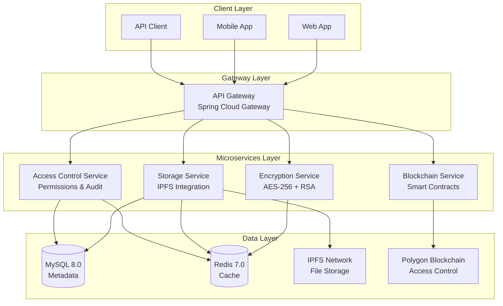

# 🔐 OM VaultChain - Decentralized File Storage Platform

<div align="center">


**Secure • Decentralized • Blockchain-Powered**

[](https://openjdk.org/)
[](https://spring.io/projects/spring-boot)
[](https://soliditylang.org/)
[](https://ipfs.io/)
[](https://docker.com/)

</div>

---

## 🌟 What is OM VaultChain?

**OM VaultChain (OMVC)** is a next-generation decentralized file storage platform that combines **client-side encryption**, **blockchain access control**, and **IPFS storage** to create a truly secure and private file management system.

### 🔒 How It Works

1. **🔐 Client-Side Encryption**: Files are encrypted on your device using AES-256-GCM before leaving your computer
2. **🌐 IPFS Storage**: Encrypted files are stored on the decentralized IPFS network for durability and censorship resistance
3. **⛓️ Blockchain Registry**: File metadata and access permissions are recorded on Polygon blockchain for transparency
4. **🔑 Smart Contract Access Control**: Granular permissions managed through immutable smart contracts
5. **🔄 Zero-Knowledge Architecture**: Even we can't access your files without your permission

### 🎯 Key Benefits

- **🛡️ True Privacy**: Client-side encryption ensures only you control access to your data
- **🌍 Decentralized**: No single point of failure with IPFS distributed storage
- **⚖️ Transparent**: All access permissions recorded on blockchain for auditability
- **🔄 Revocable**: Grant and revoke access permissions in real-time
- **📱 Cross-Platform**: Works on web, mobile, and desktop applications

---

## 📋 Table of Contents

- [🚀 Quick Start](#-quick-start)
- [🏗️ Architecture Overview](#️-architecture-overview)
- [🛠️ Technology Stack](#️-technology-stack)
- [🔧 Microservices](#-microservices)
- [⛓️ Smart Contracts](#️-smart-contracts)
- [🗄️ Database Schema](#️-database-schema)
- [🐳 Docker Deployment](#-docker-deployment)
- [🔒 Security Features](#-security-features)
- [📱 API Documentation](#-api-documentation)
- [🧪 Testing](#-testing)
- [🚀 Development Setup](#-development-setup)
- [📈 Roadmap](#-roadmap)

---

## 🚀 Quick Start

### Prerequisites
- **Java 17+** - For backend services
- **Node.js 18+** - For smart contract development
- **Docker & Docker Compose** - For containerized deployment
- **MySQL 8.0+** - Database
- **Redis 7.0+** - Caching layer

### 🏃‍♂️ Run with Docker

```bash
# Clone the repository
git clone https://github.com/your-org/om-vaultchain.git
cd om-vaultchain

# Set up environment variables
cp .env.example .env
# Edit .env with your configuration

# Start all services
docker-compose up -d

# Check service health
curl http://localhost:8002/health  # Encryption Service
curl http://localhost:8003/health  # Storage Service
curl http://localhost:8004/health  # Blockchain Service
```

### 🎯 Target Use Cases

- **🏢 Enterprise Document Management**: Secure sharing of confidential business documents
- **⚖️ Legal & Compliance**: Tamper-proof document storage with audit trails
- **🏥 Healthcare**: HIPAA-compliant patient record management
- **💼 Financial Services**: Secure client document storage and sharing
- **🎓 Education**: Secure academic record and certificate management
- **👤 Personal Privacy**: Individual secure file storage and sharing

---

## 🏗️ Architecture Overview

OM VaultChain follows a **microservices architecture** with clear separation of concerns, ensuring scalability, maintainability, and security.



---

## 🛠️ Technology Stack

<div align="center">

| **Category** | **Technology** | **Version** | **Purpose** |
|--------------|----------------|-------------|-------------|
| 🔐 **Encryption** | Java + BouncyCastle | 17+ / 1.70+ | AES-256-GCM, RSA/ECIES encryption |
| 🌐 **Backend** | Spring Boot | 3.2+ | Microservices framework |
| 📦 **Storage** | IPFS + Pinata | Latest | Decentralized file storage |
| ⛓️ **Blockchain** | Solidity + Hardhat | 0.8.19+ | Smart contracts on Polygon |
| 🔗 **Web3 SDK** | web3j | 4.9+ | Blockchain integration |
| 💾 **Database** | MySQL | 8.0+ | Metadata persistence |
| ⚡ **Cache** | Redis | 7.0+ | High-performance caching |
| 🐳 **Deployment** | Docker + Compose | Latest | Containerization |
| 🧪 **Testing** | JUnit + Mockito | 5+ | Unit & integration testing |
| 📊 **Monitoring** | Prometheus + Grafana | Latest | Metrics & observability |

</div>

---

## 🔧 Microservices

OM VaultChain is built using a **microservices architecture** with four core services, each handling specific responsibilities:

### 🔐 Encryption Service
**Port: 8002** | **Technology: Spring Boot + BouncyCastle**

Handles all cryptographic operations with enterprise-grade security.

**Key Features:**
- **AES-256-GCM** encryption for files
- **RSA/ECIES** for key encryption
- **SHA-256** file hashing
- **Secure IV generation**
- **Multi-recipient key envelopes**

<augment_code_snippet path="services/encryption-service/src/main/java/com/omvaultchain/service/AESService.java" mode="EXCERPT">
````java
@Service
public class AESService {
    // AES-256-GCM encryption/decryption
    // Key generation (256-bit)
    // IV management (12 bytes)
    // Tag verification
}
````
</augment_code_snippet>

**API Endpoints:**
- `POST /encrypt` - Encrypt file with AES-256-GCM
- `POST /decrypt` - Decrypt file for authorized users
- `POST /generate-key` - Generate secure AES keys
- `POST /hash-file` - Generate SHA-256 file hash</augment_code_snippet>

### 📦 Storage Service
**Port: 8003** | **Technology: Spring Boot + IPFS + Pinata**

Manages file storage operations on the decentralized IPFS network.

**Key Features:**
- **IPFS integration** with Pinata pinning service
- **Multi-part uploads** for large files
- **File metadata extraction** and management
- **Download access validation**
- **Storage analytics** and metrics

<augment_code_snippet path="services/storage-service/src/main/java/com/omvaultchain/service/FileUploadService.java" mode="EXCERPT">
````java
@Service
public class FileUploadService {
    // Encrypted file upload orchestration
    // Multi-part upload handling for large files
    // Progress tracking and real-time callbacks
    // Duplicate detection and deduplication
}
````
</augment_code_snippet>

**API Endpoints:**
- `POST /storage/upload` - Upload encrypted file to IPFS
- `GET /storage/download/{cid}` - Download file by CID
- `GET /storage/metadata/{fileId}` - Get file metadata
- `POST /storage/upload/batch` - Bulk file upload</augment_code_snippet>

### ⛓️ Blockchain Service
**Port: 8004** | **Technology: Spring Boot + web3j + Solidity**

Manages smart contract interactions and blockchain operations.

**Key Features:**
- **File registration** on Polygon blockchain
- **Access control** via smart contracts
- **Version management** and history
- **Event listening** for blockchain events
- **Gas optimization** strategies

<augment_code_snippet path="contracts/contracts/FileRegistry.sol" mode="EXCERPT">
````solidity
contract FileRegistry {
    struct File{
        string cid;
        string fileHash;
        address owner;
        uint256 timestamp;
    }

    function registerFile(string memory cid, string memory fileHash) public {
        files[cid] = File(cid, fileHash, msg.sender, block.timestamp);
        emit FileRegistered(cid, fileHash, msg.sender, block.timestamp);
    }
}
````
</augment_code_snippet>

**API Endpoints:**
- `POST /register-file` - Register file on blockchain
- `POST /grant-access` - Grant user access to file
- `POST /revoke-access` - Revoke user access
- `GET /has-access` - Check user access permissions</augment_code_snippet>

### 🔒 Access Control Service
**Port: 8005** | **Technology: Spring Boot + Redis + MySQL**

Manages dynamic access permissions and audit trails.

**Key Features:**
- **Role-based access control** (RBAC)
- **Policy engine** for complex permissions
- **Real-time access validation**
- **Comprehensive audit logging**
- **Organization management**

**API Endpoints:**
- `POST /access/grant` - Grant file access to user
- `POST /access/validate` - Validate user access
- `GET /access/audit/{fileId}` - Get access audit trail
- `POST /access/revoke` - Revoke user access

---

## ⛓️ Smart Contracts

OM VaultChain uses three main smart contracts deployed on **Polygon** blockchain for gas efficiency and scalability.

### 📋 FileRegistry.sol
Manages file registration and metadata on-chain.

<augment_code_snippet path="contracts/contracts/FileRegistry.sol" mode="EXCERPT">
````solidity
contract FileRegistry {
    struct File{
        string cid;
        string fileHash;
        address owner;
        uint256 timestamp;
    }

    mapping(string => File) private files;

    function registerFile(string memory cid, string memory fileHash) public {
        require(bytes(cid).length > 0, "CID Required");
        require(bytes(fileHash).length > 0, "File Hash Required");

        files[cid] = File(cid, fileHash, msg.sender, block.timestamp);
        emit FileRegistered(cid, fileHash, msg.sender, block.timestamp);
    }
}
````
</augment_code_snippet>

### 🔐 AccessControl.sol
Manages user permissions and access rights.

**Key Functions:**
- `grantAccess(string cid, address user, string encryptedKey)` - Grant file access
- `revokeAccess(string cid, address user)` - Revoke file access
- `hasAccess(string cid, address user)` - Check access permissions
- `getAccessList(string cid)` - Get all users with access

### 🔄 VersionManager.sol
Handles file versioning and history management.

**Key Functions:**
- `addVersion(string cid, string newCid, uint256 versionNumber)` - Add new version
- `getCurrentVersion(string cid)` - Get current version
- `getVersionHistory(string cid)` - Get all versions
- `rollbackVersion(string cid, uint256 versionNumber)` - Rollback to version

### 🚀 Contract Deployment

```bash
# Navigate to contracts directory
cd contracts

# Install dependencies
npm install

# Compile contracts
npx hardhat compile

# Deploy to Polygon testnet
npx hardhat run scripts/deploy.js --network polygon-mumbai

# Verify contracts
npx hardhat verify --network polygon-mumbai <CONTRACT_ADDRESS>
```

---

## 🗄️ Database Schema

OM VaultChain uses **MySQL 8.0** for persistent data storage and **Redis 7.0** for high-performance caching.

### 📊 Core Tables

#### Users Table
```sql
CREATE TABLE users (
    id CHAR(36) PRIMARY KEY,
    wallet_address VARCHAR(42) UNIQUE NOT NULL,
    public_key TEXT,
    created_at TIMESTAMP DEFAULT CURRENT_TIMESTAMP,
    updated_at TIMESTAMP DEFAULT CURRENT_TIMESTAMP ON UPDATE CURRENT_TIMESTAMP,
    is_active BOOLEAN DEFAULT TRUE,
    INDEX idx_wallet_address (wallet_address)
);
```

#### Files Table
```sql
CREATE TABLE files (
    id CHAR(36) PRIMARY KEY,
    owner_id CHAR(36) NOT NULL,
    name VARCHAR(255) NOT NULL,
    mime_type VARCHAR(100),
    size_bytes BIGINT,
    cid VARCHAR(100) UNIQUE NOT NULL,
    file_hash VARCHAR(64) NOT NULL,
    created_at TIMESTAMP DEFAULT CURRENT_TIMESTAMP,
    updated_at TIMESTAMP DEFAULT CURRENT_TIMESTAMP ON UPDATE CURRENT_TIMESTAMP,
    is_deleted BOOLEAN DEFAULT FALSE,
    FOREIGN KEY (owner_id) REFERENCES users(id) ON DELETE CASCADE,
    INDEX idx_owner_id (owner_id),
    INDEX idx_cid (cid)
);
```

#### Access Permissions Table
```sql
CREATE TABLE access_permissions (
    id CHAR(36) PRIMARY KEY,
    file_id CHAR(36) NOT NULL,
    user_id CHAR(36) NOT NULL,
    encrypted_key TEXT NOT NULL,
    granted_at TIMESTAMP DEFAULT CURRENT_TIMESTAMP,
    revoked_at TIMESTAMP NULL,
    is_active BOOLEAN DEFAULT TRUE,
    FOREIGN KEY (file_id) REFERENCES files(id) ON DELETE CASCADE,
    FOREIGN KEY (user_id) REFERENCES users(id) ON DELETE CASCADE,
    UNIQUE KEY unique_file_user (file_id, user_id)
);
```

#### Audit Logs Table
```sql
CREATE TABLE audit_logs (
    id CHAR(36) PRIMARY KEY,
    user_id CHAR(36),
    action VARCHAR(50) NOT NULL,
    resource_type VARCHAR(50) NOT NULL,
    resource_id CHAR(36),
    details JSON,
    ip_address VARCHAR(45),
    user_agent TEXT,
    created_at TIMESTAMP DEFAULT CURRENT_TIMESTAMP,
    FOREIGN KEY (user_id) REFERENCES users(id) ON DELETE SET NULL,
    INDEX idx_user_id (user_id),
    INDEX idx_action (action)
);
```

### ⚡ Redis Cache Structure

```bash
# Session Management
session:{wallet_address} -> {jwt_token, expires_at}
challenge:{wallet_address} -> {nonce, expires_at}

# File Caching
file:{file_id} -> {metadata, access_list, version_info}
file_permissions:{file_id} -> {user_list, permissions}

# User Caching
user:{wallet_address} -> {user_profile, public_key}
user_files:{user_id} -> {file_list, pagination_info}

# Performance Caching
upload_status:{upload_id} -> {progress, status, errors}
download_cache:{cid} -> {file_data, expires_at}
```

---

## 🐳 Docker Deployment

OM VaultChain is fully containerized using Docker for easy deployment and scaling.

### 🚀 Quick Start with Docker Compose

<augment_code_snippet path="docker-compose.yml" mode="EXCERPT">
````yaml
version: '3.8'

services:
  encryption-service:
    build: ./services/encryption-service
    ports:
      - "8002:8080"
    networks:
      - omvc-net

  storage-service:
    build: ./services/storage-service
    ports:
      - "8003:8080"
    environment:
      - PINATA_API_KEY=${PINATA_API_KEY}
      - PINATA_SECRET_API_KEY=${PINATA_SECRET_API_KEY}
      - DB_HOST=${DB_HOST}
    networks:
      - omvc-net
    depends_on:
      - redis

  blockchain-service:
    build: ./services/blockchain-service
    ports:
      - "8004:8080"
    environment:
      - WEB3_RPC_URL=http://host.docker.internal:7545
      - CONTRACT_FILE_REGISTRY=${CONTRACT_FILE_REGISTRY}
    networks:
      - omvc-net

  redis:
    image: redis:7
    ports:
      - "6379:6379"
    networks:
      - omvc-net

networks:
  omvc-net:
    driver: bridge
````
</augment_code_snippet>

### 🔧 Environment Configuration

Create a `.env` file with your configuration:

```bash
# Database Configuration
DB_HOST=localhost
DB_PORT=3306
DB_DATABASE=omvaultchain
DB_USERNAME=your_username
DB_PASSWORD=your_password

# IPFS Configuration
PINATA_API_KEY=your_pinata_api_key
PINATA_SECRET_API_KEY=your_pinata_secret_key

# Blockchain Configuration
PRIVATE_KEY=your_private_key
WALLET_ADDRESS=your_wallet_address
WEB3_RPC_URL=http://host.docker.internal:7545

# Smart Contract Addresses (after deployment)
CONTRACT_FILE_REGISTRY=0x...
CONTRACT_ACCESS_CONTROL=0x...
CONTRACT_VERSION_MANAGER=0x...
```

### 📦 Service Ports

| Service | Port | Description |
|---------|------|-------------|
| **Encryption Service** | 8002 | Cryptographic operations |
| **Storage Service** | 8003 | IPFS file management |
| **Blockchain Service** | 8004 | Smart contract interactions |
| **Access Control Service** | 8005 | Permission management |
| **Redis Cache** | 6379 | Caching layer |
| **MySQL Database** | 3306 | Data persistence |

---

## 🔒 Security Features

OM VaultChain implements multiple layers of security to ensure data protection and privacy.

### 🛡️ Encryption Standards

- **🔐 AES-256-GCM**: Industry-standard symmetric encryption for files
- **🔑 RSA-4096/ECIES**: Asymmetric encryption for key exchange
- **🔍 SHA-256**: Cryptographic hashing for file integrity
- **🎲 Secure Random**: Cryptographically secure IV generation
- **🔒 Zero-Knowledge**: Platform cannot access user files without permission

### ⛓️ Blockchain Security

- **🏗️ Smart Contract Auditing**: All contracts undergo security audits
- **🔄 Immutable Records**: File metadata and permissions stored on-chain
- **🔐 Multi-Signature**: Support for multi-sig wallet integration
- **⚡ Gas Optimization**: Efficient contract design to minimize costs
- **🛡️ Reentrancy Protection**: Guards against common attack vectors

### 🌐 Network Security

- **🔒 HTTPS/TLS**: All communications encrypted in transit
- **🛡️ Rate Limiting**: Protection against DDoS and abuse
- **🔍 Input Validation**: Comprehensive request sanitization
- **🚫 CORS Protection**: Proper cross-origin resource sharing policies
- **📊 Audit Logging**: Comprehensive activity tracking

### 🔑 Access Control

- **🎭 Role-Based Access Control (RBAC)**: Granular permission management
- **⏰ Time-Based Access**: Temporary access with automatic expiration
- **🌍 IP Whitelisting**: Geographic and network-based restrictions
- **🔄 Revocable Permissions**: Real-time access revocation
- **📋 Audit Trails**: Complete access history tracking

---

## 📱 API Documentation

### 🔐 Encryption Service API

**Base URL:** `http://localhost:8002`

| Method | Endpoint | Description |
|--------|----------|-------------|
| `POST` | `/encrypt` | Encrypt file with AES-256-GCM |
| `POST` | `/decrypt` | Decrypt file for authorized users |
| `POST` | `/generate-key` | Generate secure AES keys |
| `POST` | `/hash-file` | Generate SHA-256 file hash |

### 📦 Storage Service API

**Base URL:** `http://localhost:8003`

| Method | Endpoint | Description |
|--------|----------|-------------|
| `POST` | `/storage/upload` | Upload encrypted file to IPFS |
| `GET` | `/storage/download/{cid}` | Download file by CID |
| `GET` | `/storage/metadata/{fileId}` | Get file metadata |
| `POST` | `/storage/upload/batch` | Bulk file upload |

### ⛓️ Blockchain Service API

**Base URL:** `http://localhost:8004`

| Method | Endpoint | Description |
|--------|----------|-------------|
| `POST` | `/register-file` | Register file on blockchain |
| `POST` | `/grant-access` | Grant user access to file |
| `POST` | `/revoke-access` | Revoke user access |
| `GET` | `/has-access` | Check user access permissions |
| `GET` | `/version-history/{cid}` | Get file version history |

### 🔒 Access Control Service API

**Base URL:** `http://localhost:8005`

| Method | Endpoint | Description |
|--------|----------|-------------|
| `POST` | `/access/grant` | Grant file access to user |
| `POST` | `/access/validate` | Validate user access |
| `GET` | `/access/audit/{fileId}` | Get access audit trail |
| `POST` | `/access/revoke` | Revoke user access |

### 📋 Example API Usage

#### Upload and Share a File

```bash
# 1. Encrypt file
curl -X POST http://localhost:8002/encrypt \
  -F "file=@document.pdf" \
  -F "publicKeys=[\"0x...\"]"

# 2. Upload to IPFS
curl -X POST http://localhost:8003/storage/upload \
  -F "encryptedFile=@encrypted_document.pdf" \
  -H "Authorization: Bearer <jwt_token>"

# 3. Register on blockchain
curl -X POST http://localhost:8004/register-file \
  -H "Content-Type: application/json" \
  -d '{"cid":"QmXXX...","fileHash":"sha256_hash"}'

# 4. Grant access to user
curl -X POST http://localhost:8005/access/grant \
  -H "Content-Type: application/json" \
  -d '{"fileId":"uuid","userId":"uuid","permissions":["read"]}'
```

---

## 🧪 Testing

OM VaultChain includes comprehensive testing strategies to ensure reliability and security.

### 🔬 Test Coverage

- **Unit Tests**: >80% code coverage for all services
- **Integration Tests**: End-to-end API testing
- **Security Tests**: Penetration testing and vulnerability scans
- **Performance Tests**: Load testing with JMeter
- **Smart Contract Tests**: Comprehensive Solidity testing with Hardhat

### 🚀 Running Tests

```bash
# Run all service tests
./scripts/run-tests.sh

# Run specific service tests
cd services/encryption-service
mvn test

# Run smart contract tests
cd contracts
npx hardhat test

# Run integration tests
docker-compose -f docker-compose.test.yml up --abort-on-container-exit
```

---

## 🚀 Development Setup

### 📋 Prerequisites

1. **Java Development Kit 17+**
2. **Node.js 18+** and npm
3. **Docker & Docker Compose**
4. **MySQL 8.0+** (or use Docker)
5. **Redis 7.0+** (or use Docker)
6. **Git** for version control

### 🛠️ Local Development

```bash
# 1. Clone the repository
git clone https://github.com/your-org/om-vaultchain.git
cd om-vaultchain

# 2. Set up environment variables
cp .env.example .env
# Edit .env with your local configuration

# 3. Start infrastructure services
docker-compose up -d redis mysql

# 4. Deploy smart contracts (optional for local dev)
cd contracts
npm install
npx hardhat compile
npx hardhat run scripts/deploy.js --network localhost

# 5. Start microservices
./scripts/start-services.sh

# 6. Verify services are running
curl http://localhost:8002/health  # Encryption Service
curl http://localhost:8003/health  # Storage Service
curl http://localhost:8004/health  # Blockchain Service
```

### 🔧 Development Tools

- **IDE**: IntelliJ IDEA or VS Code with Java extensions
- **API Testing**: Postman or Insomnia
- **Database**: MySQL Workbench or DBeaver
- **Blockchain**: Ganache for local blockchain testing
- **Monitoring**: Prometheus + Grafana for metrics

---

## 📈 Roadmap

### 🎯 Current Phase (Q1 2024)
- ✅ Core microservices implementation
- ✅ Smart contract deployment on Polygon
- ✅ Basic file upload/download functionality
- ✅ Access control and permissions system
- 🔄 Frontend web application development

### 🚀 Phase 2 (Q2 2024)
- 📱 Mobile application (Flutter)
- 🔍 Advanced search and filtering
- 📊 Analytics dashboard
- 🔔 Real-time notifications
- 🌐 Multi-language support

### 🌟 Phase 3 (Q3 2024)
- 🏢 Enterprise features and SSO integration
- 🔄 File versioning and collaboration
- 📋 Compliance reporting tools
- ⚡ Performance optimizations
- 🛡️ Advanced security features

### 🚀 Future Vision (Q4 2024+)
- 🌍 Multi-chain support (Ethereum, BSC, Avalanche)
- 🤖 AI-powered file organization
- 🔗 Integration with popular cloud services
- 📈 Advanced analytics and insights
- 🌐 Decentralized governance (DAO)

---

## 🤝 Contributing

We welcome contributions from the community! Please read our [Contributing Guidelines](CONTRIBUTING.md) before submitting pull requests.

### 📝 Development Process

1. Fork the repository
2. Create a feature branch (`git checkout -b feature/amazing-feature`)
3. Commit your changes (`git commit -m 'Add amazing feature'`)
4. Push to the branch (`git push origin feature/amazing-feature`)
5. Open a Pull Request

### 🐛 Bug Reports

Please use the [GitHub Issues](https://github.com/your-org/om-vaultchain/issues) page to report bugs or request features.

---

## 📄 License

This project is licensed under the MIT License - see the [LICENSE](LICENSE) file for details.

---

## 📞 Support & Contact

- **📧 Email**: support@omvaultchain.com
- **💬 Discord**: [OM VaultChain Community](https://discord.gg/omvaultchain)
- **🐦 Twitter**: [@OMVaultChain](https://twitter.com/omvaultchain)
- **📖 Documentation**: [docs.omvaultchain.com](https://docs.omvaultchain.com)

---

<div align="center">

**🔐 Secure • 🌐 Decentralized • ⛓️ Blockchain-Powered**

**Built with ❤️ by the OM VaultChain Team**

[](https://github.com/your-org/om-vaultchain)
[](https://twitter.com/omvaultchain)

</div>
