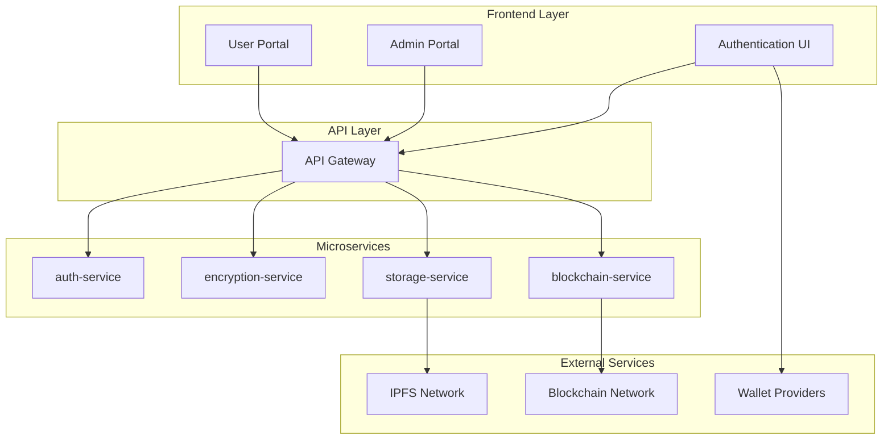
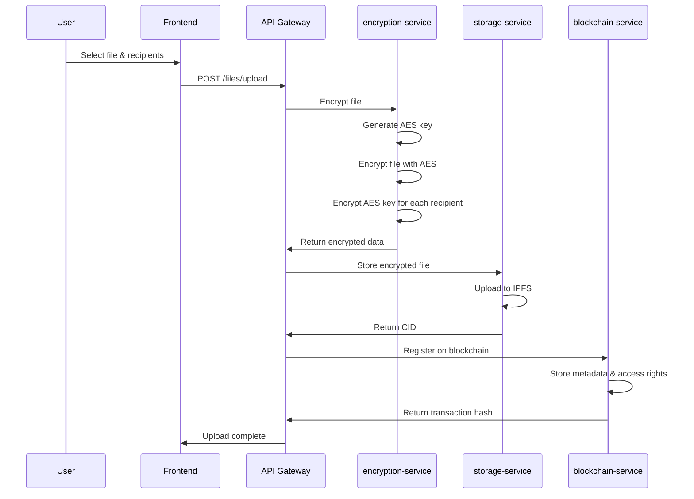
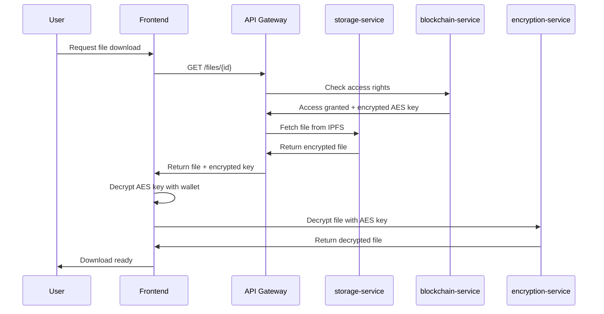

# 🔐 OM VaultChain

**Decentralized Encrypted File Storage Platform**

> A SaaS platform for encrypted file storage using client-side encryption, blockchain anchoring (Ethereum/Polygon), and decentralized storage with IPFS.

---

## 🌟 Features

- **🔒 Client-Side Encryption** - Your files are encrypted before leaving your device
- **🌐 Blockchain Anchoring** - Immutable access control via Ethereum/Polygon
- **📡 Decentralized Storage** - Files stored on IPFS for maximum availability
- **🔑 Wallet Authentication** - No passwords, just your crypto wallet
- **👥 Granular Access Control** - Share files with specific users
- **🔄 Version Control** - Track file versions and changes
- **📊 Admin Dashboard** - Complete platform monitoring and management

---

## 🎯 Target Audience

- **🏢 Enterprises** handling sensitive data
- **⚖️ Legal Professionals** (lawyers, accountants)
- **👤 Privacy-Conscious Individuals** 
- **🛡️ Cybersecurity Companies**

---

## 🏗️ Architecture Overview



---

## 📱 Frontend Applications

### 🎨 User Portal (Front Office)

**Purpose**: Enable end users to manage their encrypted files with full access control

#### 🧩 Core Modules

| Module | Description |
|--------|-------------|
| **📊 Personal Dashboard** | File overview, shared files, sorting & filtering |
| **⬆️ Secure Upload** | Client-side encryption, IPFS upload, access management |
| **🔗 Access Management** | Grant/revoke access, view permissions, action history |
| **👁️ File Viewer** | Download, decrypt, and view files securely |
| **🔄 Version Control** | Track file versions, download previous versions |
| **👤 User Profile** | Wallet info, account management |

### 🛠️ Admin Portal (Back Office)

**Purpose**: Platform supervision, abuse detection, global access management

#### 🧩 Admin Features

| Feature | Description |
|---------|-------------|
| **📈 Analytics Dashboard** | File counts, storage usage, user activity |
| **🔍 Audit & History** | Access logs, permission changes, usage tracking |
| **👥 User Management** | User administration, permission resets |
| **📡 IPFS Monitoring** | File availability, CID validation, pinning status |
| **🚨 Incident Management** | Abuse reporting, user notifications |
| **💳 Billing & Plans** | Payment processing, subscription management |

### 🔐 Authentication System

**Purpose**: Secure wallet-based authentication without passwords

#### 🧩 Auth Components

- **🔗 Wallet Connection** - MetaMask, WalletConnect integration
- **✍️ Signature Verification** - EIP-191 challenge signing
- **🎟️ Session Management** - JWT token handling
- **🚪 Logout & Security** - Secure session termination

---

## 🔧 Backend Microservices

### 🔑 auth-service

**Role**: Wallet-based authentication and session management

#### 🧱 Internal Components

| Component | Function |
|-----------|----------|
| **ChallengeManager** | Generate unique nonce for each wallet |
| **SignatureVerifier** | Verify EIP-191 signatures |
| **JWTTokenService** | Issue and validate JWT tokens |
| **UserRegistry** | Map wallets to user metadata |

```
auth-service/
├── src/
│   ├── controllers/
│   │   └── AuthController.java
│   ├── services/
│   │   ├── ChallengeManager.java
│   │   ├── SignatureVerifier.java
│   │   ├── JWTTokenService.java
│   │   └── UserRegistry.java
│   └── config/
│       └── SecurityConfig.java
├── pom.xml
└── README.md
```

### 🔒 encryption-service

**Role**: AES encryption, asymmetric key management, file hashing

#### 🧱 Internal Components

| Component | Function |
|-----------|----------|
| **AESService** | AES-256-GCM encryption/decryption |
| **AsymmetricEncryptionService** | RSA/ECIES key encryption |
| **FileHashService** | SHA-256 file hashing |
| **IVGenerator** | Secure IV generation |
| **KeyEnvelopeBuilder** | Multi-user key management |
| **CryptoOrchestrator** | Coordinate encryption workflow |

```
encryption-service/
├── src/
│   ├── controllers/
│   │   └── CryptoController.java
│   ├── services/
│   │   ├── AESService.java
│   │   ├── AsymmetricEncryptionService.java
│   │   ├── FileHashService.java
│   │   ├── IVGenerator.java
│   │   ├── KeyEnvelopeBuilder.java
│   │   └── CryptoOrchestrator.java
│   └── models/
│       └── EncryptionResult.java
├── pom.xml
└── README.md
```

### 📦 storage-service

**Role**: IPFS file management, pinning, and metadata extraction

#### 🧱 Internal Components

| Component | Function |
|-----------|----------|
| **IPFSClient** | Communicate with IPFS gateways |
| **CIDVerifier** | Validate CID integrity |
| **MetadataExtractor** | Extract file metadata |
| **BatchUploader** | Batch file operations |
| **FileStorageController** | API endpoints |

```
storage-service/
├── src/
│   ├── controllers/
│   │   └── FileStorageController.java
│   ├── services/
│   │   ├── IPFSClient.java
│   │   ├── CIDVerifier.java
│   │   ├── MetadataExtractor.java
│   │   └── BatchUploader.java
│   └── models/
│       └── FileMetadata.java
├── pom.xml
└── README.md
```

### ⛓️ blockchain-service

**Role**: Smart contract interaction, access control, event management

#### 🧱 Internal Components

| Component | Function |
|-----------|----------|
| **SmartContractClient** | Web3j integration |
| **FileRegistryService** | File registration on-chain |
| **AccessRightsService** | Permission management |
| **VersioningService** | Version tracking |
| **BlockchainMetadataMapper** | Data mapping |
| **EventListenerService** | Event monitoring |

```
blockchain-service/
├── src/
│   ├── controllers/
│   │   └── BlockchainController.java
│   ├── services/
│   │   ├── SmartContractClient.java
│   │   ├── FileRegistryService.java
│   │   ├── AccessRightsService.java
│   │   ├── VersioningService.java
│   │   ├── BlockchainMetadataMapper.java
│   │   └── EventListenerService.java
│   └── contracts/
│       └── FileRegistry.sol
├── pom.xml
└── README.md
```

---

## 🌐 API Gateway

**Central entry point for all frontend-backend communication**

### 🔗 API Endpoints

#### 🔐 Authentication & Session
- `POST /auth/challenge` - Generate wallet challenge
- `POST /auth/login` - Verify signature and create session
- `POST /auth/logout` - Terminate session

#### 📁 File Management
- `POST /files/upload` - Upload encrypted file
- `GET /files/{id}` - Download file
- `DELETE /files/{id}` - Delete file
- `GET /files/metadata/{id}` - Get file metadata

#### 🎯 Access Control
- `POST /access/grant` - Grant file access
- `POST /access/revoke` - Revoke file access
- `GET /access/{fileId}` - List file permissions

#### 📚 Version Control
- `POST /versions/upload` - Upload new version
- `GET /versions/{fileId}` - Get version history
- `GET /versions/{fileId}/{version}` - Get specific version

#### 📊 Analytics (Admin)
- `GET /admin/stats` - Platform statistics
- `GET /admin/users` - User management
- `GET /admin/audit` - Audit logs

---

## 🔄 Typical Workflow

### 📤 File Upload Process



### 📥 File Download Process



---

## 🛡️ Security Features

### 🔒 Encryption Standards
- **AES-256-GCM** for file encryption
- **RSA/ECIES** for key encryption
- **SHA-256** for file integrity
- **EIP-191** for wallet signatures

### 🔐 Access Control
- **Blockchain-based** permissions
- **Revocable** access rights
- **Transparent** audit trail
- **Multi-user** sharing

### 🌐 Decentralization
- **IPFS** for file storage
- **Blockchain** for access control
- **No single point** of failure
- **Censorship resistant**

---

## 🚀 Getting Started

### Prerequisites
- Node.js 18+
- Java 11+
- Docker
- MetaMask or compatible wallet

### Installation

1. **Clone the repository**
   ```bash
   git clone https://github.com/your-org/om-vaultchain.git
   cd om-vaultchain
   ```

2. **Install dependencies**
   ```bash
   # Frontend
   cd frontend
   npm install
   
   # Backend services
   cd ../backend
   mvn clean install
   ```

3. **Configure environment**
   ```bash
   cp .env.example .env
   # Edit .env with your configuration
   ```

4. **Start services**
   ```bash
   docker-compose up -d
   ```

5. **Access the application**
   - User Portal: `http://localhost:3000`
   - Admin Portal: `http://localhost:3001`
   - API Gateway: `http://localhost:8080`

---

## 📊 Monitoring & Analytics

### 📈 Key Metrics
- **Storage Usage** - Total files and volume
- **User Activity** - Active users and sessions
- **Access Patterns** - File sharing statistics
- **System Health** - Service availability

### 🔍 Audit Capabilities
- **Access Logs** - Who accessed what and when
- **Permission Changes** - Grant/revoke history
- **File Operations** - Upload, download, delete tracking
- **Security Events** - Failed authentication attempts

---

## 🤝 Contributing

We welcome contributions! Please see our [Contributing Guide](CONTRIBUTING.md) for details.

### Development Workflow
1. Fork the repository
2. Create a feature branch
3. Make your changes
4. Add tests
5. Submit a pull request

---

## 📄 License

This project is licensed under the MIT License - see the [LICENSE](LICENSE) file for details.

---

## 🆘 Support

- **Documentation**: [docs.omvaultchain.com](https://docs.omvaultchain.com)
- **Issues**: [GitHub Issues](https://github.com/your-org/om-vaultchain/issues)
- **Community**: [Discord](https://discord.gg/omvaultchain)
- **Email**: support@omvaultchain.com

---

## 🙏 Acknowledgments

- **IPFS** - For decentralized storage
- **Ethereum** - For blockchain infrastructure
- **MetaMask** - For wallet integration
- **Web3 Community** - For inspiration and support

---

<div align="center">
  <strong>🔐 Secure • 🌐 Decentralized • 🚀 Scalable</strong>
  <br>
  <em>Built with ❤️ by the OM VaultChain Team</em>
</div>
