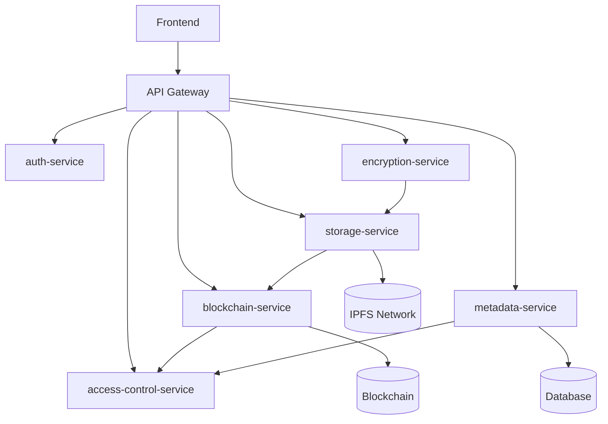
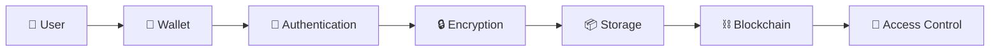

# 🔐 OM VaultChain

> **SaaS Platform for Encrypted File Storage with Blockchain Access Control**

A decentralized file storage platform utilizing client-side encryption, blockchain (Ethereum/Polygon) for anchoring and access control, and IPFS for decentralized data backup.

---

## 📋 Table of Contents

- [🎯 Project Overview](#-project-overview)
- [🏗️ Architecture](#️-architecture)
- [🖥️ Frontend Layer](#️-frontend-layer)
- [🌐 API Gateway](#-api-gateway)
- [🔧 Backend Microservices](#-backend-microservices)
- [📊 Service Architecture Diagrams](#-service-architecture-diagrams)

---

## 🎯 Project Overview

### 🌟 Context
OM VaultChain is a SaaS platform for encrypted file storage that leverages:
- **Client-side encryption** for maximum security
- **Blockchain** (Ethereum/Polygon) for immutable access control
- **IPFS** for decentralized data storage

### 🚀 Project Objectives
- ✅ Enable users to upload encrypted files with full access control
- ✅ Provide revocable, traceable, transparent, and tamper-proof access system
- ✅ Deliver secure, scalable infrastructure compliant with privacy requirements

### 👥 Target Audience
- **🏢 Enterprises** handling sensitive data
- **⚖️ Legal professionals** (lawyers, accountants)
- **👤 Individuals** protecting personal documents
- **🛡️ Cybersecurity companies**

---

## 🏗️ Architecture

### 🔧 Microservices Architecture Overview

```
┌─────────────────┐    ┌─────────────────┐
│  Frontend Layer │    │   API Gateway   │
└─────────────────┘    └─────────────────┘
         │                       │
         └───────────────────────┘
                     │
    ┌────────────────┼────────────────┐
    │                │                │
┌───▼────┐    ┌─────▼─────┐    ┌────▼────┐
│Backend │    │Blockchain │    │ Storage │
│Services│    │  Layer    │    │  (IPFS) │
└────────┘    └───────────┘    └─────────┘
```

**Core Components:**
- 🖥️ Frontend Layer
- 🌐 API Gateway
- 🔧 Microservices (Backend Logic)
- 📦 Decentralized Storage (IPFS)
- ⛓️ Smart Contract Layer (Blockchain)
- 🔧 Internal Services (Back Office, Admin, Logging)

---

## 🖥️ Frontend Layer

### 🎨 Front Office App (User Platform)

> **🎯 Purpose:** Enable end users to manage their encrypted files in a decentralized manner with access control

#### 🧩 Functional Components

<details>
<summary><strong>📊 Personal Dashboard</strong></summary>

**Features:**
- 📁 List of uploaded encrypted files
- 🤝 List of files shared with me
- 🔄 Sort by date, size, name, owner
</details>

<details>
<summary><strong>🔒 Secure Upload Module</strong></summary>

**Workflow:**
1. 📁 Local file selection
2. 🔐 Client-side encryption (JavaScript or via microservice)
3. ⬆️ Upload to IPFS
4. 👥 Choose users to grant access (via public address)
5. 🔧 Call encryption-service + blockchain-service
</details>

<details>
<summary><strong>🔑 Sharing & Access Management</strong></summary>

**Features:**
- 👀 View who has access to each file
- ➕ Add user (encrypt AES key for their pubkey)
- ❌ Revoke user access
- 📜 Action history
</details>

<details>
<summary><strong>📁 File Viewer / Download</strong></summary>

**Process:**
1. 📥 Download encrypted file from IPFS (via CID)
2. 🔑 Retrieve encrypted AES key from smart contract
3. 🔓 Decrypt locally with wallet private key
</details>

<details>
<summary><strong>🕐 Version History</strong></summary>

**Features:**
- 📋 View all versions of a file
- ⬇️ Download previous version
- ⬆️ Upload new version (repeats process)
</details>

<details>
<summary><strong>👤 User Profile</strong></summary>

**Features:**
- 💳 Display wallet address
- 🔑 (Optional) View public keys
- 🗑️ Delete account or files
</details>

---

### 🔧 Back Office App (Admin Portal)

> **🎯 Purpose:** Supervise platform usage, detect abuse, manage global access, handle support requests

#### 🧩 Functional Components

<details>
<summary><strong>📊 Global Analytics View</strong></summary>

**Metrics:**
- 📁 Number of files
- 💾 Total storage volume
- 👥 Activity per user
- 💰 Usage by pricing plan
</details>

<details>
<summary><strong>🔍 Audit & History</strong></summary>

**Features:**
- 👀 View who accessed what, when
- 🔄 See when access was shared/revoked
- 📜 Usage logs for each file
</details>

<details>
<summary><strong>👥 User Management</strong></summary>

**Actions:**
- 🗑️ Delete user
- 🔄 Reset permissions
- 🔁 Replay access sharing
</details>

<details>
<summary><strong>📡 IPFS Supervision</strong></summary>

**Monitoring:**
- ❌ Invalid or unavailable files
- 🔍 CID or pinning anomalies
</details>

<details>
<summary><strong>🚨 Incident Management</strong></summary>

**Actions:**
- 🚩 Mark file as abusive
- 📧 Notify user
- 🚫 Remove access
</details>

<details>
<summary><strong>💳 Billing & Plans</strong></summary>

**Features:**
- 📊 Number of stored files
- 💰 Stripe / Web3 payments
- 📋 Plan status (free/premium)
</details>

---

### 🔐 Authentication & Session UI

> **🎯 Purpose:** Securely identify users without passwords (wallet-based auth)

#### 🧩 Functional Components

<details>
<summary><strong>🔑 Login Screen</strong></summary>

**Process:**
1. 🔘 "Connect with MetaMask or WalletConnect" button
2. 🎲 Generate challenge (nonce)
3. ✍️ Sign with wallet (ethers.js)
4. 📤 Send signature → backend → verification
5. ✅ If OK → JWT session token
</details>

<details>
<summary><strong>📱 Session & Logout</strong></summary>

**Features:**
- 💾 Frontend tracking (localStorage or memory)
- 🔗 Token attached to each API request
- 🚪 Logout = flush + revoke
</details>

> **🛠️ Technologies:** Free to use what you want

---

## 🌐 API Gateway

> **🎯 Primary Role:** Serve as intermediary between frontend and all backend microservices

**Key Features:**
- 🔒 Secure, traceable, extensible
- 🚪 Single entry point for the platform

### 🔧 Main API Axes

<details>
<summary><strong>🔐 Authentication & Session</strong></summary>

- Wallet connection (MetaMask, WalletConnect)
- Challenge signature (EIP-191)
- JWT session management
</details>

<details>
<summary><strong>📁 Files & Upload</strong></summary>

- Secure file upload
- Server or client-side encryption
- IPFS upload
- CID, IV, hash reception
</details>

<details>
<summary><strong>🎯 Sharing & Access Control</strong></summary>

- Grant or revoke user access
- Generate encrypted AES keys for each public key
- Retrieve access rights
</details>

<details>
<summary><strong>🔓 Decryption & Download</strong></summary>

- Retrieve encrypted file (by CID)
- Retrieve encrypted AES key for user
- Local decryption via private key
</details>

<details>
<summary><strong>🧾 Metadata & History</strong></summary>

- List owned or shared files
- File details (name, CID, version, date)
- Access and action history
</details>

<details>
<summary><strong>📚 Version Management</strong></summary>

- Upload new version
- Retrieve version history
- Mark version as stable or final
</details>

<details>
<summary><strong>🧑‍💼 User & Profile</strong></summary>

- Display wallet info
- Public key management (optional registration)
- Account deletion (opt-out)
</details>

<details>
<summary><strong>📊 Administration (Backoffice)</strong></summary>

- Monitor stored files/users
- Usage logs
- Forced access revocation
- Support actions
</details>

<details>
<summary><strong>💳 Billing & SaaS Plan</strong></summary>

- Subscription/unsubscription
- Consumption history
- Stripe/Web3 pay integration
</details>

<details>
<summary><strong>🛰️ Notifications & Alerts (Optional)</strong></summary>

- New access received
- Access revoked
- File update
</details>

---

## 🔧 Backend Microservices

### 🔐 auth-service

> **🎯 Role:** Secure authentication via wallet signatures

#### 🧱 Internal Components

<details>
<summary><strong>🎲 ChallengeManager</strong></summary>

- Generate unique random string per wallet
- Store challenge temporarily (memory cache or Redis)
- **Expiration:** 5 minutes
</details>

<details>
<summary><strong>✍️ SignatureVerifier</strong></summary>

- Uses web3j or ethers (Java lib) to:
  - Extract address from signature
  - Compare with provided walletAddress
  - Returns true if signed by owner
</details>

<details>
<summary><strong>🎫 JWTTokenService</strong></summary>

- Generate JWT token after verification
  - Wallet address
  - Role ("user" or "admin")
  - Expiration date
- Enable token validation on other microservices
</details>

<details>
<summary><strong>👤 UserRegistry</strong></summary>

- Map wallet → user metadata (e.g., publicKey)
- Add internal SaaS profile data
- Storage: MongoDB, PostgreSQL, or Redis
</details>

**📁 Project Structure:**
```
auth-service/
├── src/main/java/com/omvaultchain/auth/
│   ├── controller/
│   │   └── AuthController.java
│   ├── service/
│   │   ├── ChallengeManager.java
│   │   ├── SignatureVerifier.java
│   │   ├── JWTTokenService.java
│   │   └── UserRegistry.java
│   ├── model/
│   │   └── AuthRequest.java
│   └── config/
│       └── SecurityConfig.java
├── Dockerfile
└── pom.xml
```

---

### 🔐 encryption-service

> **🎯 Role:** Handle all cryptographic operations

#### 🧱 Internal Components

**Flow:** `IVGenerator → AESService → AsymmetricEncryptionService → FileHashService → CryptoOrchestrator`

<details>
<summary><strong>🔒 AESService</strong></summary>

**Role:** Manage AES-256-GCM encryption/decryption

**Functions:**
- `generateKey()` → generates 256-bit AES key
- `encrypt(data, key)` → returns encryptedData, iv, tag
- `decrypt(encryptedData, key, iv)` → returns original data

**Tech:** Javax.crypto or BouncyCastle
</details>

<details>
<summary><strong>🔑 AsymmetricEncryptionService</strong></summary>

**Role:** Encrypt/decrypt AES key with RSA or ECIES public/private keys

**Functions:**
- `encryptAESKeyWithPublicKey(aesKey, publicKey)`
- `decryptAESKeyWithPrivateKey(encryptedKey, privateKey)`

**Mode:** RSA/ECB/OAEPWithSHA-256AndMGF1Padding or ECIES
</details>

<details>
<summary><strong>🔍 FileHashService</strong></summary>

**Role:** Generate SHA-256 file hash

**Purpose:** Verify integrity or uniquely identify files

**Functions:**
- `computeHash(data): String` (hex or base64)
</details>

<details>
<summary><strong>🎲 IVGenerator</strong></summary>

**Role:** Generate random IV (12 bytes) for AES-GCM

**Security:** Based on SecureRandom

**Function:**
- `generateIV(): byte[]`
</details>

<details>
<summary><strong>📦 KeyEnvelopeBuilder</strong></summary>

**Role:** Build "encrypted AES key + user ID" object

**Used when:** Sharing file with multiple people

**Returns:** `Map<userId, AESKeyEnvelope>`

**Each envelope contains:**
- encryptedAESKey
- publicKeyUsed
- EncryptionAlgorithm
</details>

<details>
<summary><strong>🎼 CryptoOrchestrator</strong></summary>

**Role:** Coordinate entire process

**Typical execution:**
1. Generate AES key
2. Encrypt file
3. Generate hash
4. For each recipient, encrypt AES key
5. Return all info needed for upload + blockchain
</details>

<details>
<summary><strong>🎮 CryptoController</strong></summary>

**Exposes endpoints:**
- `POST /encrypt` → takes file + public keys, returns storage info
- `POST /decrypt` → takes encrypted file + decrypted AES key + IV, returns original file
</details>

---

### 📦 storage-service

> **🎯 Role:** Manage IPFS storage operations

#### 🧱 Internal Components

<details>
<summary><strong>🌐 IPFSClient</strong></summary>

**Role:** Communicate with IPFS gateway (Pinata, Web3.Storage, or local)

**Functions:**
- `upload(file: byte[])` → CID
- `fetch(cid: String)` → file
- `pin(cid: String)`, `unpin(cid: String)`

**Uses:** HTTP REST to Pinata or Web3.Storage
</details>

<details>
<summary><strong>✅ CIDVerifier</strong></summary>

**Role:** Verify CID returned by IPFS matches content (file hash)

**Function:**
- `validateCID(file, expectedCID)` → boolean
</details>

<details>
<summary><strong>📊 MetadataExtractor</strong></summary>

**Role:** Extract and return stored file info

**Info:** size, CID, MIME type (if known), upload date

**Function:**
- `extractMetadata(file: byte[])` → FileMetadata
</details>

<details>
<summary><strong>📦 BatchUploader (Optional)</strong></summary>

**Role:** Upload multiple encrypted files at once (e.g., zip or JSON array)

**Feature:** Generates Merkle Root to represent file batch
</details>

<details>
<summary><strong>🎮 FileStorageController</strong></summary>

**API exposed to other services:**
- `POST /store` → encrypted file → returns CID, hash, metadata
- `GET /file/:cid` → retrieves file from IPFS
- `DELETE /file/:cid` → removes (unpin) file (if authorized)
</details>

**🔁 Relations with other services:**
- **📥 Receives:** encrypted file from encryption-service (via API Gateway)
- **📤 Provides:**
  - CID to blockchain-service
  - metadata to metadata-service

---

### ⛓️ blockchain-service

> **🎯 Role:** Handle blockchain operations and smart contract interactions

#### 🧱 Internal Components

<details>
<summary><strong>🔗 SmartContractClient</strong></summary>

**Connects backend to smart contracts via web3j (Java lib)**

**Functions:**
- `deployContract()`
- `loadContract(address)`
- `callContractMethod(name, params)`
- `listenToEvents()`
</details>

<details>
<summary><strong>📋 FileRegistryService</strong></summary>

**Registers file in smart contract:**
- CID
- Hash
- Encrypted AES Keys (per user)
- Metadata (upload date, owner, version)
</details>

<details>
<summary><strong>🔑 AccessRightsService</strong></summary>

**Manages rights:**
- `grantAccess(fileId, userAddress, encryptedAESKey)`
- `revokeAccess(fileId, userAddress)`
- `getAccessList(fileId)`
</details>

<details>
<summary><strong>🔄 VersioningService</strong></summary>

**Handles file versions:**
- Register new file version
- Maintain link between old and new versions
- (e.g., version tree or linked list on-chain)
</details>

<details>
<summary><strong>🗂️ BlockchainMetadataMapper</strong></summary>

**Converts retrieved info to backend-understandable objects**

**Parses:** Solidity structures (tuples, arrays)
</details>

<details>
<summary><strong>👂 EventListenerService</strong></summary>

**Listens to emitted events:**
- FileUploaded
- AccessGranted
- AccessRevoked
- VersionAdded

**Can send events to:** audit-log-service or frontend
</details>

**🔁 Interactions with other services:**
- **encryption-service:** provides encrypted AES keys
- **storage-service:** provides CID
- **metadata-service:** provides filename, MIME type, etc.
- **access-control-service:** controls access rights
- **frontend:** consults access, history, etc.

---

### 🔐 access-control-service

> **🎯 Role:** The "gatekeeper" - manage file access permissions

#### 🧱 Internal Components

<details>
<summary><strong>✅ AccessGrantService</strong></summary>

**Role:** Share file access with new user

**Actions:**
- Retrieve file's AES key (already encrypted for them)
- Call blockchain-service to register access
</details>

<details>
<summary><strong>❌ AccessRevokeService</strong></summary>

**Role:** Remove user access (soft or strict)

**Actions:**
- Mark user as "revoked" in smart contract
- (Optional) notify associated services
</details>

<details>
<summary><strong>🔍 AccessValidator</strong></summary>

**Role:** Verify if user has file access rights

**Used during:** download or frontend display

**Checks:** on-chain status via blockchain-service
</details>

<details>
<summary><strong>🚚 AESKeyDeliveryService</strong></summary>

**Role:** Deliver correct encrypted AES key version to user

**Process:**
- Key retrieved via blockchain-service (AESKey[user] on-chain storage)
- Ensures key is linked to correct CID/version
</details>

<details>
<summary><strong>👥 GroupAccessService (Optional)</strong></summary>

**Role:** Share file with multiple users simultaneously (group)

**Benefits:** Simplifies enterprise SaaS management
</details>

#### 📋 Example Logic

**Access Sharing:**
1. Frontend: "I want to share this file with Bob"
2. access-control-service:
   - Takes file's AES key
   - Encrypts it with Bob's public key (or takes pre-encrypted version)
   - Calls blockchain-service → registers encrypted AES key for Bob
3. Bob can then download file + retrieve this key for decryption

**Revocation:**
- Owner revokes user access
- access-control-service calls blockchain-service → access status = revoked
- Frontend blocks download/decryption

**🔁 Interactions:**
- **blockchain-service:** register/read chain access
- **encryption-service:** re-encrypt AES key if needed
- **metadata-service:** retrieve human-readable file info
- **frontend:** display access info and send user actions

---

### 📊 metadata-service

> **🎯 Role:** Manage human-readable file metadata

#### 🧱 Internal Components

<details>
<summary><strong>📋 FileMetadataRegistry</strong></summary>

**Role:** Register readable file info

**Receives:** fileId, name, type, size, CID, owner, date

**Creates:** link between CID and metadata
</details>

<details>
<summary><strong>🔄 VersionManager</strong></summary>

**Role:** Link successive file versions

**Example:**
- v1 → CID: abc123
- v2 → CID: def456
- v3 → CID: ghi789

**Maintains:** consultable history for user
</details>

<details>
<summary><strong>🔍 MetadataQueryService</strong></summary>

**Role:** Query metadata from frontend or other services

**Can return:**
- User's file list
- File details
- Version history
</details>

<details>
<summary><strong>🔄 MetadataMapper</strong></summary>

**Role:** Transform database data to frontend-usable objects

**Features:**
- Format dates
- Convert size to MB/KB, etc.
</details>

<details>
<summary><strong>👤 FileOwnerValidator</strong></summary>

**Role:** Verify only file owner can modify metadata

**Used during:** renaming or updates
</details>

#### 📦 Example Registration

```json
{
  "fileId": "dcf9-22a1-45a4",
  "CID": "Qmbvdwxc...",
  "name": "contract_partner.pdf",
  "type": "application/pdf",
  "size": 2184000,
  "owner": "0xAbc123...",
  "uploadDate": "2025-07-03T14:02Z",
  "version": 3,
  "previousVersion": "CID v2",
  "description": "Contract signed by both parties"
}
```

**🔁 Interactions:**
- **storage-service:** provides CID + file size
- **blockchain-service:** provides owner + file ID (fileId)
- **access-control-service:** can display files accessible by user
- **frontend:** lists user's files, metadata, history

---

## 📊 Service Architecture Diagrams

### 🔄 Data Flow Overview



### 🔐 Security Architecture



---

## 🚀 Development Guidelines

### 📋 Best Practices

- **🔒 Security First:** Always implement client-side encryption
- **🔄 Immutable Records:** All critical data must be blockchain-anchored
- **📊 Comprehensive Logging:** Track all access and modifications
- **🧪 Test Coverage:** Ensure robust testing for all microservices
- **📚 Documentation:** Maintain clear API documentation

### 🎯 Success Metrics

- **🔐 Security:** Zero data breaches
- **⚡ Performance:** <2s file access time
- **🌍 Scalability:** Support 10k+ concurrent users
- **🔄 Reliability:** 99.9% uptime

---

> **💡 Remember:** This is a living document. Update it as the project evolves and new requirements emerge.

---

**Built with ❤️ by the OM VaultChain Team**
