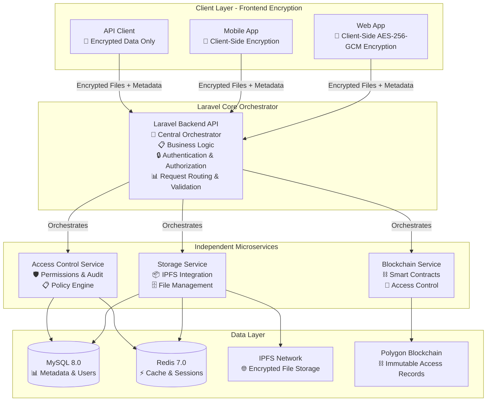
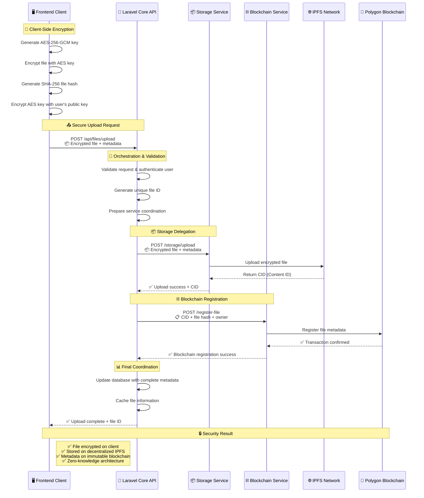
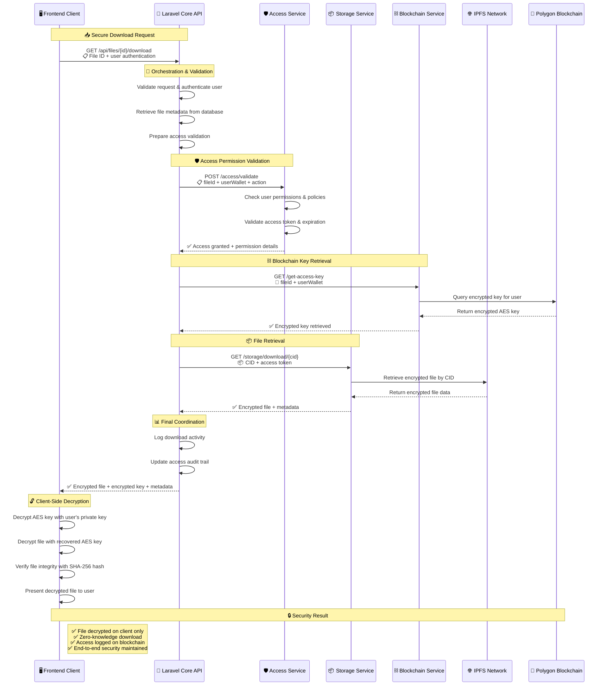
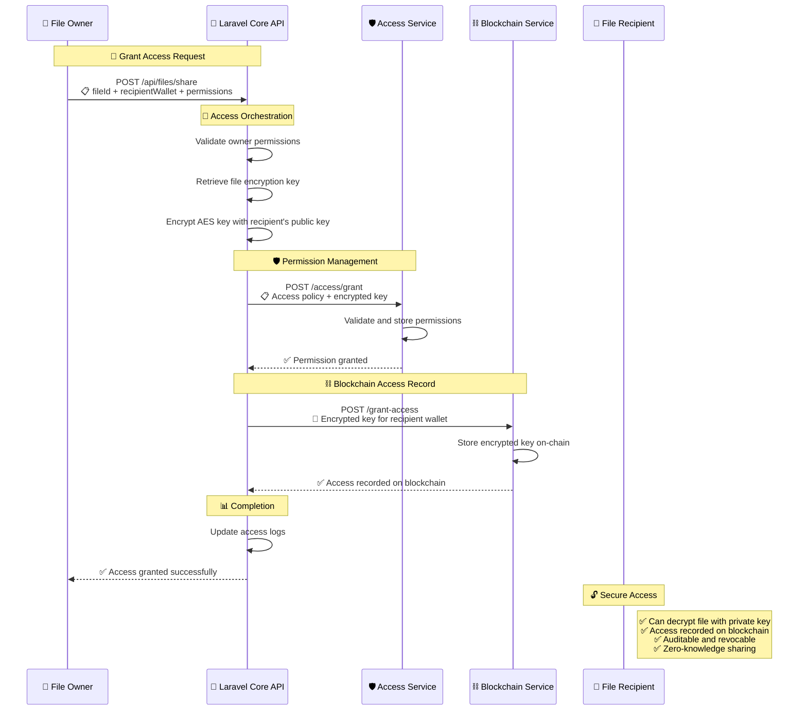
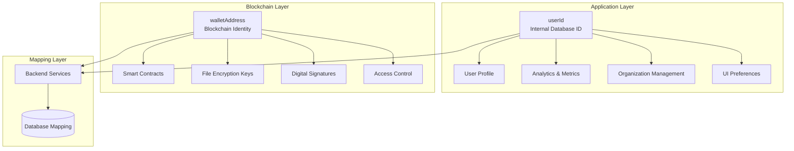
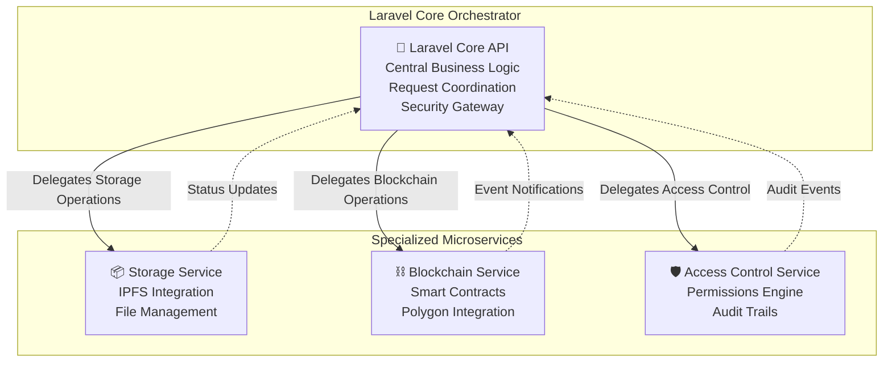

# 🔐 OM VaultChain - Decentralized File Storage Platform

<div align="center">


**Secure • Decentralized • Blockchain-Powered**

[](https://reactjs.org/)
[](https://openjdk.org/)
[](https://spring.io/projects/spring-boot)
[](https://soliditylang.org/)
[](https://ipfs.io/)
[](https://docker.com/)

</div>

---

## 🌟 What is OM VaultChain?

**OM VaultChain (OMVC)** is a next-generation decentralized file storage platform that combines **client-side encryption**, **blockchain access control**, and **IPFS storage** to create a truly secure and private file management system.

### 🔒 How It Works

**OM VaultChain** implements a **Laravel-orchestrated microservices architecture** that ensures maximum security through client-side encryption and decentralized storage:

1. **🔐 Frontend Encryption**: Files are encrypted in your browser using AES-256-GCM before any data leaves your device
2. **🎯 Laravel Core Orchestration**: The Laravel backend API acts as the central coordinator, routing encrypted files and metadata to specialized services
3. **📦 Decentralized Storage**: Laravel delegates encrypted file storage to the Storage Service, which uploads to IPFS for durability and censorship resistance
4. **⛓️ Blockchain Registration**: Laravel coordinates with the Blockchain Service to register file metadata and access permissions on Polygon blockchain
5. **🛡️ Access Control Management**: Laravel orchestrates permission granting/revoking through the Access Control Service and smart contracts
6. **🔄 Zero-Knowledge Architecture**: The Laravel core never sees unencrypted files - only coordinates encrypted data between services

### 🎯 Key Benefits

- **🛡️ True Privacy**: Client-side encryption ensures only you control access to your data
- **🌍 Decentralized**: No single point of failure with IPFS distributed storage
- **⚖️ Transparent**: All access permissions recorded on blockchain for auditability
- **🔄 Revocable**: Grant and revoke access permissions in real-time
- **📱 Cross-Platform**: Works on web, mobile, and desktop applications

---

## 📋 Table of Contents

- [🚀 Quick Start](#-quick-start)
- [🏗️ Architecture Overview](#️-architecture-overview)
- [🛠️ Technology Stack](#️-technology-stack)
- [🔧 Microservices](#-microservices)
- [⛓️ Smart Contracts](#️-smart-contracts)
- [🗄️ Database Schema](#️-database-schema)
- [🐳 Docker Deployment](#-docker-deployment)
- [🔒 Security Features](#-security-features)
- [📱 API Documentation](#-api-documentation)
- [🧪 Testing](#-testing)
- [🚀 Development Setup](#-development-setup)
- [📈 Roadmap](#-roadmap)

---

## 🚀 Quick Start

### Prerequisites
- **PHP 8.1+** - For Laravel Core API
- **Composer** - PHP dependency management
- **Java 17+** - For microservices (Storage, Blockchain, Access Control)
- **Node.js 18+** - For smart contract development and frontend
- **Docker & Docker Compose** - For containerized deployment
- **MySQL 8.0+** - Database for Laravel and microservices
- **Redis 7.0+** - Caching layer and session storage

### 🏃‍♂️ Run with Docker

```bash
# Clone the repository
git clone https://github.com/your-org/om-vaultchain.git
cd om-vaultchain

# Set up environment variables
cp .env.example .env
# Edit .env with your configuration

# Start all services
docker-compose up -d

# Check service health
curl http://localhost:8000/api/health  # Laravel Core API
curl http://localhost:8003/health       # Storage Service
curl http://localhost:8004/health       # Blockchain Service
curl http://localhost:8005/health       # Access Control Service
```

### 🎯 Target Use Cases

- **🏢 Enterprise Document Management**: Secure sharing of confidential business documents
- **⚖️ Legal & Compliance**: Tamper-proof document storage with audit trails
- **🏥 Healthcare**: HIPAA-compliant patient record management
- **💼 Financial Services**: Secure client document storage and sharing
- **🎓 Education**: Secure academic record and certificate management
- **👤 Personal Privacy**: Individual secure file storage and sharing

---

## 🏗️ Architecture Overview

OM VaultChain follows a **microservices architecture** with a **Laravel backend core** acting as the central orchestrator, ensuring scalability, maintainability, and security through clear separation of concerns.

### 🎯 Core Architecture Principles

**OM VaultChain** implements a **Laravel-centric orchestration model** where the Laravel backend serves as the **primary API gateway and business logic coordinator**, delegating specialized operations to independent microservices while maintaining centralized control and consistency.

#### 🔄 Data Flow & Security Model



### 🎯 Laravel Core Orchestrator Responsibilities

The **Laravel backend** serves as the **central nervous system** of OM VaultChain, handling:

#### 🔐 **Security & Authentication**
- **User authentication** and session management
- **JWT token** generation and validation
- **Wallet signature** verification for blockchain identity
- **Rate limiting** and DDoS protection
- **Input validation** and sanitization

#### 📋 **Business Logic Coordination**
- **File upload orchestration**: Coordinates encrypted file storage and blockchain registration
- **Access control workflows**: Manages permission granting/revoking across services
- **Multi-service transactions**: Ensures consistency across storage and blockchain operations
- **Error handling and rollback**: Manages failures across distributed services

#### 🎯 **Request Routing & Validation**
- **API endpoint management**: Single entry point for all client requests
- **Request validation**: Ensures data integrity before service delegation
- **Response aggregation**: Combines results from multiple microservices
- **Service health monitoring**: Tracks microservice availability and performance

#### 📊 **Data Consistency & State Management**
- **Cross-service synchronization**: Maintains consistency between storage and blockchain
- **Cache management**: Coordinates Redis caching across services
- **Database transactions**: Manages MySQL operations and integrity
- **Event coordination**: Publishes and subscribes to inter-service events

---

## 🔐 Security-First Data Flow

OM VaultChain implements a **zero-knowledge architecture** where encryption happens entirely on the client-side before any data leaves the user's device, ensuring maximum privacy and security.

### 📤 **File Upload Flow**



### 📥 **File Download Flow**



### 🔑 **Access Control Flow**



### 🛡️ **Security Benefits**

#### 🔐 **Client-Side Encryption Advantages**
- **🚫 Zero Server-Side Decryption**: Laravel core never sees unencrypted files
- **🔒 End-to-End Security**: Files remain encrypted from client to IPFS storage
- **🛡️ Breach Protection**: Even if servers are compromised, files remain secure
- **🔑 User-Controlled Keys**: Only users with private keys can decrypt files
- **📱 Device-Level Security**: Encryption keys never leave user devices unprotected

#### ⛓️ **Blockchain Audit Trail**
- **📋 Immutable Records**: All file access and permissions recorded on-chain
- **🔍 Transparent Auditing**: Complete history of file access and modifications
- **🚫 Tamper-Proof**: Blockchain ensures access records cannot be altered
- **⚖️ Legal Compliance**: Cryptographic proof for regulatory requirements
- **🔄 Revocable Access**: Real-time permission revocation with blockchain verification

#### 🏗️ **Architectural Security**
- **🎯 Centralized Control**: Laravel orchestrator maintains security policies
- **🔄 Service Isolation**: Microservices operate independently with limited scope
- **📊 Consistent Validation**: All requests validated through single entry point
- **🛡️ Defense in Depth**: Multiple security layers across client, API, and services
- **⚡ Performance Security**: Redis caching with encrypted session management

---

## 🎯 Laravel Core API - Central Orchestrator

The **Laravel Core API** serves as the **primary entry point** and **business logic coordinator** for all OM VaultChain operations. It acts as an intelligent orchestrator that delegates specialized tasks to independent microservices while maintaining centralized control, security, and consistency.

### 🏗️ **Core Responsibilities**

#### 🔐 **Authentication & Security Gateway**
- **User Authentication**: JWT-based authentication with wallet signature verification
- **Request Validation**: Comprehensive input validation and sanitization
- **Rate Limiting**: DDoS protection and abuse prevention
- **Security Headers**: CORS, CSP, and other security policy enforcement
- **Session Management**: Secure session handling with Redis-backed storage

#### 🎯 **Service Orchestration**
- **Request Routing**: Intelligent routing of requests to appropriate microservices
- **Service Coordination**: Manages multi-service operations and transactions
- **Error Handling**: Centralized error handling with graceful degradation
- **Response Aggregation**: Combines and formats responses from multiple services
- **Circuit Breaker**: Prevents cascade failures across microservices

#### 📊 **Business Logic Management**
- **File Upload Workflow**: Orchestrates the complete encrypted file upload process
- **Access Control Workflow**: Manages permission granting/revoking across services
- **User Management**: Handles user registration, profiles, and organization management
- **Audit Coordination**: Ensures comprehensive logging across all operations
- **Policy Enforcement**: Applies business rules and compliance requirements

### 🔄 **Laravel API Endpoints**

#### 🔐 **Authentication & User Management**
```bash
POST /api/auth/register          # User registration with wallet
POST /api/auth/login             # Wallet-based authentication
POST /api/auth/logout            # Session termination
GET  /api/auth/profile           # User profile information
PUT  /api/auth/profile           # Update user profile
POST /api/auth/verify-wallet     # Wallet signature verification
```

#### 📤 **File Operations**
```bash
POST /api/files/upload           # Orchestrated file upload
GET  /api/files                  # List user files with pagination
GET  /api/files/{id}             # Get file metadata
PUT  /api/files/{id}             # Update file metadata
DELETE /api/files/{id}           # Soft delete file
GET  /api/files/{id}/download    # Secure file download
POST /api/files/{id}/share       # Share file with users
```

#### 🛡️ **Access Control**
```bash
POST /api/access/grant           # Grant file access
POST /api/access/revoke          # Revoke file access
GET  /api/access/permissions     # List user permissions
GET  /api/access/audit/{fileId}  # Access audit trail
POST /api/access/validate        # Validate access permissions
```

#### 🏢 **Organization Management**
```bash
POST /api/organizations          # Create organization
GET  /api/organizations          # List user organizations
POST /api/organizations/{id}/invite  # Invite users
GET  /api/organizations/{id}/files   # Organization files
PUT  /api/organizations/{id}/roles   # Manage user roles
```

### 🔄 **Service Integration Pattern**

The Laravel Core follows a **delegation pattern** where it maintains business logic while delegating specialized operations:

```php
<?php
// Example: File Upload Orchestration
class FileUploadController extends Controller
{
    public function upload(Request $request)
    {
        // 1. Laravel handles authentication & validation
        $this->validateRequest($request);
        $user = auth()->user();

        // 2. Generate file metadata
        $fileId = Str::uuid();
        $metadata = $this->extractMetadata($request);

        // 3. Delegate to Storage Service
        $storageResponse = $this->storageService->upload([
            'file' => $request->file('encrypted_file'),
            'metadata' => $metadata,
            'user_id' => $user->id
        ]);

        // 4. Delegate to Blockchain Service
        $blockchainResponse = $this->blockchainService->registerFile([
            'cid' => $storageResponse['cid'],
            'file_hash' => $metadata['hash'],
            'owner_wallet' => $user->wallet_address
        ]);

        // 5. Laravel coordinates final state
        $file = File::create([
            'id' => $fileId,
            'owner_id' => $user->id,
            'cid' => $storageResponse['cid'],
            'blockchain_tx' => $blockchainResponse['transaction_hash'],
            'metadata' => $metadata
        ]);

        // 6. Return coordinated response
        return response()->json([
            'file_id' => $fileId,
            'cid' => $storageResponse['cid'],
            'blockchain_tx' => $blockchainResponse['transaction_hash'],
            'status' => 'uploaded'
        ]);
    }
}
```

### 🛡️ **Security & Compliance**

#### 🔒 **Zero-Knowledge Coordination**
- **No Plaintext Access**: Laravel never receives or processes unencrypted files
- **Metadata Only**: Only handles encrypted files and associated metadata
- **Key Management**: Coordinates encrypted key distribution without key access
- **Audit Trail**: Maintains comprehensive logs without exposing sensitive data

#### ⚖️ **Compliance Features**
- **GDPR Compliance**: User data management and right to deletion
- **HIPAA Ready**: Healthcare data handling capabilities
- **SOX Compliance**: Financial audit trail requirements
- **Custom Policies**: Configurable compliance rules and validation

---

## � Identity & Access Model

OM VaultChain implements a **dual-identity architecture** that combines traditional application user management with blockchain-based decentralized identity. This hybrid approach ensures both user experience and cryptographic security while maintaining compatibility with existing systems.

### 🆔 Dual-Identity Architecture

OM VaultChain operates with two distinct but interconnected identity systems:



### 🏢 Internal User ID (`userId`)

The **`userId`** is a traditional UUID-based identifier used for application-level features and internal system management.

#### **Primary Use Cases:**
- **👤 User Profiles**: Personal information, preferences, and settings
- **📊 Analytics & Metrics**: Usage tracking, performance monitoring, and reporting
- **🏢 Organization Management**: Team memberships, role assignments, and enterprise features
- **🎨 UI/UX Personalization**: Interface preferences, themes, and customizations
- **📋 Application State**: Session management, caching, and internal workflows
- **🔍 Search & Discovery**: Personal file organization and metadata management

#### **Database Schema:**
```sql
CREATE TABLE users (
    id CHAR(36) PRIMARY KEY,           -- userId (UUID)
    wallet_address VARCHAR(42) UNIQUE, -- Associated wallet
    email VARCHAR(255),                -- Optional email
    display_name VARCHAR(100),         -- User display name
    profile_image_url TEXT,            -- Profile picture
    preferences JSON,                  -- UI/UX preferences
    created_at TIMESTAMP,
    updated_at TIMESTAMP,
    is_active BOOLEAN DEFAULT TRUE
);
```

### ⛓️ Wallet Address (`walletAddress`)

The **`walletAddress`** is the authoritative blockchain identity that controls cryptographic operations and decentralized access control.

#### **Primary Use Cases:**
- **🔐 Blockchain Access Control**: Smart contract-based permission management
- **🔑 Encrypted Key Management**: AES file keys encrypted with user's public key
- **📝 Smart Contract Interactions**: All on-chain operations and transactions
- **✍️ Signature-Based Authentication**: Cryptographic proof of identity
- **🛡️ Decentralized Verification**: Trustless identity verification
- **🔄 Cross-Platform Compatibility**: Universal identity across DApps

#### **Key Requirements:**
> **⚠️ Important**: Users must register their wallet address and public key before accessing any encrypted files.

```sql
CREATE TABLE user_wallets (
    wallet_address VARCHAR(42) PRIMARY KEY,
    public_key TEXT NOT NULL,              -- For encryption
    user_id CHAR(36),                      -- Link to internal user
    registered_at TIMESTAMP,
    is_verified BOOLEAN DEFAULT FALSE,
    FOREIGN KEY (user_id) REFERENCES users(id)
);
```

### 🔄 Identity Mapping & Compatibility

The backend maintains seamless mapping between both identity systems to ensure compatibility:

#### **Mapping Strategy:**
```java
@Service
public class IdentityMappingService {

    // Convert wallet address to internal user ID
    public UUID getUserIdByWallet(String walletAddress) {
        return userRepository.findByWalletAddress(walletAddress)
            .map(User::getId)
            .orElseThrow(() -> new UserNotFoundException("Wallet not registered"));
    }

    // Convert internal user ID to wallet address
    public String getWalletByUserId(UUID userId) {
        return userRepository.findById(userId)
            .map(User::getWalletAddress)
            .orElseThrow(() -> new UserNotFoundException("User not found"));
    }

    // Validate wallet registration
    public boolean isWalletRegistered(String walletAddress) {
        return userWalletRepository.existsByWalletAddress(walletAddress);
    }
}
```

### 🔑 Encryption & Key Management

The encryption system has been updated to use wallet-based identity for enhanced security:

#### **Previous Model (Deprecated):**
```java
// ❌ Old approach - using internal userId
encryptedKey = encryptAESKey(aesKey, getUserPublicKey(userId));
```

#### **Current Model (Wallet-Based):**
```java
// ✅ New approach - using wallet address
encryptedKey = encryptAESKey(aesKey, getWalletPublicKey(walletAddress));
```

#### **Key Association Process:**
1. **File Upload**: AES key generated for file encryption
2. **Key Encryption**: AES key encrypted using owner's wallet public key
3. **Blockchain Storage**: Encrypted key stored in smart contract
4. **Access Grant**: Additional encrypted copies created for each recipient's wallet
5. **Access Revoke**: Encrypted keys removed from smart contract

### 🏗️ Smart Contract Integration

All smart contracts operate exclusively with wallet addresses for decentralized verification:

#### **FileRegistry.sol**
```solidity
contract FileRegistry {
    struct File {
        string cid;
        string fileHash;
        address owner;        // wallet address only
        uint256 timestamp;
    }

    mapping(string => File) private files;

    function registerFile(string memory cid, string memory fileHash) public {
        files[cid] = File(cid, fileHash, msg.sender, block.timestamp);
    }
}
```

#### **AccessControl.sol**
```solidity
contract AccessControl {
    mapping(string => mapping(address => string)) private encryptedKeys;

    function grantAccess(
        string memory cid,
        address userWallet,     // wallet address only
        string memory encryptedKey
    ) public {
        require(isFileOwner(cid, msg.sender), "Not file owner");
        encryptedKeys[cid][userWallet] = encryptedKey;
    }
}
```

### 🔒 Authentication Flow

The authentication process combines both identity systems for optimal security and usability:

#### **Registration Process:**
1. **Wallet Connection**: User connects MetaMask/WalletConnect
2. **Signature Challenge**: Backend generates nonce for signature
3. **Identity Verification**: User signs challenge with private key
4. **Account Creation**: Internal `userId` created and linked to `walletAddress`
5. **Public Key Registration**: User's public key stored for encryption

#### **Login Process:**
1. **Wallet Authentication**: User signs login challenge
2. **Identity Resolution**: Backend maps `walletAddress` to `userId`
3. **Session Creation**: JWT token issued containing both identities
4. **Service Access**: Internal services use `userId`, blockchain services use `walletAddress`

### 🎯 Rationale & Benefits

#### **Why Dual-Identity?**

| **Aspect** | **Internal userId** | **Wallet Address** |
|------------|--------------------|--------------------|
| **Purpose** | Application features | Cryptographic operations |
| **Scope** | Database & UI | Blockchain & encryption |
| **Mutability** | Can be changed | Immutable |
| **Privacy** | Internal only | Public on blockchain |
| **Verification** | Database lookup | Cryptographic proof |

#### **Key Advantages:**
- **🔐 Enhanced Security**: Cryptographic identity for sensitive operations
- **🌐 Decentralization**: Reduced dependency on centralized identity systems
- **🔄 Future-Proof**: Preparation for full client-side encryption
- **⚡ Performance**: Optimized for both user experience and blockchain operations
- **🛡️ Verifiable Access**: Cryptographically provable file permissions
- **🔗 Interoperability**: Compatible with other Web3 applications

#### **Migration Path:**
> **📈 Future Vision**: This dual-identity model enables gradual migration toward fully decentralized, client-side encryption while maintaining current application functionality.

### 🚨 Important Considerations

> **⚠️ Wallet Registration Required**
> Users must register their wallet address and public key before accessing any encrypted files. Unregistered wallets cannot decrypt file content.

> **🔑 Key Recovery**
> If a user loses access to their wallet, they cannot recover encrypted files. Consider implementing social recovery or multi-signature solutions for enterprise users.

> **🔄 Address Changes**
> Changing wallet addresses requires re-encryption of all accessible files. This is a significant operation that should be carefully planned.

---

## �🛠️ Technology Stack

<div align="center">

| **Category** | **Technology** | **Version** | **Purpose** |
|--------------|----------------|-------------|-------------|
| 🔐 **Encryption** | Web Crypto API / CryptoJS | ES2021+ | AES-GCM, SHA-256, RSA key wrapping |
| 🌐 **Frontend** | React + TypeScript | 18+ | Client-side encryption interface |
| 🌐 **Backend** | Spring Boot | 3.2+ | Microservices framework |
| 📦 **Storage** | IPFS + Pinata | Latest | Decentralized file storage |
| ⛓️ **Blockchain** | Solidity + Hardhat | 0.8.19+ | Smart contracts on Polygon |
| 🔗 **Web3 SDK** | web3j | 4.9+ | Blockchain integration |
| 💾 **Database** | MySQL | 8.0+ | Metadata persistence |
| ⚡ **Cache** | Redis | 7.0+ | High-performance caching |
| 🐳 **Deployment** | Docker + Compose | Latest | Containerization |
| 🧪 **Testing** | JUnit + Mockito | 5+ | Unit & integration testing |
| 📊 **Monitoring** | Prometheus + Grafana | Latest | Metrics & observability |

</div>

---

## 🔧 Microservices

OM VaultChain implements a **Laravel-orchestrated microservices architecture** where the **Laravel Core API** acts as the central coordinator, delegating specialized operations to independent services. Each microservice focuses on a specific domain while the Laravel backend maintains overall system coherence and business logic.

### 🎯 **Service Interaction Model**



**Key Principles:**
- **🎯 Laravel as Orchestrator**: All client requests go through Laravel, which coordinates microservice calls
- **🔄 Service Independence**: Each microservice operates independently with its own database and logic
- **📊 Centralized State**: Laravel maintains overall system state and business rules
- **🛡️ Security Boundary**: Laravel enforces authentication and authorization before service delegation
- **📈 Scalability**: Individual services can be scaled based on demand

### 🧠 Client-Side Encryption (React)
**Folder:** `client-side/src/crypto` | **Technology:** React + CryptoJS + Web Crypto API

Handles AES-256-GCM encryption, key wrapping, and SHA-256 hashing directly in the user's browser for zero-knowledge security.

**Key Features:**
- **AES-256-GCM** file encryption with secure IVs
- **SHA-256** file integrity hashing
- **RSA key wrapping** for multiple recipients
- **Secure envelope creation**
- **All logic in-browser**, no sensitive data leaves the device unencrypted

**Typical Files:**
- `encrypt.js` - File encryption operations
- `decrypt.js` - File decryption operations
- `keyUtils.js` - Key generation and management
- `hash.js` - SHA-256 hashing utilities
- `envelopeManager.js` - Multi-recipient key envelopes

**Project Structure:**
```
client-side/
├── src/
│   ├── crypto/
│   │   ├── encrypt.js
│   │   ├── decrypt.js
│   │   ├── keyUtils.js
│   │   ├── hash.js
│   │   └── envelopeManager.js
│   ├── components/
│   │   ├── FileUpload.jsx
│   │   ├── FileDownload.jsx
│   │   └── EncryptionStatus.jsx
│   └── utils/
│       ├── cryptoHelpers.js
│       └── fileHelpers.js
├── package.json
└── README.md
```

> **🔒 Security Note:** Encryption now happens in the browser before uploading the file to the backend.

### 📦 Storage Service
**Port: 8003** | **Technology: Spring Boot + IPFS + Pinata** | **Orchestrated by Laravel Core**

**Specialized microservice** that handles all file storage operations on the decentralized IPFS network. **Receives delegated requests from the Laravel Core API** and focuses exclusively on storage-related functionality.

**🎯 Laravel Integration:**
- **Receives encrypted files** from Laravel Core after authentication and validation
- **Reports storage status** back to Laravel for coordination with other services
- **No direct client access** - all requests routed through Laravel orchestrator
- **Stateless operations** - Laravel maintains overall file state and metadata

**Key Features:**
- **IPFS integration** with Pinata pinning service for decentralized storage
- **Multi-part uploads** for large encrypted files with progress tracking
- **File metadata extraction** and management for encrypted content
- **Download access validation** coordinated with Laravel access control
- **Storage analytics** and metrics reporting to Laravel dashboard

<augment_code_snippet path="services/storage-service/src/main/java/com/omvaultchain/service/FileUploadService.java" mode="EXCERPT">
````java
@Service
public class FileUploadService {
    // Encrypted file upload orchestration
    // Multi-part upload handling for large files
    // Progress tracking and real-time callbacks
    // Duplicate detection and deduplication
}
````
</augment_code_snippet>

**API Endpoints:**
- `POST /storage/upload` - Upload encrypted file to IPFS
- `GET /storage/download/{cid}` - Download file by CID
- `GET /storage/metadata/{fileId}` - Get file metadata
- `POST /storage/upload/batch` - Bulk file upload</augment_code_snippet>

### ⛓️ Blockchain Service
**Port: 8004** | **Technology: Spring Boot + web3j + Solidity** | **Orchestrated by Laravel Core**

**Specialized microservice** that handles all blockchain interactions and smart contract operations. **Receives coordination requests from the Laravel Core API** to register files and manage access control on the Polygon blockchain.

**🎯 Laravel Integration:**
- **Receives file registration requests** from Laravel after successful IPFS storage
- **Coordinates access control** operations initiated by Laravel user management
- **Provides blockchain verification** data back to Laravel for audit trails
- **Event notifications** sent to Laravel for real-time system updates
- **No direct client access** - all blockchain operations orchestrated through Laravel

**Key Features:**
- **File registration** on Polygon blockchain with immutable metadata
- **Access control** via smart contracts coordinated with Laravel permissions
- **Version management** and history tracking for file evolution
- **Event listening** for blockchain events with Laravel notification
- **Gas optimization** strategies to minimize transaction costs

<augment_code_snippet path="contracts/contracts/FileRegistry.sol" mode="EXCERPT">
````solidity
contract FileRegistry {
    struct File{
        string cid;
        string fileHash;
        address owner;
        uint256 timestamp;
    }

    function registerFile(string memory cid, string memory fileHash) public {
        files[cid] = File(cid, fileHash, msg.sender, block.timestamp);
        emit FileRegistered(cid, fileHash, msg.sender, block.timestamp);
    }
}
````
</augment_code_snippet>

**API Endpoints:**
- `POST /register-file` - Register file on blockchain
- `POST /grant-access` - Grant user access to file
- `POST /revoke-access` - Revoke user access
- `GET /has-access` - Check user access permissions</augment_code_snippet>

### 🔒 Access Control Service
**Port: 8005** | **Technology: Spring Boot + Redis + MySQL** | **Orchestrated by Laravel Core**

**Specialized microservice** that manages dynamic access permissions, policy enforcement, and comprehensive audit trails. **Works in coordination with the Laravel Core API** to provide granular access control across the platform.

**🎯 Laravel Integration:**
- **Receives permission requests** from Laravel when users share files or manage access
- **Validates access attempts** coordinated by Laravel before file downloads
- **Provides audit data** to Laravel for compliance reporting and user dashboards
- **Policy enforcement** aligned with Laravel business rules and user roles
- **Real-time notifications** to Laravel for access events and security alerts

**Key Features:**
- **Role-based access control** (RBAC) integrated with Laravel user management
- **Policy engine** for complex permissions coordinated with Laravel business logic
- **Real-time access validation** for Laravel-orchestrated file operations
- **Comprehensive audit logging** with Laravel-coordinated compliance reporting
- **Organization management** synchronized with Laravel user and team structures

**API Endpoints:**
- `POST /access/grant` - Grant file access to user
- `POST /access/validate` - Validate user access
- `GET /access/audit/{fileId}` - Get access audit trail
- `POST /access/revoke` - Revoke user access

### 🎯 **Benefits of Laravel-Orchestrated Architecture**

#### 🔐 **Enhanced Security**
- **Single Security Boundary**: All authentication and authorization handled by Laravel
- **Consistent Validation**: Unified input validation and sanitization across all operations
- **Centralized Audit**: Complete audit trail maintained by Laravel orchestrator
- **Zero-Knowledge Coordination**: Laravel coordinates encrypted data without decryption access

#### 📈 **Scalability & Performance**
- **Independent Scaling**: Each microservice can be scaled based on specific demand
- **Load Distribution**: Laravel intelligently distributes load across service instances
- **Caching Strategy**: Coordinated caching across services through Laravel
- **Resource Optimization**: Services focus on their core competencies

#### 🛠️ **Development & Maintenance**
- **Clear Separation of Concerns**: Each service has a well-defined responsibility
- **Technology Flexibility**: Services can use optimal technology stacks
- **Independent Deployment**: Services can be updated without affecting others
- **Simplified Testing**: Isolated service testing with Laravel integration tests

#### 🔄 **Business Logic Consistency**
- **Centralized Rules**: Business logic maintained in Laravel for consistency
- **Transaction Coordination**: Multi-service operations coordinated by Laravel
- **Error Handling**: Unified error handling and recovery strategies
- **State Management**: Laravel maintains overall system state and consistency

---

## ⛓️ Smart Contracts

OM VaultChain uses three main smart contracts deployed on **Polygon** blockchain for gas efficiency and scalability.

### 📋 FileRegistry.sol
Manages file registration and metadata on-chain.

<augment_code_snippet path="contracts/contracts/FileRegistry.sol" mode="EXCERPT">
````solidity
contract FileRegistry {
    struct File{
        string cid;
        string fileHash;
        address owner;
        uint256 timestamp;
    }

    mapping(string => File) private files;

    function registerFile(string memory cid, string memory fileHash) public {
        require(bytes(cid).length > 0, "CID Required");
        require(bytes(fileHash).length > 0, "File Hash Required");

        files[cid] = File(cid, fileHash, msg.sender, block.timestamp);
        emit FileRegistered(cid, fileHash, msg.sender, block.timestamp);
    }
}
````
</augment_code_snippet>

### 🔐 AccessControl.sol
Manages user permissions and access rights.

**Key Functions:**
- `grantAccess(string cid, address user, string encryptedKey)` - Grant file access
- `revokeAccess(string cid, address user)` - Revoke file access
- `hasAccess(string cid, address user)` - Check access permissions
- `getAccessList(string cid)` - Get all users with access

### 🔄 VersionManager.sol
Handles file versioning and history management.

**Key Functions:**
- `addVersion(string cid, string newCid, uint256 versionNumber)` - Add new version
- `getCurrentVersion(string cid)` - Get current version
- `getVersionHistory(string cid)` - Get all versions
- `rollbackVersion(string cid, uint256 versionNumber)` - Rollback to version

### 🚀 Contract Deployment

```bash
# Navigate to contracts directory
cd contracts

# Install dependencies
npm install

# Compile contracts
npx hardhat compile

# Deploy to Polygon testnet
npx hardhat run scripts/deploy.js --network polygon-mumbai

# Verify contracts
npx hardhat verify --network polygon-mumbai <CONTRACT_ADDRESS>
```

---

## 🗄️ Database Schema

OM VaultChain uses **MySQL 8.0** for persistent data storage and **Redis 7.0** for high-performance caching.

### 📊 Core Tables

#### Users Table
```sql
CREATE TABLE users (
    id CHAR(36) PRIMARY KEY,
    wallet_address VARCHAR(42) UNIQUE NOT NULL,
    public_key TEXT,
    created_at TIMESTAMP DEFAULT CURRENT_TIMESTAMP,
    updated_at TIMESTAMP DEFAULT CURRENT_TIMESTAMP ON UPDATE CURRENT_TIMESTAMP,
    is_active BOOLEAN DEFAULT TRUE,
    INDEX idx_wallet_address (wallet_address)
);
```

#### Files Table
```sql
CREATE TABLE files (
    id CHAR(36) PRIMARY KEY,
    owner_id CHAR(36) NOT NULL,
    name VARCHAR(255) NOT NULL,
    mime_type VARCHAR(100),
    size_bytes BIGINT,
    cid VARCHAR(100) UNIQUE NOT NULL,
    file_hash VARCHAR(64) NOT NULL,
    created_at TIMESTAMP DEFAULT CURRENT_TIMESTAMP,
    updated_at TIMESTAMP DEFAULT CURRENT_TIMESTAMP ON UPDATE CURRENT_TIMESTAMP,
    is_deleted BOOLEAN DEFAULT FALSE,
    FOREIGN KEY (owner_id) REFERENCES users(id) ON DELETE CASCADE,
    INDEX idx_owner_id (owner_id),
    INDEX idx_cid (cid)
);
```

#### Access Permissions Table
```sql
CREATE TABLE access_permissions (
    id CHAR(36) PRIMARY KEY,
    file_id CHAR(36) NOT NULL,
    user_id CHAR(36) NOT NULL,
    encrypted_key TEXT NOT NULL,
    granted_at TIMESTAMP DEFAULT CURRENT_TIMESTAMP,
    revoked_at TIMESTAMP NULL,
    is_active BOOLEAN DEFAULT TRUE,
    FOREIGN KEY (file_id) REFERENCES files(id) ON DELETE CASCADE,
    FOREIGN KEY (user_id) REFERENCES users(id) ON DELETE CASCADE,
    UNIQUE KEY unique_file_user (file_id, user_id)
);
```

#### Audit Logs Table
```sql
CREATE TABLE audit_logs (
    id CHAR(36) PRIMARY KEY,
    user_id CHAR(36),
    action VARCHAR(50) NOT NULL,
    resource_type VARCHAR(50) NOT NULL,
    resource_id CHAR(36),
    details JSON,
    ip_address VARCHAR(45),
    user_agent TEXT,
    created_at TIMESTAMP DEFAULT CURRENT_TIMESTAMP,
    FOREIGN KEY (user_id) REFERENCES users(id) ON DELETE SET NULL,
    INDEX idx_user_id (user_id),
    INDEX idx_action (action)
);
```

### ⚡ Redis Cache Structure

```bash
# Session Management
session:{wallet_address} -> {jwt_token, expires_at}
challenge:{wallet_address} -> {nonce, expires_at}

# File Caching
file:{file_id} -> {metadata, access_list, version_info}
file_permissions:{file_id} -> {user_list, permissions}

# User Caching
user:{wallet_address} -> {user_profile, public_key}
user_files:{user_id} -> {file_list, pagination_info}

# Performance Caching
upload_status:{upload_id} -> {progress, status, errors}
download_cache:{cid} -> {file_data, expires_at}
```

---

## 🐳 Docker Deployment

OM VaultChain is fully containerized using Docker for easy deployment and scaling.

### 🚀 Quick Start with Docker Compose

<augment_code_snippet path="docker-compose.yml" mode="EXCERPT">
````yaml
version: '3.8'

services:
  storage-service:
    build: ./services/storage-service
    ports:
      - "8003:8080"
    environment:
      - PINATA_API_KEY=${PINATA_API_KEY}
      - PINATA_SECRET_API_KEY=${PINATA_SECRET_API_KEY}
      - DB_HOST=${DB_HOST}
    networks:
      - omvc-net
    depends_on:
      - redis

  blockchain-service:
    build: ./services/blockchain-service
    ports:
      - "8004:8080"
    environment:
      - WEB3_RPC_URL=http://host.docker.internal:7545
      - CONTRACT_FILE_REGISTRY=${CONTRACT_FILE_REGISTRY}
    networks:
      - omvc-net

  redis:
    image: redis:7
    ports:
      - "6379:6379"
    networks:
      - omvc-net

networks:
  omvc-net:
    driver: bridge
````
</augment_code_snippet>

### 🔧 Environment Configuration

Create a `.env` file with your configuration:

```bash
# Database Configuration
DB_HOST=localhost
DB_PORT=3306
DB_DATABASE=omvaultchain
DB_USERNAME=your_username
DB_PASSWORD=your_password

# IPFS Configuration
PINATA_API_KEY=your_pinata_api_key
PINATA_SECRET_API_KEY=your_pinata_secret_key

# Blockchain Configuration
PRIVATE_KEY=your_private_key
WALLET_ADDRESS=your_wallet_address
WEB3_RPC_URL=http://host.docker.internal:7545

# Smart Contract Addresses (after deployment)
CONTRACT_FILE_REGISTRY=0x...
CONTRACT_ACCESS_CONTROL=0x...
CONTRACT_VERSION_MANAGER=0x...
```

### 📦 Service Ports

| Service | Port | Description |
|---------|------|-------------|
| **Client-Side Encryption** | N/A | Browser-based cryptographic operations |
| **Laravel Core API** | 8000 | Central orchestrator and business logic |
| **Storage Service** | 8003 | IPFS file management |
| **Blockchain Service** | 8004 | Smart contract interactions |
| **Access Control Service** | 8005 | Permission management |
| **Redis Cache** | 6379 | Caching layer |
| **MySQL Database** | 3306 | Data persistence |

---

## 🔒 Security Features

OM VaultChain implements multiple layers of security to ensure data protection and privacy.

### 🛡️ Encryption Standards

- **🔐 AES-256-GCM**: Industry-standard symmetric encryption for files
- **🔑 RSA-4096/ECIES**: Asymmetric encryption for key exchange
- **🔍 SHA-256**: Cryptographic hashing for file integrity
- **🎲 Secure Random**: Cryptographically secure IV generation
- **🔒 Zero-Knowledge**: Platform cannot access user files without permission

### ⛓️ Blockchain Security

- **🏗️ Smart Contract Auditing**: All contracts undergo security audits
- **🔄 Immutable Records**: File metadata and permissions stored on-chain
- **🔐 Multi-Signature**: Support for multi-sig wallet integration
- **⚡ Gas Optimization**: Efficient contract design to minimize costs
- **🛡️ Reentrancy Protection**: Guards against common attack vectors

### 🌐 Network Security

- **🔒 HTTPS/TLS**: All communications encrypted in transit
- **🛡️ Rate Limiting**: Protection against DDoS and abuse
- **🔍 Input Validation**: Comprehensive request sanitization
- **🚫 CORS Protection**: Proper cross-origin resource sharing policies
- **📊 Audit Logging**: Comprehensive activity tracking

### 🔑 Access Control

- **🎭 Role-Based Access Control (RBAC)**: Granular permission management
- **⏰ Time-Based Access**: Temporary access with automatic expiration
- **🌍 IP Whitelisting**: Geographic and network-based restrictions
- **🔄 Revocable Permissions**: Real-time access revocation
- **📋 Audit Trails**: Complete access history tracking

---

## 📱 API Documentation

### 🎯 **Laravel-Centric API Architecture**

**All client applications interact exclusively with the Laravel Core API**, which orchestrates calls to the underlying microservices. This ensures consistent authentication, validation, and business logic enforcement across all operations.

### � Quick Reference

| Service | Port | Base URL | Client Access | Status |
|---------|------|----------|---------------|--------|
| **Laravel Core API** | 8000 | `http://localhost:8000/api` | ✅ **Primary Entry Point** | ✅ Active |
| **Storage Service** | 8003 | `http://localhost:8003` | ❌ Internal Only | ✅ Active |
| **Blockchain Service** | 8004 | `http://localhost:8004` | ❌ Internal Only | ✅ Active |
| **Access Control Service** | 8005 | `http://localhost:8005` | ❌ Internal Only | 🟡 In Development |

> **⚠️ Important**: Microservices are **internal-only** and should not be accessed directly by client applications. All requests must go through the **Laravel Core API** for proper authentication, validation, and coordination.

### 📋 Example API Usage

#### Upload and Share a File (Laravel-Orchestrated)

```bash
# 1. File is encrypted in the browser before upload (no API call needed)
# Encryption happens client-side using Web Crypto API

# 2. Authenticate with Laravel Core API
curl -X POST http://localhost:8000/api/auth/login \
  -H "Content-Type: application/json" \
  -d '{"wallet_address":"0x...","signature":"0x..."}'

# 3. Upload encrypted file through Laravel (orchestrates storage + blockchain)
curl -X POST http://localhost:8000/api/files/upload \
  -F "encrypted_file=@encrypted_document.pdf" \
  -F "metadata={\"name\":\"document.pdf\",\"size\":1024}" \
  -H "Authorization: Bearer <jwt_token>"

# Laravel automatically:
# - Validates request and user authentication
# - Delegates to Storage Service for IPFS upload
# - Delegates to Blockchain Service for registration
# - Coordinates final state and returns unified response

# 4. Share file with another user through Laravel
curl -X POST http://localhost:8000/api/files/{fileId}/share \
  -H "Content-Type: application/json" \
  -H "Authorization: Bearer <jwt_token>" \
  -d '{"recipient_wallet":"0x...","permissions":["read","download"]}'

# Laravel automatically:
# - Validates sharing permissions
# - Delegates to Access Control Service
# - Delegates to Blockchain Service for access recording
# - Sends notifications and updates audit trail
```

---

## 🔧 Detailed API Documentation & Implementation Status

> **Legend:** ✅ Implemented | 🟡 In Progress | 🕓 Planned | ❌ Not Started

---


### 📦 storage-service
**Technology:** Spring Boot + IPFS Client + Pinata API + Web3.Storage
**Port:** 8003 | **Status:** ✅ Active

A comprehensive microservice handling all file-related operations including encrypted uploads, secure downloads, metadata management, file tagging, audit logging, and performance metrics. Supports both B2B enterprise bulk operations and B2C individual user scenarios with IPFS decentralized storage integration.

#### Internal Components:

**🌐 IPFSClient**
```java
@Service
public class IPFSClient {
    // Pinata/Web3.Storage API integration
    // Multi-gateway failover support
    // Pin management and lifecycle
    // Node availability monitoring
    // Automatic re-pinning on failure
    // Gateway performance optimization
    // Connection pooling and retry logic
}
```

**⬆️ FileUploadService**
```java
@Service
public class FileUploadService {
    // Encrypted file upload orchestration
    // Multi-part upload handling for large files
    // Progress tracking and real-time callbacks
    // Duplicate detection and deduplication
    // Upload validation and virus scanning
    // Bandwidth optimization and throttling
    // Error recovery and resume capability
}
```

**⬇️ FileDownloadService**
```java
@Service
public class FileDownloadService {
    // Secure file retrieval from IPFS
    // Access permission validation
    // Content streaming and partial downloads
    // Download resume capability
    // Bandwidth throttling and quota management
    // Cache management for frequently accessed files
    // Geographic proximity routing
}
```

**🔄 FileStreamingService**
```java
@Service
public class FileStreamingService {
    // HTTP range request handling
    // Chunked transfer encoding
    // Memory-efficient streaming for large files
    // Connection pooling and concurrent streams
    // Stream compression/decompression
    // Adaptive bitrate streaming
    // Real-time progress monitoring
}
```

**📊 MetadataExtractor**
```java
@Service
public class MetadataExtractor {
    // File metadata extraction (size, type, dimensions)
    // MIME type detection and validation
    // File signature verification
    // Encoding detection and charset handling
    // Timestamp capture and timezone handling
    // Checksum generation (SHA-256, MD5)
    // Content analysis for security scanning
}
```

**🏷️ FileTaggingService**
```java
@Service
public class FileTaggingService {
    // Tag creation and management
    // Tag hierarchy and categorization
    // Bulk tagging operations
    // Tag-based search and filtering
    // Tag analytics and usage statistics
    // Auto-tagging based on content analysis
    // Tag permission and access control
}
```

**🔍 FileSearchService**
```java
@Service
public class FileSearchService {
    // Full-text search across file metadata
    // Advanced filtering (date, size, type, tags)
    // Search index maintenance
    // Query optimization and caching
    // Search analytics and suggestions
    // Elasticsearch integration
    // Faceted search capabilities
}
```

**📋 FilePreviewService**
```java
@Service
public class FilePreviewService {
    // Thumbnail generation for images/videos
    // Document preview generation
    // Preview caching and optimization
    // Multiple format support (PDF, images, videos)
    // Security-aware preview generation
    // Watermarking for sensitive content
    // Progressive loading for large previews
}
```

**📦 BatchOperationService**
```java
@Service
public class BatchOperationService {
    // Bulk upload/download operations
    // Parallel processing management
    // Progress aggregation and reporting
    // Failure handling and partial retry
    // Resource management and throttling
    // Enterprise-grade bulk operations
    // Queue management and prioritization
}
```

**🔒 AccessControlValidator**
```java
@Service
public class AccessControlValidator {
    // Download permission verification
    // User authorization checking
    // Access token validation
    // Rate limiting enforcement
    // Suspicious activity detection
    // Audit trail generation
    // IP-based access control
}
```

**✅ CIDVerifier**
```java
@Service
public class CIDVerifier {
    // CID format validation
    // Hash verification against blockchain
    // Content integrity checks
    // Multihash validation
    // Version compatibility checking
    // Corrupted file detection and recovery
    // Blockchain synchronization verification
}
```

**🔄 UploadStatusManager**
```java
@Service
public class UploadStatusManager {
    // Real-time upload progress tracking
    // Status persistence and recovery
    // WebSocket notifications
    // Multi-part upload coordination
    // Failure detection and retry logic
    // Upload queue management
    // Progress aggregation for batch uploads
}
```

**📈 StorageMetricsCollector**
```java
@Service
public class StorageMetricsCollector {
    // Upload/download statistics
    // Storage usage analytics
    // Performance metrics collection
    // Error rate monitoring
    // User activity tracking
    // Cost analysis and optimization
    // Capacity planning data
}
```

**🗃️ FileAvailabilityChecker**
```java
@Service
public class FileAvailabilityChecker {
    // IPFS node availability monitoring
    // File pinning status verification
    // Gateway health checking
    // Redundancy validation
    // Automatic re-pinning on failure
    // Performance metrics collection
    // Alerting for unavailable files
}
```

**🎯 ContentDeliveryOptimizer**
```java
@Service
public class ContentDeliveryOptimizer {
    // Gateway selection optimization
    // Geographic proximity routing
    // Load balancing across gateways
    // Performance monitoring and analysis
    // Failover management
    // Cache hit optimization
    // Network latency reduction
}
```

**📋 FileAuditService**
```java
@Service
public class FileAuditService {
    // Comprehensive audit logging
    // File access tracking
    // User activity monitoring
    // Compliance reporting
    // Security event logging
    // Forensic analysis support
    // Automated compliance checks
}
```

#### Internal API Endpoints:

**🔄 Upload Operations**
- ✅ `POST /storage/upload` — Single file upload to IPFS
- ✅ `POST /storage/upload/batch` — Bulk file upload
- ✅ `POST /storage/upload/resume` — Resume interrupted upload
- ✅ `GET /storage/upload/status/{uploadId}` — Upload progress status
- ✅ `DELETE /storage/upload/{uploadId}` — Cancel upload operation

**⬇️ Download Operations**
- ✅ `GET /storage/download/id` — Download file by ID
- ✅ `GET /storage/download/cid/{cid}` — Download file by CID
- ✅ `POST /storage/download/batch/id` — Bulk download by ID
- ✅ `POST /storage/download/batch/cid` — Bulk download by CID

**🔍 Search & Discovery**
- 🟡 `GET /storage/search/metadata` — Search files by metadata
- 🟡 `GET /storage/files/owned` — List user files with pagination
- 🟡 `GET /storage/files/access` — List user files with pagination
- 🟡 `GET /storage/files/available` — List user files with pagination
- 🕓 `GET /storage/files/recent` — Recently accessed files

**🏷️ Tagging & Organization**
- 🕓 `POST /storage/tags` — Create new tag
- 🕓 `GET /storage/tags` — List all user tags
- 🕓 `PUT /storage/files/{fileId}/tags` — Add tags to file
- 🕓 `DELETE /storage/files/{fileId}/tags` — Remove tags from file
- 🕓 `GET /storage/files/tags/{tagId}` — Files by tag

**📊 Metadata Operations**
- 🟡 `GET /storage/files/metadata` — Get file metadata
- 🟡 `PUT /storage/files/metadata` — Update file metadata
- 🕓 `GET /storage/files/versions` — File version history
- 🕓 `POST /storage/files/analyze` — Analyze file content

**📈 Analytics & Metrics**
- 🕓 `GET /storage/metrics/usage` — Storage usage statistics
- 🕓 `GET /storage/metrics/performance` — Performance metrics
- 🕓 `GET /storage/metrics/activity` — User activity analytics
- ✅ `GET /storage/health` — Service health check

**🔒 Access Control**
- 🟡 `POST /storage/access/validate` — Validate file access
- 🕓 `GET /storage/access/history/{fileId}` — Access history
- 🕓 `POST /storage/access/audit` — Generate audit report

**🗑️ File Deletion**
- 🕓 `DELETE /storage/files/{fileId}` — Soft-delete a file (sets `is_deleted=true` in the DB)
  > Note: This does **not remove the file from IPFS** — it only hides it from the user's file list and marks it as deleted in the database.

#### Project Structure:
```
storage-service/
├── src/main/java/com/omvaultchain/storage/
│   ├── controller/
│   │   ├── FileController.java
│   │   ├── UploadController.java
│   │   ├── DownloadController.java
│   │   ├── StreamingController.java
│   │   ├── SearchController.java
│   │   ├── TaggingController.java
│   │   ├── MetricsController.java
│   │   └── AuditController.java
│   ├── service/
│   │   ├── IPFSClient.java
│   │   ├── FileUploadService.java
│   │   ├── FileDownloadService.java
│   │   ├── FileStreamingService.java
│   │   ├── MetadataExtractor.java
│   │   ├── FileTaggingService.java
│   │   ├── FileSearchService.java
│   │   ├── FilePreviewService.java
│   │   ├── BatchOperationService.java
│   │   ├── AccessControlValidator.java
│   │   ├── CIDVerifier.java
│   │   ├── UploadStatusManager.java
│   │   ├── StorageMetricsCollector.java
│   │   ├── FileAvailabilityChecker.java
│   │   ├── ContentDeliveryOptimizer.java
│   │   └── FileAuditService.java
│   ├── model/
│   │   ├── FileMetadata.java
│   │   ├── UploadRequest.java
│   │   ├── UploadResponse.java
│   │   ├── DownloadRequest.java
│   │   ├── DownloadResponse.java
│   │   ├── StreamingRequest.java
│   │   ├── SearchRequest.java
│   │   ├── TagRequest.java
│   │   ├── StorageMetrics.java
│   │   ├── AuditRecord.java
│   │   └── IPFSGatewayConfig.java
│   ├── repository/
│   │   ├── FileMetadataRepository.java
│   │   ├── UploadStatusRepository.java
│   │   ├── FileTagRepository.java
│   │   ├── FilePreviewRepository.java
│   │   ├── FileAuditLogRepository.java
│   │   ├── DownloadHistoryRepository.java
│   │   └── StorageMetricsRepository.java
│   └── config/
│       ├── StorageConfig.java
│       ├── IPFSConfig.java
│       ├── CacheConfig.java
│       └── MetricsConfig.java
├── Dockerfile
└── pom.xml
```

#### Database Tables Used:
- **`files`** — Core file metadata and ownership
- **`upload_status`** — Upload progress and status tracking
- **`file_tags`** — File tagging and categorization
- **`file_previews`** — Generated previews and thumbnails
- **`file_audit_logs`** — Comprehensive audit trail

#### Caching Strategy:
- **Redis** for file metadata caching
- **Redis** for upload status and progress tracking
- **Redis** for frequently accessed file previews
- **Redis** for search result caching
- **Redis** for user activity metrics

### ⛓️ blockchain-service
**Technology:** Spring Boot + web3j + Solidity
**Port:** 8004 | **Status:** ✅ Active

#### Internal Components:

**🔗 SmartContractClient**
```java
@Service
public class SmartContractClient {
    // web3j integration
    // Contract deployment
    // Method calling
    // Event listening
}
```

**📋 FileRegistryService**
```java
@Service
public class FileRegistryService {
    // File registration on-chain
    // CID storage
    // Hash anchoring
    // Metadata linking
}
```

**🔑 AccessRightsService**
```java
@Service
public class AccessRightsService {
    // Access grant/revoke
    // Permission management
    // Rights validation
    // User access tracking
}
```

**🔄 VersioningService**
```java
@Service
public class VersioningService {
    // Version registration
    // Version linking
    // History maintenance
    // Rollback support
}
```

**🗂️ BlockchainMetadataMapper**
```java
@Component
public class BlockchainMetadataMapper {
    // Solidity data parsing
    // Type conversion
    // Structure mapping
}
```

**👂 EventListenerService**
```java
@Service
public class EventListenerService {
    // Smart contract event listening
    // Event processing
    // Notification dispatching
}
```

#### Blockchain API Endpoints:

**📋 File Registration**
- ✅ `POST /register-file` — Registers file hash + CID on-chain

**🔐 Access Control**
- ✅ `POST /grant-access` — Grant encrypted AES key to a wallet
- ✅ `POST /revoke-access` — Revoke access from a wallet
- ✅ `GET /has-access` — Check if a wallet has access to CID
- ✅ `GET /access-list` — List all wallets with access to a file (B2B auditing)
- ✅ `POST /grant-multiple-access` — Grant access to multiple wallets at once
- ✅ `GET /verify-access` — Return blockchain proof of access for validation

**🔄 File Versioning**
- ✅ `POST /add-version` — Add a new file version
- ✅ `POST /rollback-version` — Roll back to a specific version
- ✅ `GET /version-history` — List all versions of a file
- ✅ `GET /current-version` — Get the current version metadata
- ✅ `GET /version-at` — Get version metadata by version number
- ✅ `GET /file-status` — Get current file status (active/deleted)
- ✅ `POST /delete-file` — Mark a file as deleted
- ✅ `GET /compare-versions` — Compare two versions for diff (optional enhancement)
- ✅ `POST /revoke-all-access` — Emergency revoke for all users (security feature)
- ✅ `POST /lock-version` — Mark version as immutable (for legal use cases)

#### Project Structure:
```
blockchain-service/
├── src/main/java/com/omvaultchain/blockchain/
│   ├── controller/BlockchainController.java
│   ├── service/
│   │   ├── SmartContractClient.java
│   │   ├── FileRegistryService.java
│   │   ├── AccessRightsService.java
│   │   ├── VersioningService.java
│   │   ├── BlockchainMetadataMapper.java
│   │   └── EventListenerService.java
│   ├── model/
│   │   ├── FileRecord.java
│   │   ├── AccessRecord.java
│   │   └── VersionRecord.java
│   └── config/BlockchainConfig.java
├── contracts/
│   ├── FileRegistry.sol
│   ├── AccessControl.sol
│   └── VersionManager.sol
├── Dockerfile
└── pom.xml
```

---

### 🔐 access-control-service
**Technology:** Spring Boot + Redis + MySQL + JWT + Policy Engine
**Port:** 8005 | **Status:** 🟡 In Development

A comprehensive microservice managing dynamic file access control, role-based permissions, policy enforcement, and audit trails. Handles both individual user access and enterprise-level organization access control with blockchain integration for critical operations.

#### Internal Components:

**🔍 AccessRequestHandler**
```java
@Service
public class AccessRequestHandler {
    // Validates incoming access requests
    // User/organization authentication verification
    // File existence and ownership validation
    // Request sanitization and security checks
    // Rate limiting enforcement per user/IP
    // Suspicious activity detection and blocking
}
```

**⚖️ PermissionEvaluator**
```java
@Service
public class PermissionEvaluator {
    // Role-based access control (RBAC) evaluation
    // Access control list (ACL) policy enforcement
    // Token validation and expiration checks
    // IP whitelisting and geolocation restrictions
    // Time-based access window validation
    // Download count and quota enforcement
}
```

**🧠 PolicyEngine**
```java
@Service
public class PolicyEngine {
    // Dynamic JSON-based policy evaluation
    // Custom rule engine with condition matching
    // Policy template management and versioning
    // Complex conditional logic processing
    // Policy conflict resolution and prioritization
    // Real-time policy updates and hot-reloading
}
```

**🎯 AccessGrantService**
```java
@Service
public class AccessGrantService {
    // File access granting orchestration
    // Blockchain smart contract integration
    // AES key encryption for new recipients
    // Multi-user batch access granting
    // Access expiration scheduling and management
    // Emergency access revocation capabilities
}
```

**🚫 AccessRevokeService**
```java
@Service
public class AccessRevokeService {
    // Individual and bulk access revocation
    // Blockchain transaction coordination
    // Real-time access invalidation
    // Cache invalidation and cleanup
    // Cascade revocation for dependent access
    // Emergency lockdown procedures
}
```

**📋 AccessAuditService**
```java
@Service
public class AccessAuditService {
    // Comprehensive access logging and tracking
    // Real-time audit trail generation
    // Compliance reporting and analytics
    // Suspicious activity pattern detection
    // Historical access analysis and insights
    // Regulatory compliance validation
}
```

**🏢 OrganizationAccessManager**
```java
@Service
public class OrganizationAccessManager {
    // Enterprise-level access management
    // Role-to-files mapping and bulk operations
    // Department and team-based access control
    // Hierarchical permission inheritance
    // Organization policy enforcement
    // Bulk user onboarding and offboarding
}
```

**🔒 AccessTokenManager**
```java
@Service
public class AccessTokenManager {
    // JWT access token generation and validation
    // Short-lived token management for downloads
    // Token refresh and renewal logic
    // Token blacklisting and revocation
    // Cryptographic signature verification
    // Multi-factor authentication integration
}
```

**📊 AccessAnalyticsService**
```java
@Service
public class AccessAnalyticsService {
    // Access pattern analysis and insights
    // User behavior tracking and profiling
    // File popularity and usage statistics
    // Security anomaly detection
    // Performance metrics collection
    // Business intelligence reporting
}
```

**⏰ AccessSchedulerService**
```java
@Service
public class AccessSchedulerService {
    // Time-based access scheduling and automation
    // Access expiration management
    // Scheduled policy updates and changes
    // Automated access reviews and renewals
    // Background cleanup and maintenance
    // Notification scheduling for access events
}
```

**🔄 AccessSyncService**
```java
@Service
public class AccessSyncService {
    // Cross-service access state synchronization
    // Blockchain state consistency verification
    // Cache coherence and invalidation
    // Event-driven access updates
    // Conflict resolution and reconciliation
    // Distributed system consistency management
}
```

**🎭 RolePermissionManager**
```java
@Service
public class RolePermissionManager {
    // Role definition and management
    // Permission mapping and assignment
    // Role hierarchy and inheritance
    // Dynamic role updates and modifications
    // Role-based file access templates
    // Permission aggregation and optimization
}
```

**🌐 IPAccessController**
```java
@Service
public class IPAccessController {
    // IP-based access control and validation
    // Geolocation-based restrictions
    // VPN and proxy detection
    // IP reputation scoring and blocking
    // Dynamic IP whitelist management
    // Network-based access policies
}
```

**📈 AccessMetricsCollector**
```java
@Service
public class AccessMetricsCollector {
    // Access control performance metrics
    // Success/failure rate monitoring
    // Response time and latency tracking
    // Resource utilization analysis
    // Error rate and exception monitoring
    // Service health and availability tracking
}
```

**🔔 AccessNotificationService**
```java
@Service
public class AccessNotificationService {
    // Real-time access event notifications
    // Multi-channel notification delivery
    // Customizable notification templates
    // Escalation and priority management
    // Notification history and tracking
    // Integration with external systems
}
```

#### Internal API Endpoints:

**🔓 Access Grant Operations**
- ✅ `POST /access/grant` — Grant user access to file
- ✅ `POST /access/grant/multiple` — Bulk access granting for multiple users
- ✅ `POST /access/grant/temporary` — Grant temporary time-limited access
- 🟡 `POST /access/grant/role` — Grant access based on user role

**🚫 Access Revoke Operations**
- ✅ `POST /access/revoke` — Revoke user access from file
- ✅ `POST /access/revoke/multiple` — Bulk access revocation
- ✅ `POST /access/remove-all` — Revoke all access to file

**✅ Access Validation**
- ✅ `POST /access/validate` — Validate user access to file
- ✅ `POST /access/validate/bulk` — Bulk access validation
- ✅ `GET /access/check/{fileId}/{userId}` — Check specific user access

**📋 Access Management**
- 🟡 `GET /access/list/{fileId}` — List all users with file access
- 🟡 `GET /access/files/{userId}` — List files accessible by user
- 🟡 `GET /access/permissions/{userId}` — Get user's all permissions
- 🟡 `PUT /access/update/{permissionId}` — Update access permissions
- 🟡 `GET /access/status/{fileId}` — Get file access status summary

**🧠 Policy Management**
- 🟡 `POST /access/policy` — Create/update file access policy
- 🟡 `GET /access/policy/{fileId}` — Get file access policies
- 🟡 `DELETE /access/policy/{policyId}` — Delete access policy
- 🟡 `POST /access/policy/template` — Create policy template
- 🟡 `GET /access/policy/validate` — Validate policy configuration

**🏢 Organization Management**
- 🟡 `POST /access/org/create` — Create organization access group
- 🟡 `POST /access/org/assign` — Assign users to organization
- 🟡 `GET /access/org/members/{orgId}` — List organization members
- 🟡 `POST /access/org/bulk-grant` — Bulk grant for organization
- 🟡 `GET /access/org/files/{orgId}` — List organization accessible files

**🎭 Role Management**
- 🟡 `POST /access/roles` — Create access role
- 🟡 `GET /access/roles` — List all roles
- 🟡 `PUT /access/roles/{roleId}` — Update role permissions
- 🟡 `DELETE /access/roles/{roleId}` — Delete role
- 🟡 `POST /access/roles/assign` — Assign role to user

**📊 Analytics & Audit**
- ✅ `GET /access/audit/{fileId}` — Get file access audit log
- ✅ `GET /access/audit/user/{userId}` — Get user access history
- 🟡 `POST /access/audit/report` — Generate compliance report
- 🟡 `GET /access/analytics/usage` — Access usage analytics
- 🟡 `GET /access/analytics/patterns` — Access pattern analysis

**⏰ Scheduled Operations**
- 🕓 `POST /access/schedule/grant` — Schedule future access grant
- 🕓 `POST /access/schedule/revoke` — Schedule future access revocation
- 🕓 `GET /access/schedule/list` — List scheduled operations
- 🕓 `DELETE /access/schedule/{scheduleId}` — Cancel scheduled operation

**🔄 Synchronization**
- 🟡 `POST /access/sync/blockchain` — Sync with blockchain state
- 🟡 `POST /access/sync/cache` — Refresh cache from database
- 🟡 `GET /access/sync/status` — Get synchronization status

**📈 Monitoring & Health**
- ✅ `GET /access/health` — Service health check
- 🟡 `GET /access/metrics` — Access control metrics
- 🟡 `GET /access/performance` — Performance statistics

#### Project Structure:
```
access-control-service/
├── src/main/java/com/omvaultchain/accesscontrol/
│   ├── controller/AccessControlController.java
│   ├── service/
│   │   ├── AccessRequestHandler.java
│   │   ├── PermissionEvaluator.java
│   │   ├── PolicyEngine.java
│   │   ├── AccessGrantService.java
│   │   ├── AccessRevokeService.java
│   │   ├── AccessAuditService.java
│   │   ├── OrganizationAccessManager.java
│   │   ├── AccessTokenManager.java
│   │   ├── AccessAnalyticsService.java
│   │   ├── AccessSchedulerService.java
│   │   ├── AccessSyncService.java
│   │   ├── RolePermissionManager.java
│   │   ├── IPAccessController.java
│   │   ├── AccessMetricsCollector.java
│   │   └── AccessNotificationService.java
│   ├── model/
│   │   ├── AccessRequest.java
│   │   ├── AccessResponse.java
│   │   ├── AccessPermission.java
│   │   ├── AccessPolicy.java
│   │   ├── AccessToken.java
│   │   ├── AccessAuditRecord.java
│   │   ├── OrganizationAccess.java
│   │   ├── RolePermission.java
│   │   ├── AccessSchedule.java
│   │   ├── AccessMetrics.java
│   │   ├── PolicyTemplate.java
│   │   └── IPAccessRule.java
│   └── config/AccessControlConfig.java
├── Dockerfile
└── pom.xml
```

#### Database Tables Used:
- **`access_permissions`** — Core access control records
- **`access_policies`** — File-specific access policies
- **`access_audit_logs`** — Comprehensive audit trail
- **`organizations`** — Organization management
- **`user_roles`** — Role-based access control
- **`scheduled_operations`** — Time-based access management

#### Caching Strategy:
- **Redis** for access permission caching
- **Redis** for policy evaluation results
- **Redis** for role and organization data
- **Redis** for access token validation
- **Redis** for audit log aggregation

---

## 🧪 Testing

OM VaultChain includes comprehensive testing strategies to ensure reliability and security.

### 🔬 Test Coverage

- **Unit Tests**: >80% code coverage for all services
- **Integration Tests**: End-to-end API testing
- **Security Tests**: Penetration testing and vulnerability scans
- **Performance Tests**: Load testing with JMeter
- **Smart Contract Tests**: Comprehensive Solidity testing with Hardhat

### 🚀 Running Tests

```bash
# Run all service tests
./scripts/run-tests.sh

# Run specific service tests
cd services/storage-service
mvn test

# Run smart contract tests
cd contracts
npx hardhat test

# Run integration tests
docker-compose -f docker-compose.test.yml up --abort-on-container-exit
```

---

## 🚀 Development Setup

### 📋 Prerequisites

1. **Java Development Kit 17+**
2. **Node.js 18+** and npm
3. **Docker & Docker Compose**
4. **MySQL 8.0+** (or use Docker)
5. **Redis 7.0+** (or use Docker)
6. **Git** for version control

### 🛠️ Local Development

```bash
# 1. Clone the repository
git clone https://github.com/your-org/om-vaultchain.git
cd om-vaultchain

# 2. Set up environment variables
cp .env.example .env
# Edit .env with your local configuration

# 3. Start infrastructure services
docker-compose up -d redis mysql

# 4. Deploy smart contracts (optional for local dev)
cd contracts
npm install
npx hardhat compile
npx hardhat run scripts/deploy.js --network localhost

# 5. Start microservices
./scripts/start-services.sh

# 6. Verify services are running
curl http://localhost:8003/health  # Storage Service
curl http://localhost:8004/health  # Blockchain Service
```

### 🔧 Development Tools

- **IDE**: IntelliJ IDEA or VS Code with Java extensions
- **API Testing**: Postman or Insomnia
- **Database**: MySQL Workbench or DBeaver
- **Blockchain**: Ganache for local blockchain testing
- **Monitoring**: Prometheus + Grafana for metrics

---

## 📈 Roadmap

### 🎯 Current Phase (Q1 2024)
- ✅ Core microservices implementation
- ✅ Smart contract deployment on Polygon
- ✅ Basic file upload/download functionality
- ✅ Access control and permissions system
- 🔄 Frontend web application development

### 🚀 Phase 2 (Q2 2024)
- 📱 Mobile application (Flutter)
- 🔍 Advanced search and filtering
- 📊 Analytics dashboard
- 🔔 Real-time notifications
- 🌐 Multi-language support

### 🌟 Phase 3 (Q3 2024)
- 🏢 Enterprise features and SSO integration
- 🔄 File versioning and collaboration
- 📋 Compliance reporting tools
- ⚡ Performance optimizations
- 🛡️ Advanced security features

### 🚀 Future Vision (Q4 2024+)
- 🌍 Multi-chain support (Ethereum, BSC, Avalanche)
- 🤖 AI-powered file organization
- 🔗 Integration with popular cloud services
- 📈 Advanced analytics and insights
- 🌐 Decentralized governance (DAO)

---

## 🤝 Contributing

We welcome contributions from the community! Please read our [Contributing Guidelines](CONTRIBUTING.md) before submitting pull requests.

### 📝 Development Process

1. Fork the repository
2. Create a feature branch (`git checkout -b feature/amazing-feature`)
3. Commit your changes (`git commit -m 'Add amazing feature'`)
4. Push to the branch (`git push origin feature/amazing-feature`)
5. Open a Pull Request

### 🐛 Bug Reports

Please use the [GitHub Issues](https://github.com/your-org/om-vaultchain/issues) page to report bugs or request features.

---

## 📄 License

This project is licensed under the MIT License - see the [LICENSE](LICENSE) file for details.

---

## 📞 Support & Contact

- **📧 Email**: support@omvaultchain.com
- **💬 Discord**: [OM VaultChain Community](https://discord.gg/omvaultchain)
- **🐦 Twitter**: [@OMVaultChain](https://twitter.com/omvaultchain)
- **📖 Documentation**: [docs.omvaultchain.com](https://docs.omvaultchain.com)

---

<div align="center">

**🔐 Secure • 🌐 Decentralized • ⛓️ Blockchain-Powered**

**Built with ❤️ by the OM VaultChain Team**

[](https://github.com/your-org/om-vaultchain)
[](https://twitter.com/omvaultchain)

</div>
