# 🔐 OM VaultChain (OMVC)

<h2>🛡️ Private • 🌐 Decentralized • ✅ Verifiable</h2>

**The next-generation file storage platform that puts privacy and ownership back in your hands**

*Empowering individuals and organizations to store, share, and verify files without trusting centralized servers*

---

## 🚀 What is OMVC?

**OM VaultChain (OMVC)** is a revolutionary file storage and sharing platform that combines **client-side encryption**, **decentralized storage**, and **blockchain governance** to create a truly private, secure, and user-controlled file management ecosystem.

### 🎯 Core Philosophy
- **🔐 Privacy by Design**: Your files are encrypted on your device before they ever leave it
- **🌐 Decentralization First**: No single point of failure or control
- **✅ Cryptographic Verification**: Every action is verifiable and auditable on-chain
- **👤 User Sovereignty**: You own your data, keys, and access decisions

### ⚡ Key Features at a Glance

| Feature | Traditional Cloud | OMVC |
|---------|------------------|------|
| **Encryption** | Server-side (they have keys) | Client-side (you own keys) |
| **Storage** | Centralized servers | Decentralized IPFS network |
| **Access Control** | Platform policies | Blockchain smart contracts |
| **Data Ownership** | Platform owns your data | You own your data completely |
| **Privacy** | Trust the provider | Zero-knowledge architecture |
| **Censorship** | Can be censored/blocked | Censorship-resistant |
| **Vendor Lock-in** | High dependency | Portable across platforms |

---

## 🏗️ System Architecture Overview

OMVC operates on a **four-layer architecture** that ensures maximum security, decentralization, and user control:

### 🔍 Layer Breakdown

#### 🖥️ **Client Layer** - Where Security Begins
- **Web/Mobile Interface**: User-friendly applications for file management
- **Client-Side Crypto Engine**: AES-256-GCM encryption/decryption in browser
- **Wallet Integration**: MetaMask, WalletConnect for blockchain identity

#### 🎯 **Orchestration Layer** - Smart Coordination
- **Laravel Core API**: Central business logic and request coordination
- **Authentication Engine**: Wallet-based identity verification
- **Policy Engine**: Access control rules and compliance enforcement

#### ⚙️ **Service Layer** - Specialized Operations
- **Storage Service**: IPFS integration and file management
- **Blockchain Service**: Smart contract interactions and on-chain operations
- **Access Control Service**: Permission management and audit trails

#### 💾 **Data Layer** - Distributed Foundation
- **IPFS Network**: Decentralized, content-addressed file storage
- **Polygon Blockchain**: Smart contracts for access control and file registry
- **MySQL Database**: Application metadata and user profiles
- **Redis Cache**: High-performance session and data caching

---

## 🧭 How OMVC Works (Detailed Flow)

### 🔄 **The OMVC Process Flow**

1. **🔐 Client-Side Security**: Files are encrypted with AES-256-GCM on the user's device
2. **🎯 Smart Coordination**: Laravel API orchestrates the entire process without seeing plaintext
3. **📦 Decentralized Storage**: Encrypted files stored on IPFS with content addressing
4. **⛓️ Blockchain Registry**: File metadata and access permissions recorded on Polygon
5. **🛡️ Access Control**: Cryptographic keys managed through smart contracts
6. **📊 Zero-Knowledge**: Servers coordinate workflows but never access private data

---

## 🔐 User Authentication & Registration

### 🎯 **Registration Flow** - Becoming Part of the OMVC Ecosystem

```mermaid
sequenceDiagram
    participant U as 👤 New User
    participant W as 🦊 Wallet (MetaMask)
    participant C as 🖥️ Client App
    participant A as 🎯 Laravel API
    participant B as ⛓️ Blockchain
    participant D as 💾 Database

    Note over U,D: 🚀 User Registration Process

    U->>C: Visit OMVC Platform
    C->>C: Check wallet connection
    C->>U: Show "Connect Wallet" button

    U->>W: Click "Connect Wallet"
    W->>W: User approves connection
    W-->>C: Wallet connected (address)

    C->>A: POST /api/auth/check-wallet
    A->>D: Check if wallet exists
    D-->>A: Wallet not found
    A-->>C: New user detected

    C->>U: Show registration form
    U->>C: Enter display name, email (optional)

    C->>A: POST /api/auth/register
    A->>A: Generate registration challenge
    A-->>C: Challenge message + nonce

    C->>W: Request signature for challenge
    W->>U: Show signature request
    U->>W: Approve signature
    W-->>C: Signed challenge

    C->>A: POST /api/auth/verify-registration
    A->>A: Verify signature
    A->>D: Create user account
    A->>A: Generate JWT token
    A-->>C: Registration success + JWT

    C->>C: Store JWT securely
    C->>U: Welcome to OMVC! 🎉
```

### 🔑 **Login Flow** - Secure Wallet-Based Authentication

```mermaid
sequenceDiagram
    participant U as 👤 Returning User
    participant W as 🦊 Wallet (MetaMask)
    participant C as 🖥️ Client App
    participant A as 🎯 Laravel API
    participant R as ⚡ Redis Cache
    participant D as 💾 Database

    Note over U,D: 🔐 Secure Login Process

    U->>C: Visit OMVC Platform
    C->>C: Check existing session
    C->>U: Show "Connect Wallet" button

    U->>W: Connect wallet
    W-->>C: Wallet address provided

    C->>A: POST /api/auth/login-challenge
    A->>D: Verify wallet is registered
    D-->>A: User found
    A->>A: Generate login challenge + nonce
    A->>R: Cache challenge (5 min expiry)
    A-->>C: Challenge message

    C->>W: Request signature
    W->>U: "Sign message to login"
    U->>W: Approve signature
    W-->>C: Signed message

    C->>A: POST /api/auth/verify-login
    A->>R: Retrieve & validate challenge
    A->>A: Verify signature cryptographically
    A->>D: Load user profile & preferences
    A->>A: Generate JWT with user context
    A->>R: Cache session data
    A-->>C: Login success + JWT + user profile

    C->>C: Store JWT & user data
    C->>U: Welcome back! Dashboard loaded 🏠
```

### 🛡️ **Session Management** - Maintaining Secure State

```mermaid
flowchart TB
    subgraph "🔐 Authentication States"
        ANON[Anonymous User]
        CONNECTED[Wallet Connected]
        CHALLENGED[Challenge Issued]
        AUTHENTICATED[Authenticated]
        EXPIRED[Session Expired]
    end

    subgraph "🎯 Security Checks"
        JWT_CHECK[JWT Validation]
        WALLET_CHECK[Wallet Verification]
        NONCE_CHECK[Nonce Validation]
        SIG_CHECK[Signature Verification]
    end

    ANON --> CONNECTED
    CONNECTED --> CHALLENGED
    CHALLENGED --> JWT_CHECK
    JWT_CHECK --> WALLET_CHECK
    WALLET_CHECK --> NONCE_CHECK
    NONCE_CHECK --> SIG_CHECK
    SIG_CHECK --> AUTHENTICATED
    AUTHENTICATED --> EXPIRED
    EXPIRED --> ANON

    style AUTHENTICATED fill:#c8e6c9
    style EXPIRED fill:#ffcdd2
    style ANON fill:#f5f5f5
```

---

## 📤 File Upload Flow (Detailed)

```mermaid
sequenceDiagram
    participant U as 👤 User
    participant C as 🖥️ Client App
    participant W as 🦊 Wallet
    participant A as 🎯 Laravel API
    participant S as 📦 Storage Service
    participant I as 🌐 IPFS Network
    participant B as ⛓️ Blockchain Service
    participant P as 🔗 Polygon Network

    Note over U,P: 🔐 Secure File Upload Process

    U->>C: Select file(s) to upload
    C->>C: Validate file size & type
    C->>U: Show upload preview

    Note over C: 🔐 Client-Side Encryption
    C->>C: Generate random AES-256 key
    C->>C: Generate random IV (Initialization Vector)
    C->>C: Encrypt file with AES-256-GCM
    C->>C: Calculate SHA-256 hash of original file
    C->>C: Generate file metadata (name, size, type)

    Note over C,W: 🔑 Key Management
    C->>W: Get user's public key
    W-->>C: Public key provided
    C->>C: Encrypt AES key with user's public key
    C->>C: Create encrypted envelope

    Note over C,A: 📤 Upload Initiation
    C->>A: POST /api/files/upload/init
    Note right of A: Metadata: filename, size, hash, encrypted_key
    A->>A: Validate user authentication
    A->>A: Generate unique file ID
    A->>A: Create upload session
    A-->>C: Upload session + file ID

    Note over C,S: 📦 Storage Phase
    C->>S: POST /storage/upload (via Laravel)
    Note right of S: Encrypted file + metadata
    S->>S: Validate encrypted file
    S->>I: Upload to IPFS network
    I-->>S: Return CID (Content Identifier)
    S->>S: Pin file for persistence
    S-->>A: Upload success + CID

    Note over A,B: ⛓️ Blockchain Registration
    A->>B: POST /blockchain/register-file
    Note right of B: CID, file_hash, owner_wallet, encrypted_key
    B->>P: Deploy file registry transaction
    P-->>B: Transaction hash + confirmation
    B->>P: Store encrypted key in AccessControl contract
    P-->>B: Key storage confirmed
    B-->>A: Blockchain registration complete

    Note over A: 📊 Final Coordination
    A->>A: Update database with complete metadata
    A->>A: Cache file information
    A->>A: Log upload activity
    A-->>C: Upload complete + file details

    C->>U: ✅ File uploaded successfully!
    C->>C: Update UI with new file

    Note over U,P: 🛡️ Security Guarantees
    Note right of U: ✅ File encrypted before leaving device<br/>✅ Server never sees plaintext<br/>✅ Decentralized storage on IPFS<br/>✅ Access control on blockchain<br/>✅ Cryptographic verification
```

### 📊 **Upload Process Breakdown**

| Phase | Location | Security Level | Data State |
|-------|----------|----------------|------------|
| **File Selection** | Client | 🔐 Secure | Plaintext (local only) |
| **Encryption** | Client Browser | 🔐 Secure | AES-256-GCM encrypted |
| **Key Management** | Client + Wallet | 🔐 Secure | RSA encrypted keys |
| **Upload** | Client → Server | 🔐 Secure | Encrypted in transit |
| **Storage** | IPFS Network | 🔐 Secure | Encrypted at rest |
| **Registry** | Blockchain | 🔐 Secure | Immutable records |

---

## 📥 File Download & Access Flow (Detailed)

### 🔍 **Download Security Layers**

```mermaid
flowchart TB
    subgraph "🛡️ Security Validation Layers"
        AUTH[User Authentication]
        PERM[Permission Check]
        POLICY[Policy Validation]
        KEY[Key Verification]
        INTEGRITY[File Integrity]
        AUDIT[Audit Logging]
    end

    subgraph "🔐 Decryption Process"
        WALLET_AUTH[Wallet Authorization]
        KEY_DECRYPT[Key Decryption]
        FILE_DECRYPT[File Decryption]
        HASH_VERIFY[Hash Verification]
    end

    AUTH --> PERM
    PERM --> POLICY
    POLICY --> KEY
    KEY --> INTEGRITY
    INTEGRITY --> AUDIT

    AUDIT --> WALLET_AUTH
    WALLET_AUTH --> KEY_DECRYPT
    KEY_DECRYPT --> FILE_DECRYPT
    FILE_DECRYPT --> HASH_VERIFY

    style AUTH fill:#e8f5e8
    style KEY fill:#f3e5f5
    style FILE_DECRYPT fill:#e1f5fe
    style HASH_VERIFY fill:#fff3e0
```

---

## 🔑 File Sharing & Access Management (Detailed)

### 🤝 **File Sharing Flow** - Granting Access to Others

```mermaid
sequenceDiagram
    participant O as 👤 File Owner
    participant C as 🖥️ Client App
    participant W as 🦊 Owner's Wallet
    participant A as 🎯 Laravel API
    participant AC as 🛡️ Access Control Service
    participant B as ⛓️ Blockchain Service
    participant P as 🔗 Polygon Network
    participant R as 👥 Recipient

    Note over O,R: 🤝 Secure File Sharing Process

    O->>C: Select file to share
    C->>C: Load file metadata
    O->>C: Click "Share File"

    C->>O: Show sharing dialog
    O->>C: Enter recipient wallet address
    O->>C: Set permissions (view/download/time limit)
    O->>C: Confirm sharing

    Note over C,A: 🔐 Permission Setup
    C->>A: POST /api/files/{id}/share
    Note right of A: recipient_wallet, permissions, expiry
    A->>A: Validate owner permissions
    A->>A: Validate recipient wallet format
    A->>A: Check sharing policies

    Note over A,AC: 🛡️ Access Control Configuration
    A->>AC: POST /access/grant
    Note right of AC: fileId, recipient_wallet, permissions, policy
    AC->>AC: Create access policy
    AC->>AC: Set permission levels
    AC->>AC: Configure expiration
    AC-->>A: ✅ Access policy created

    Note over A,W: 🔑 Key Encryption for Recipient
    A->>A: Retrieve file's AES key from database
    A->>A: Get recipient's public key
    A->>A: Encrypt AES key with recipient's public key
    A->>A: Create encrypted envelope for recipient

    Note over A,B: ⛓️ Blockchain Access Grant
    A->>B: POST /blockchain/grant-access
    Note right of B: fileId, recipient_wallet, encrypted_key, permissions
    B->>P: Call AccessControl.grantAccess()
    P-->>B: Transaction hash
    B->>P: Wait for confirmation
    P-->>B: ✅ Access granted on-chain
    B-->>A: ✅ Blockchain access recorded

    Note over A: 📊 Finalization
    A->>A: Update sharing logs
    A->>A: Send notification to recipient
    A->>A: Update file metadata
    A-->>C: ✅ File shared successfully

    C->>O: Show sharing confirmation
    C->>R: Send notification (if email provided)

    Note over O,R: 🎯 Result
    Note right of R: ✅ Can now access file<br/>✅ Cryptographic access proof<br/>✅ Time-limited if configured<br/>✅ Auditable on blockchain
```

### 🚫 **Access Revocation Flow** - Removing Permissions

```mermaid
sequenceDiagram
    participant O as 👤 File Owner
    participant C as 🖥️ Client App
    participant A as 🎯 Laravel API
    participant AC as 🛡️ Access Control Service
    participant B as ⛓️ Blockchain Service
    participant P as 🔗 Polygon Network
    participant R as 👥 Affected User

    Note over O,R: 🚫 Access Revocation Process

    O->>C: View file sharing settings
    C->>A: GET /api/files/{id}/access-list
    A-->>C: List of users with access
    C->>O: Show access management panel

    O->>C: Select user to revoke
    O->>C: Click "Revoke Access"
    C->>O: Confirm revocation

    Note over C,A: 🛡️ Revocation Initiation
    C->>A: POST /api/files/{id}/revoke-access
    Note right of A: target_wallet, reason
    A->>A: Validate owner permissions
    A->>A: Verify target has current access

    Note over A,AC: 🚫 Access Control Update
    A->>AC: POST /access/revoke
    Note right of AC: fileId, target_wallet
    AC->>AC: Remove access permissions
    AC->>AC: Update policy status
    AC->>AC: Log revocation event
    AC-->>A: ✅ Access revoked in system

    Note over A,B: ⛓️ Blockchain Revocation
    A->>B: POST /blockchain/revoke-access
    Note right of B: fileId, target_wallet
    B->>P: Call AccessControl.revokeAccess()
    P-->>B: Transaction hash
    B->>P: Wait for confirmation
    P-->>B: ✅ Access revoked on-chain
    B-->>A: ✅ Blockchain revocation confirmed

    Note over A: 📊 Cleanup & Notification
    A->>A: Update access logs
    A->>A: Clear cached permissions
    A->>A: Send revocation notification
    A-->>C: ✅ Access revoked successfully

    C->>O: Show revocation confirmation
    C->>R: Notify user of revocation (if configured)

    Note over O,R: 🎯 Result
    Note right of R: ❌ Can no longer access file<br/>✅ Revocation recorded on blockchain<br/>✅ Immediate effect<br/>✅ Audit trail maintained
```

### 🔄 **Access Management Dashboard**

---

## 🏢 Organization & Team Management

### 👥 **Team Collaboration Features**

### 🔐 **Enterprise Security Features**

| Feature | Description | Benefit |
|---------|-------------|---------|
| **🏢 Multi-Tenant Architecture** | Isolated organization environments | Complete data separation |
| **👤 Role-Based Access Control** | Granular permission management | Principle of least privilege |
| **📊 Audit & Compliance** | Comprehensive activity logging | Regulatory compliance |
| **🔄 Automated Workflows** | Policy-driven file management | Reduced manual overhead |
| **🛡️ Advanced Security** | MFA, IP restrictions, device management | Enterprise-grade protection |
| **📈 Analytics Dashboard** | Usage metrics and insights | Data-driven decisions |

---

## 🧩 Technical Concepts & Glossary

- CID (Content Identifier): A hash-like address that points to the encrypted file in decentralized storage
- AES-GCM: Symmetric encryption mode providing confidentiality and integrity
- Envelope (encrypted key): The file’s AES key encrypted to a specific wallet’s public key
- Wallet address: Your blockchain identity; used to bind access to you cryptographically
- Zero-knowledge architecture: Servers coordinate workflows but never require plaintext or private keys
- Orchestrator API: The coordinating service that validates policies, talks to storage and blockchain, and responds to the client
- Decentralized storage: A distributed network (e.g., IPFS) that holds only ciphertext, addressed by CID
- Access record: On-chain proof that wallet X can decrypt file Y (stores an encrypted key for X)
- Integrity hash: SHA-256 of the plaintext; lets clients verify the file after decryption

---

## 🛡️ Security model at a glance

- End-to-end: Encryption and decryption are purely client-side
- Principle of least knowledge: Servers cannot decrypt content and don’t hold private keys
- Verifiability: Access and file identity are anchored on-chain
- Revocability: Owners can remove a recipient’s encrypted key, cutting off future access
- Breach resilience: Even if storage or servers are compromised, attackers get only ciphertext

Threats mitigated
- Server breach: No plaintext exposure
- Storage leak: Encrypted data + no keys
- Insider access: Policies enforce cryptographic checks; keys stay with users

Assumptions
- Users protect their wallets/private keys
- Recipients with current access can always copy decrypted content locally (all DRM-free systems share this limitation)

---

## 🧠 Why it matters

- Own your data: You decide who can open a file, not a vendor
- Auditable sharing: Who gained access, when, and under what policy is provable
- Portable and open: Content addressing and wallets interoperate across ecosystems

---

### 🔐 **Detailed Cryptographic Glossary**

| Term | Definition | Purpose in OMVC |
|------|------------|-----------------|
| **AES-256-GCM** | Advanced Encryption Standard with Galois/Counter Mode | Symmetric encryption providing confidentiality and integrity |
| **SHA-256** | Secure Hash Algorithm 256-bit | File integrity verification and content addressing |
| **RSA Encryption** | Asymmetric encryption algorithm | Encrypting AES keys for specific wallet recipients |
| **Digital Signature** | Cryptographic proof of authenticity | Wallet-based authentication and non-repudiation |
| **Initialization Vector (IV)** | Random value for encryption | Ensures unique ciphertext even for identical files |
| **Nonce** | Number used once | Prevents replay attacks in authentication |
| **CID (Content Identifier)** | Hash-based address for content | Immutable pointer to encrypted files in IPFS |
| **Envelope Encryption** | AES key encrypted to recipient's public key | Secure key sharing without key exchange |
| **Zero-Knowledge Architecture** | Servers never see plaintext data | Client-side encryption before upload |
| **Access Record** | On-chain proof of file permissions | Immutable audit trail of who can access what |

---

## 🎯 Use Cases & Applications

### 🏢 **Enterprise & Business**
- **Legal Firms**: Secure client document storage with audit trails
- **Healthcare**: HIPAA-compliant patient record management
- **Financial Services**: Confidential document sharing with clients
- **Consulting**: Secure project deliverables and intellectual property
- **Real Estate**: Property documents and transaction records

### 🎓 **Education & Research**
- **Universities**: Academic record and certificate management
- **Research Institutions**: Secure collaboration on sensitive data
- **Student Records**: Tamper-proof academic credentials
- **Intellectual Property**: Patent applications and research data

### 👤 **Personal & Individual**
- **Personal Archives**: Family photos, documents, and memories
- **Legal Documents**: Wills, contracts, and important papers
- **Creative Work**: Art, writing, and intellectual property
- **Financial Records**: Tax documents and investment records
- **Medical Records**: Personal health information management

---

## 🚀 Future Roadmap & Vision

### 🔮 **Upcoming Features**
- **📱 Mobile Applications**: Native iOS and Android apps
- **🔄 Real-time Collaboration**: Live document editing and sharing
- **🤖 AI Integration**: Smart file organization and search
- **🌍 Multi-chain Support**: Ethereum, BSC, and other networks
- **📊 Advanced Analytics**: Detailed usage and security insights
- **🔐 Hardware Wallet Support**: Ledger and Trezor integration

### 🌟 **Long-term Vision**
- **🌐 Decentralized Web**: Full Web3 integration and interoperability
- **🤝 Cross-platform Compatibility**: Universal file access across platforms
- **🛡️ Quantum-resistant Encryption**: Future-proof security algorithms
- **🌍 Global Accessibility**: Censorship-resistant file access worldwide
- **♻️ Sustainable Infrastructure**: Carbon-neutral storage solutions

---

## 🙌 Credits

**Made with ❤️ by Mossab Milha (aka Dexter)**

*Building the future of private, decentralized file storage*

