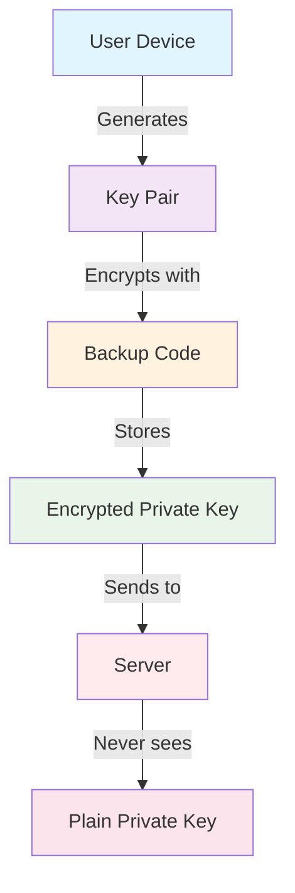
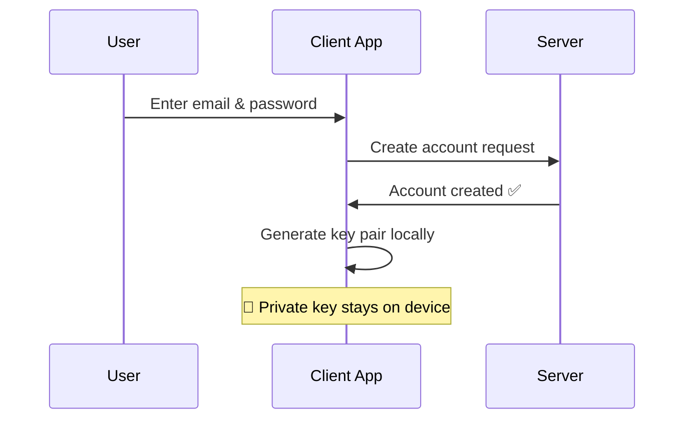
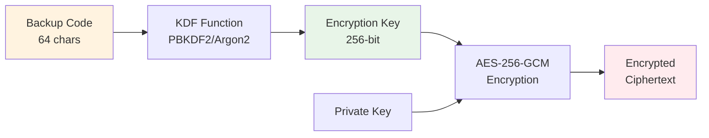
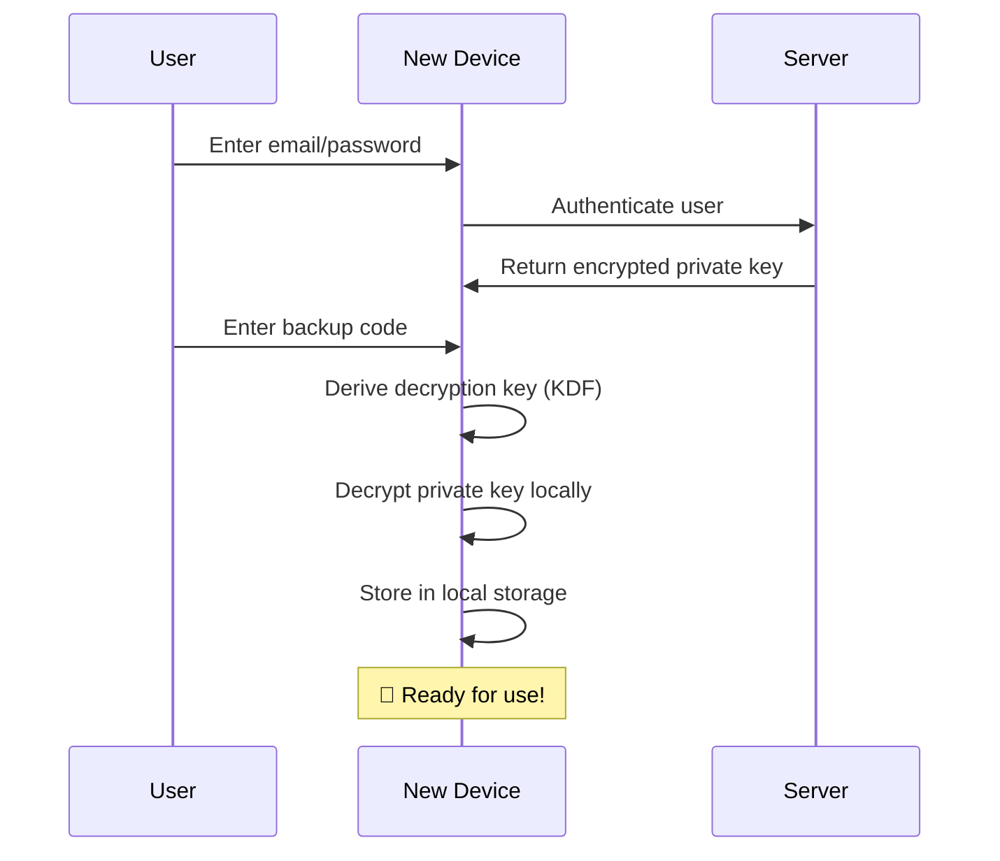
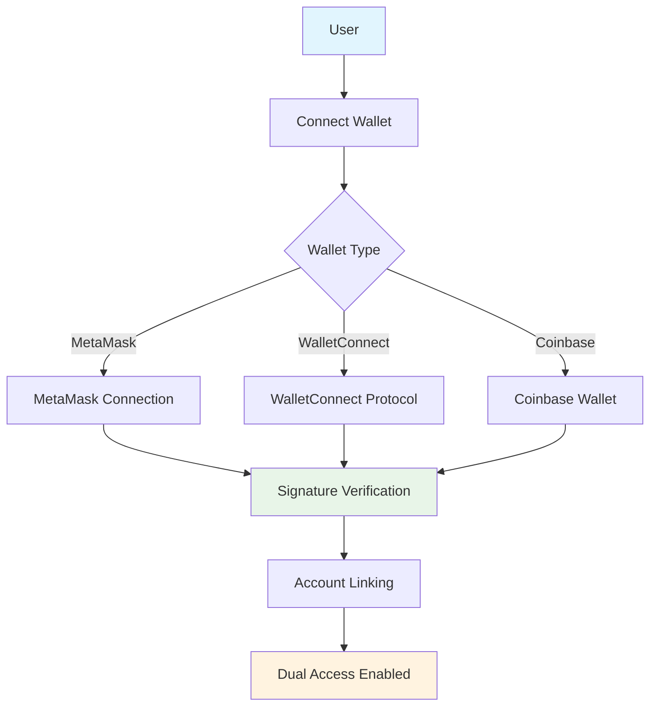
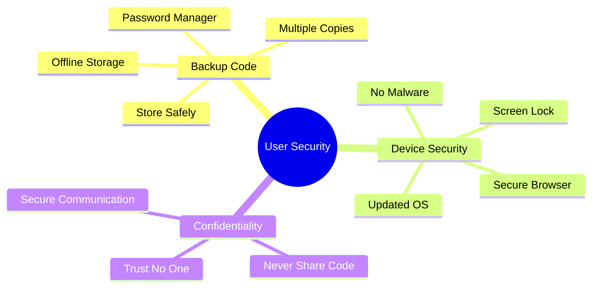
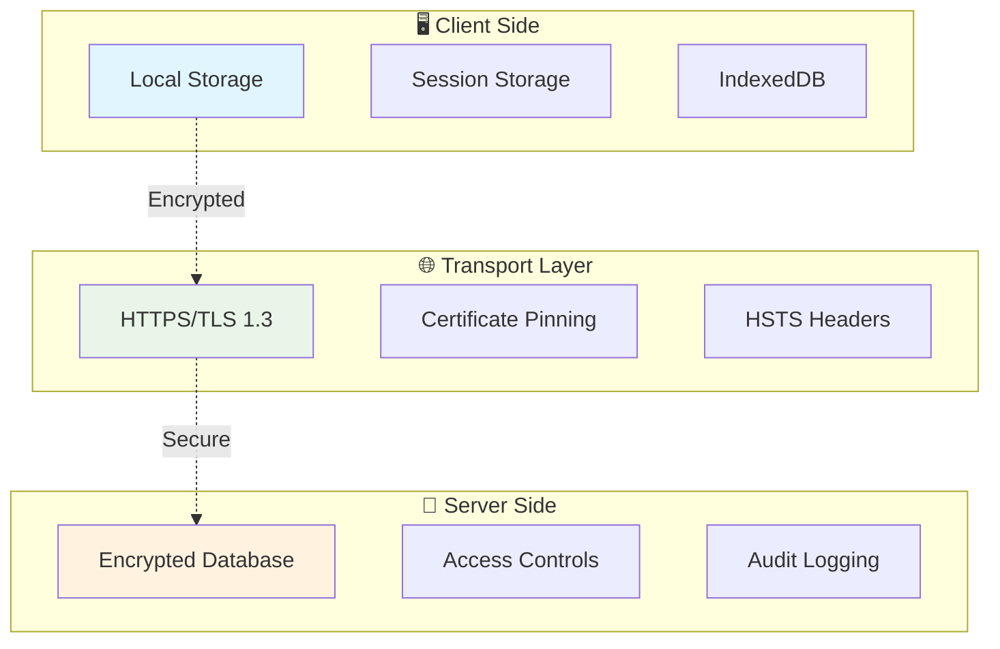
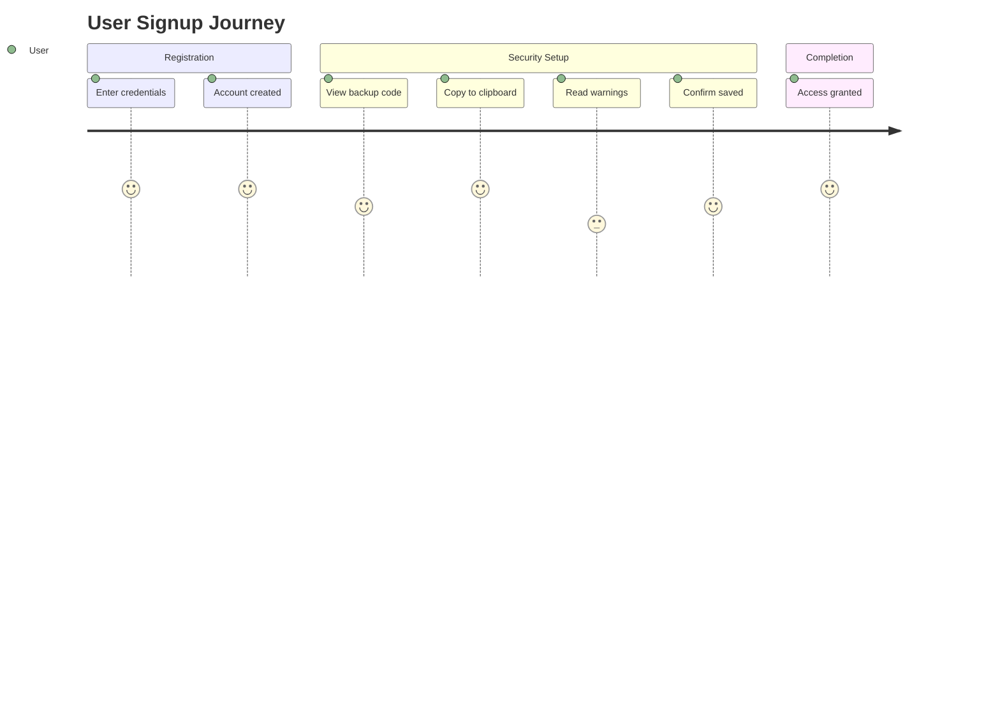
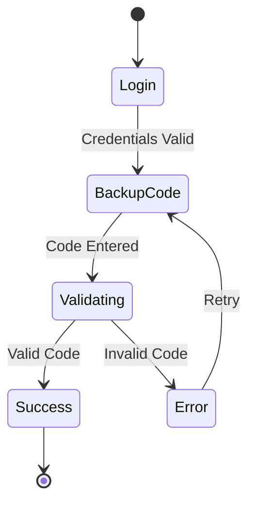

<div align="center">

# 🔐 VaultChain Backend

**Secure Cryptographic Key Management & User Authentication System**

[](https://github.com/your-repo)
[](https://github.com/your-repo)
[](https://github.com/your-repo)
[](LICENSE)

---

*A production-ready backend system implementing client-side key generation, zero-knowledge architecture, and secure multi-device access with cryptographic backup codes.*

</div>

## 📚 Table of Contents

- [🚀 Quick Start](#-quick-start)
- [🔐 Security Principles](#-security-principles)
- [📋 User Signup Flow](#-user-signup-flow)
- [🔄 Multi-Device Access](#-multi-device-access-flow)
- [🦊 Wallet Integration](#-optional-wallet-integration)
- [⚠️ Security Considerations](#️-security-considerations)
- [🔧 Technical Implementation](#-technical-implementation-notes)
- [📱 User Experience](#-user-experience-flow)
- [🛠️ API Documentation](#️-api-documentation)
- [🤝 Contributing](#-contributing)

---

## 🚀 Quick Start

> **⚡ Fast Setup**: Get the VaultChain backend running in under 5 minutes

```bash
# Clone the repository
git clone https://github.com/your-org/vaultchain-backend.git
cd vaultchain-backend

# Install dependencies
npm install

# Set up environment variables
cp .env.example .env

# Start the development server
npm run dev
```

## 📖 Overview

This document explains the complete **user signup and private key backup system** for our secure application. The system is designed with **security-first principles**, ensuring that private keys never leave the user's device unencrypted and that only the user has access to their cryptographic keys through a secure backup mechanism.

> 🎯 **Core Mission**: Provide enterprise-grade security with consumer-friendly usability

## 🔐 Security Principles

<div align="center">

| 🛡️ Principle | 📝 Description | ✅ Benefit |
|---------------|----------------|------------|
| **Client-Side Key Generation** | All cryptographic keys are generated on the user's device | Zero server-side key exposure |
| **Zero-Knowledge Architecture** | Server never has access to unencrypted private keys | Complete user privacy |
| **User-Controlled Recovery** | Only the user possesses the backup code needed for key recovery | No single point of failure |
| **Local Storage Priority** | Private keys are stored locally for seamless device usage | Optimal user experience |

</div>

### 🔒 Security Guarantees



## 📋 User Signup Flow

<details>
<summary><strong>🎯 Click to expand the complete signup process</strong></summary>

### 🔑 Step 1: User Registration

<div align="center">



</div>

| 📝 Action | 🔧 Implementation | 🛡️ Security |
|-----------|------------------|-------------|
| **User Input** | User provides email and password | Standard authentication |
| **Account Creation** | Standard account creation with email/password authentication | Server-side validation |
| **Key Pair Generation** | Generated **client-side** using Web Crypto API/libsodium | Private key never transmitted |

### 🎲 Step 2: Backup Code Generation

<div align="center">

**🔢 Backup Code Format**
```
AB3F-9D2E-Q7W1-ZXCV-M8K2-P5T9-L4N6-R7Y3-
H1J8-W2E5-Z9X4-C6V7-B3N1-Q8M5-F2K9-D7L4
```
*64 characters • 16 chunks • 4 chars each • Dash separated*

</div>

#### 🎯 Generation Process

1. **🎲 Random Code Generation**:
   - System generates a 64-character random alphanumeric string
   - Uses cryptographically secure random number generation (CSPRNG)
   - Format: 16 chunks of 4 characters each, separated by dashes

2. **👤 User Presentation**:
   - 🖥️ Backup code displayed prominently with copy button
   - 📝 Clear instructions to save securely (write down, password manager)
   - ⚠️ Critical importance warnings
   - ✅ Confirmation checkbox before proceeding

> **🚨 Critical Warning**: This backup code is the **ONLY** way to recover your account on new devices!</details>

### 🔐 Step 3: Private Key Encryption

<div align="center">



</div>

| 🔧 Process | 📋 Details | 🎯 Purpose |
|------------|-------------|------------|
| **🔑 Key Derivation** | PBKDF2-SHA256 (100k+ iterations) or Argon2id | Convert backup code to encryption key |
| **🔒 Local Encryption** | AES-256-GCM with derived key | Secure private key for storage |
| **💾 Data Storage** | Encrypted key → Server, Plain key → Local | Enable both security and usability |

#### 📊 Storage Distribution

```
🖥️  CLIENT DEVICE          🌐  SERVER               👤  USER
├── 🔓 Plain Private Key    ├── 🔒 Encrypted Key     ├── 📝 Backup Code
├── 🔑 Public Key          ├── 🔑 Public Key        └── 🧠 Email/Password
└── 🍪 Session Data        └── 👤 User Metadata
```

### 🚨 Step 4: Security Education

<div align="center">

| ⚠️ Warning | 📝 Explanation |
|------------|----------------|
| **🔑 Only Recovery Method** | Backup code is the **only** way to recover access on new devices |
| **💀 Permanent Loss Risk** | Lost backup code = permanent loss of encrypted data access |
| **🚫 No Server Recovery** | Server cannot help recover lost backup codes |
| **🏦 Secure Storage** | Store offline, multiple copies, password managers |

</div>

## 🔄 Multi-Device Access Flow

<div align="center">

**🔄 Seamless Cross-Device Experience**

</div>

### 📱 Logging in on a New Device

<div align="center">



</div>

| 🔢 Step | 🎯 Action | 🔧 Implementation | 🛡️ Security |
|---------|-----------|------------------|-------------|
| **1** | **🔐 Authentication** | Email/password login | Standard auth validation |
| **2** | **📥 Key Retrieval** | Fetch encrypted private key | Encrypted data only |
| **3** | **🔑 Backup Code Entry** | User enters backup code | Client-side input |
| **4** | **🔄 Key Derivation** | Derive decryption key | KDF on client |
| **5** | **🔓 Decryption** | Decrypt private key | Local processing |
| **6** | **💾 Local Storage** | Store for future use | Device-specific storage |

### 🎯 Recovery Process Flow

<div align="center">

```
🆕 New Device Login
         ↓
🔐 Email/Password Auth
         ↓
📥 Fetch Encrypted Private Key
         ↓
🔑 Enter Backup Code
         ↓
🔄 Derive Decryption Key (KDF)
         ↓
🔓 Decrypt Private Key Locally
         ↓
💾 Store in Local Storage
         ↓
🎉 Ready for Use
```

</div>

## 🦊 Optional Wallet Integration

<div align="center">

**🔗 Connect Your Favorite Wallet**

[](https://metamask.io/)
[](https://walletconnect.org/)
[](https://wallet.coinbase.com/)

</div>

### 🔗 MetaMask/Wallet Connection

<details>
<summary><strong>🎯 Advanced users: Wallet-based authentication flow</strong></summary>

<div align="center">



</div>

| 🔢 Step | 🎯 Action | 💡 Benefit |
|---------|-----------|-------------|
| **🔗 Wallet Connection** | Connect existing wallet (MetaMask, etc.) | Familiar crypto interface |
| **✍️ Signature Verification** | Authentication via wallet signature | No password needed |
| **🚫 No Key Storage** | No private keys stored by app | Maximum security |
| **🔗 Account Linking** | Link wallet to existing account | Unified experience |
| **🔄 Dual Access** | Use both methods interchangeably | Ultimate flexibility |

</details>

### 🎯 Wallet Flow Benefits

<div align="center">

| 🌟 Benefit | 📝 Description | 👥 Target Users |
|------------|----------------|-----------------|
| **🎮 Familiar Interface** | Crypto-native user experience | DeFi enthusiasts |
| **🛡️ Existing Security** | Leverages wallet's security model | Security-conscious users |
| **🚫 No Backup Codes** | No additional codes to manage | Simplicity seekers |
| **🔗 DeFi Integration** | Seamless blockchain interactions | Web3 developers |

</div>

## ⚠️ Security Considerations

<div align="center">

**🛡️ Enterprise-Grade Security Architecture**

</div>

### 🛡️ What We Protect Against

<div align="center">

| 🎯 Threat | 🔒 Protection | ✅ Status |
|-----------|---------------|-----------|
| **🏢 Server Breaches** | Encrypted keys useless without backup codes | ✅ Protected |
| **🕵️ Man-in-the-Middle** | All encryption/decryption client-side | ✅ Protected |
| **👨‍💼 Insider Threats** | Admins cannot access user private keys | ✅ Protected |
| **📱 Device Loss** | Backup code enables recovery | ✅ Protected |

</div>

### 👤 User Responsibilities

<div align="center">



</div>

| 🎯 Responsibility | 📝 Description | 🚨 Risk Level |
|------------------|----------------|---------------|
| **🔐 Secure Backup Code Storage** | Store codes safely (offline, password manager) | 🔴 Critical |
| **📱 Device Security** | Maintain device security (updates, antivirus) | 🟡 High |
| **🤐 Backup Code Confidentiality** | Never share codes with anyone | 🔴 Critical |

### 🚫 Recovery Limitations

<div align="center">

| ❌ Limitation | 📝 Explanation | 💡 Mitigation |
|---------------|----------------|---------------|
| **🔑 No Backup Code = No Recovery** | We cannot recover lost backup codes | Store multiple secure copies |
| **🔄 No Password Reset for Keys** | Password reset only affects account access | Backup code is separate |
| **💀 Permanent Data Loss** | Lost codes = permanent encrypted data loss | Education & warnings |

</div>

## 🔧 Technical Implementation Notes

<div align="center">

**⚙️ Production-Ready Cryptographic Implementation**

</div>

### 🔐 Cryptographic Standards

<div align="center">

| 🔧 Component | 📋 Standard | 🎯 Purpose | 🔒 Strength |
|--------------|-------------|------------|-------------|
| **🔑 Key Generation** | Ed25519/secp256k1 + X25519 | Signing + Encryption | 256-bit |
| **🔄 Key Derivation** | PBKDF2-SHA256 (100k+) / Argon2id | Backup code → Key | 256-bit |
| **🔒 Symmetric Encryption** | AES-256-GCM | Private key encryption | 256-bit |
| **🎲 Random Generation** | CSPRNG | Secure randomness | Cryptographic |

</div>

### 🏗️ Storage Security Architecture

<div align="center">



</div>

| 🏗️ Layer | 🔧 Implementation | 🛡️ Security Measures |
|-----------|------------------|----------------------|
| **🖥️ Client** | Local/Session storage with encryption | Device-level security |
| **🌐 Transport** | HTTPS/TLS 1.3 + Certificate pinning | End-to-end encryption |
| **🏢 Server** | Encrypted database + access controls | Defense in depth |

### 📝 Backup Code Specification

<div align="center">

| 📊 Property | 📋 Value | 🎯 Rationale |
|-------------|----------|--------------|
| **📏 Length** | 64 characters | 256 bits of entropy |
| **🔤 Character Set** | A-Z, 0-9 (no ambiguous chars) | Human-readable |
| **📐 Format** | 16 groups × 4 chars + dashes | Easy to read/type |
| **✅ Validation** | Checksum + format validation | Error prevention |

**Example:** `AB3F-9D2E-Q7W1-ZXCV-M8K2-P5T9-L4N6-R7Y3-H1J8-W2E5-Z9X4-C6V7-B3N1-Q8M5-F2K9-D7L4`

</div>

## 📱 User Experience Flow

<div align="center">

**🎨 Designed for Security & Usability**

</div>

### 🆕 First-Time Signup Experience

<div align="center">



</div>

| 🔢 Step | 🎯 Action | 🎨 UI Element | 💡 UX Notes |
|---------|-----------|---------------|-------------|
| **1** | Enter email/password | Standard form | Clean, familiar |
| **2** | Account created | Success message | Positive feedback |
| **3** | **"Secure Your Account"** | Prominent modal | Security focus |
| **4** | Backup code display | Monospace font + copy button | Easy to read |
| **5** | Educational content | Warning cards | Clear importance |
| **6** | Confirmation checkbox | "I have safely stored..." | User commitment |
| **7** | Continue to app | Primary CTA button | Clear next step |

### 🔄 Subsequent Device Access

<div align="center">



</div>

| 🔢 Step | 🎯 Action | 🎨 UI Element | 💡 UX Notes |
|---------|-----------|---------------|-------------|
| **1** | Login with email/password | Standard login form | Familiar flow |
| **2** | **"Enter Backup Code"** | Formatted input field | XXXX-XXXX pattern |
| **3** | Format hints | Placeholder text | Guidance provided |
| **4** | Validation & recovery | Loading spinner | Progress feedback |
| **5** | Success: Access granted | Welcome message | Positive completion |

---

## 🛠️ API Documentation

<div align="center">

**📚 RESTful API Endpoints**

[](https://api.vaultchain.com/docs)
[](https://postman.com/vaultchain)

</div>

### 🔐 Authentication Endpoints

| 🌐 Endpoint | 📝 Description | 📋 Request | 📤 Response |
|-------------|----------------|-------------|-------------|
| `POST /auth/signup` | Create new user account | `{email, password}` | `{userId, publicKey}` |
| `POST /auth/login` | Authenticate user | `{email, password}` | `{token, encryptedPrivateKey}` |
| `POST /auth/verify-backup` | Verify backup code | `{userId, backupCode}` | `{success, privateKey}` |
| `POST /auth/wallet-connect` | Connect wallet | `{signature, address}` | `{token, linked}` |

### 🔑 Key Management Endpoints

| 🌐 Endpoint | 📝 Description | 📋 Request | 📤 Response |
|-------------|----------------|-------------|-------------|
| `GET /keys/encrypted` | Get encrypted private key | `Authorization: Bearer` | `{encryptedKey, metadata}` |
| `POST /keys/store` | Store encrypted key | `{encryptedKey, publicKey}` | `{success, keyId}` |
| `PUT /keys/update` | Update key metadata | `{keyId, metadata}` | `{success}` |

---

## 🤝 Contributing

<div align="center">

**🚀 Help us build the future of secure authentication**

[](https://github.com/your-org/vaultchain-backend/graphs/contributors)
[](https://github.com/your-org/vaultchain-backend/issues)
[](https://github.com/your-org/vaultchain-backend/pulls)

</div>

### 🎯 How to Contribute

1. **🍴 Fork** the repository
2. **🌿 Create** a feature branch (`git checkout -b feature/amazing-feature`)
3. **💾 Commit** your changes (`git commit -m 'Add amazing feature'`)
4. **📤 Push** to the branch (`git push origin feature/amazing-feature`)
5. **🔄 Open** a Pull Request

### 📋 Development Setup

```bash
# Clone your fork
git clone https://github.com/your-username/vaultchain-backend.git
cd vaultchain-backend

# Install dependencies
npm install

# Set up environment
cp .env.example .env.local

# Run tests
npm test

# Start development server
npm run dev
```

### 🐛 Bug Reports & 💡 Feature Requests

- **🐛 Bug Reports**: Use our [bug report template](https://github.com/your-org/vaultchain-backend/issues/new?template=bug_report.md)
- **💡 Feature Requests**: Use our [feature request template](https://github.com/your-org/vaultchain-backend/issues/new?template=feature_request.md)

---

<div align="center">

**🔐 VaultChain Backend - Secure by Design**

*This comprehensive flow ensures maximum security while maintaining usability for both technical and non-technical users.*

[](https://opensource.org/licenses/MIT)
[](https://github.com/your-org/vaultchain-backend/security)

**Made with ❤️ by the VaultChain Team**

</div>
