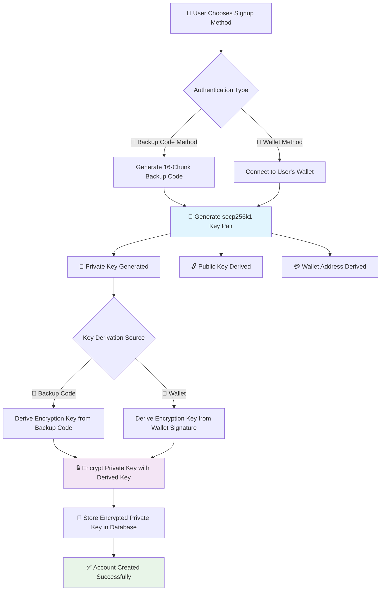
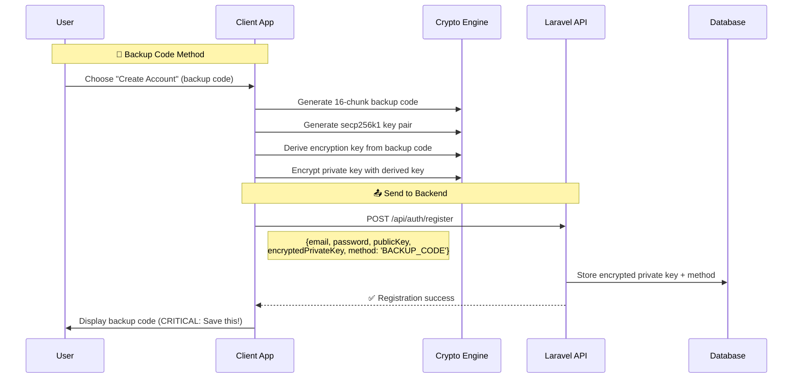
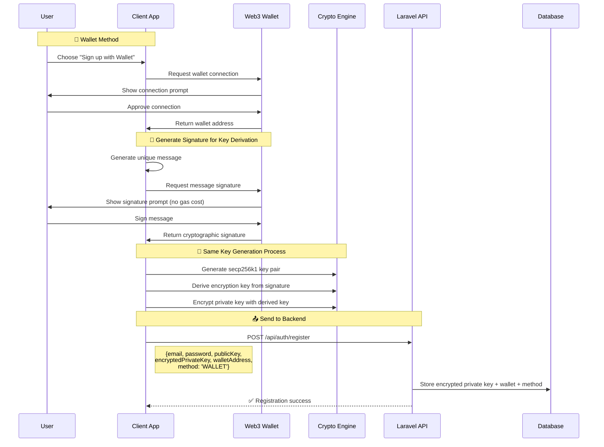
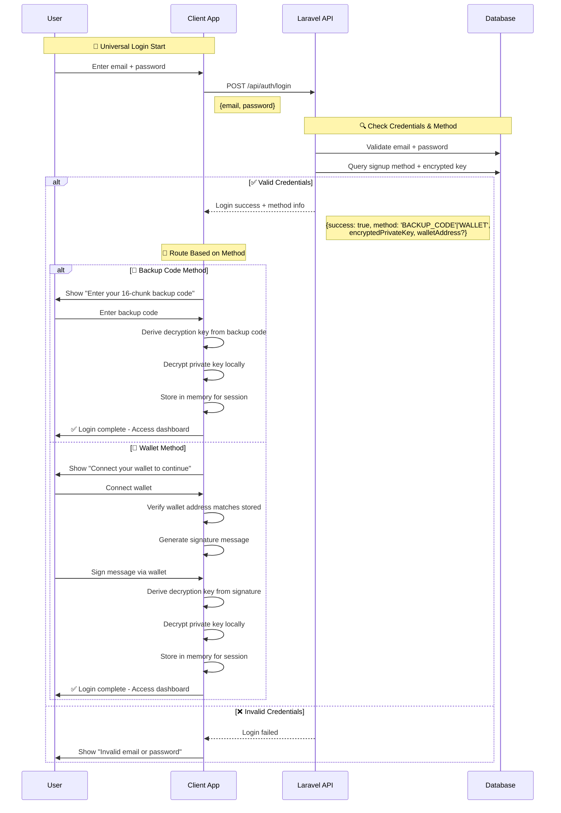
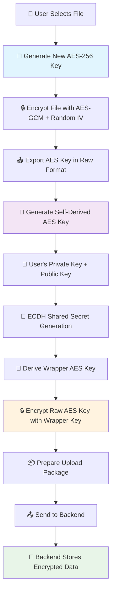

<div align="center">

# 🔐 OM VaultChain - Client-Side Application

**Secure Client-Side Encryption & Decentralized File Management**

[](https://reactjs.org/)
[](https://vitejs.dev/)
[](https://github.com/your-repo)
[](https://github.com/your-repo)

---

*A production-ready React frontend implementing client-side encryption, unified key generation with dual authentication methods, and zero-knowledge file management.*

</div>

## 📚 Table of Contents

- [🚀 Quick Start](#-quick-start)
- [🏗️ Project Structure](#️-project-structure)
- [🔐 Unified Key Generation System](#-unified-key-generation-system)
- [🔑 Dual Authentication Methods](#-dual-authentication-methods)
- [🔄 Smart Login Flow](#-smart-login-flow)
- [📤 File Upload Flow](#-file-upload-flow)
- [🦊 Wallet Integration](#-wallet-integration)
- [🛠️ Technology Stack](#️-technology-stack)
- [🔒 Security Considerations](#-security-considerations)
- [🚀 Development](#-development)
- [🔗 Integration](#-integration)

---

## 🚀 Quick Start

> **⚡ Fast Setup**: Get the OM VaultChain client running in under 2 minutes

```bash
# Install dependencies
npm install

# Start development server
npm run dev

# Build for production
npm run build

# Preview production build
npm run preview

# Lint code
npm run lint
```

## 🏗️ Project Structure

```
src/
├── crypto/                    # 🔐 Client-Side Encryption Engine
│   ├── encrypt.js            # AES-256-GCM file encryption
│   ├── decrypt.js            # File decryption operations
│   ├── keyUtils.js           # Cryptographic key management
│   ├── hash.js               # SHA-256 hashing utilities
│   ├── envelopeManager.js    # Multi-recipient key envelopes
│   ├── createEnvelope.js     # Secure envelope creation
│   ├── backupCodeUtils.js    # 🔑 Backup code generation (16x4 format)
│   └── keyDerivation.js      # 🔄 Unified key derivation system
├── components/               # 🧩 React Components
│   ├── auth/                 # Authentication components
│   ├── common/               # Shared UI components
│   ├── files/                # File management components
│   └── layout/               # Layout and navigation
├── pages/                    # 📄 Application Pages
│   ├── auth/                 # Login/Signup pages
│   ├── dashboard/            # Main dashboard
│   ├── profile/              # User profile management
│   ├── error/                # Error pages
│   └── public/               # Public pages
├── services/                 # 🌐 API Integration
│   ├── api/                  # API service modules
│   └── apiClient.js          # HTTP client configuration
├── context/                  # ⚛️ React Context Providers
├── hooks/                    # 🪝 Custom React Hooks
├── utils/                    # 🛠️ Utility Functions
├── styles/                   # 🎨 Styling
│   ├── components/           # Component-specific styles
│   ├── pages/                # Page-specific styles
│   ├── globals.css           # Global styles
│   ├── themes.css            # Theme definitions
│   └── variables.css         # CSS variables
└── assets/                   # 📁 Static Assets
    ├── images/               # Image files
    ├── fonts/                # Font files
    └── animations/           # Animation assets
```

## 🔐 Unified Key Generation System

<div align="center">

**🎯 Same Cryptographic Foundation, Different Key Derivation**

</div>

### 🔑 Universal Key Generation Process

Both signup methods follow the same cryptographic foundation but use different key derivation sources:

<div align="center">



</div>

### 🔄 Key Derivation Differences

<div align="center">

| 🎯 Method | 🔑 Derivation Source | 🔧 Process | 🛡️ Security |
|-----------|---------------------|------------|-------------|
| **🔑 Backup Code** | 16-chunk backup code | PBKDF2-SHA256 from backup code | User-controlled recovery phrase |
| **🦊 Wallet** | Wallet signature | PBKDF2-SHA256 from signature message | Wallet-controlled cryptographic proof |

</div>

#### 🔧 Implementation Details

<div align="center">

**📝 Unified Key Generation (keyUtils.js)**

</div>

```javascript
// Universal key pair generation (same for both methods)
export async function generateKeyPair() {
    // 1. Generate secp256k1 private key (32 bytes)
    const privateKey = crypto.getRandomValues(new Uint8Array(32));
    
    // 2. Derive public key using elliptic curve cryptography
    const publicKey = secp256k1.getPublicKey(privateKey);
    
    // 3. Derive Ethereum-compatible wallet address
    const walletAddress = ethereumjs.pubToAddress(publicKey);
    
    return { privateKey, publicKey, walletAddress };
}

// Key derivation - DIFFERENT sources, SAME process
export async function deriveEncryptionKey(source, method) {
    let keyMaterial;
    
    if (method === 'BACKUP_CODE') {
        // Derive from 16-chunk backup code
        keyMaterial = new TextEncoder().encode(source); // backup code
    } else if (method === 'WALLET') {
        // Derive from wallet signature
        keyMaterial = new TextEncoder().encode(source); // signature message
    }
    
    // Same PBKDF2 process for both methods
    const derivedKey = await crypto.subtle.importKey(
        'raw',
        await crypto.subtle.deriveBits({
            name: 'PBKDF2',
            salt: new TextEncoder().encode('omvaultchain-salt-v1'),
            iterations: 100000,
            hash: 'SHA-256'
        }, 
        await crypto.subtle.importKey('raw', keyMaterial, 'PBKDF2', false, ['deriveBits']),
        256),
        { name: 'AES-GCM' },
        false,
        ['encrypt', 'decrypt']
    );
    
    return derivedKey;
}

// Encrypt private key (same for both methods)
export async function encryptPrivateKey(privateKey, encryptionKey) {
    const iv = crypto.getRandomValues(new Uint8Array(12));
    const encryptedData = await crypto.subtle.encrypt({
        name: 'AES-GCM',
        iv: iv
    }, encryptionKey, privateKey);
    
    return { encryptedData, iv };
}
```

## 🔑 Dual Authentication Methods

### 🎯 Method 1: Backup Code Authentication

<div align="center">

**🔢 16-Chunk Human-Readable Recovery System**

```
ABCD-EFGH-IJKL-MNOP-QRST-UVWX-YZ12-3456-
H1J8-W2E5-Z9X4-C6V7-B3N1-Q8M5-F2K9-D7L4
```
*64 characters • 16 chunks • 4 chars each • Dash separated*

</div>

#### 🔄 Backup Code Signup Flow

<div align="center">



</div>

### 🎯 Method 2: Wallet-Based Authentication

<div align="center">

**🦊 Web3 Wallet Integration**

</div>

#### 🔄 Wallet Signup Flow

<div align="center">



</div>

## 🔄 Smart Login Flow

<div align="center">

**🎯 Intelligent Authentication Method Detection**

</div>

### 🔍 Login Process: Email/Password → Method Detection → Appropriate Flow

<div align="center">



</div>

### 📋 Login Flow Breakdown

<div align="center">

| 🔢 Step | 🎯 Action | 🔧 Implementation | 📊 Data Flow |
|---------|-----------|------------------|-------------|
| **1** | **🔐 Credential Check** | Standard email/password validation | `{email, password}` → Laravel |
| **2** | **🔍 Method Detection** | Query database for signup method | Laravel returns method type |
| **3** | **🎯 Route to Appropriate Flow** | Client shows correct input form | Different UI based on method |
| **4** | **🔑 Key Recovery** | Derive decryption key using method-specific source | Client-side key derivation |
| **5** | **🔓 Private Key Decryption** | Decrypt stored private key | Local decryption only |
| **6** | **✅ Session Established** | User gains access to encrypted files | Ready for file operations |

</div>

### 🔧 Login Implementation Example

```javascript
// Smart login flow implementation
async function loginUser(email, password) {
    try {
        // Step 1: Validate credentials and get method
        const response = await loginAPI(email, password);
        
        if (!response.success) {
            throw new Error('Invalid credentials');
        }
        
        const { method, encryptedPrivateKey, walletAddress } = response;
        
        // Step 2: Route based on signup method
        if (method === 'BACKUP_CODE') {
            // Show backup code input
            const backupCode = await promptForBackupCode();
            
            // Derive decryption key from backup code
            const decryptionKey = await deriveEncryptionKey(backupCode, 'BACKUP_CODE');
            
            // Decrypt private key
            const privateKey = await decryptPrivateKey(encryptedPrivateKey, decryptionKey);
            
            // Store in session
            setSessionKeys({ privateKey, method: 'BACKUP_CODE' });
            
        } else if (method === 'WALLET') {
            // Show wallet connection prompt
            const connectedWallet = await connectWallet();
            
            // Verify wallet address matches
            if (connectedWallet.address !== walletAddress) {
                throw new Error('Wallet address mismatch');
            }
            
            // Generate and sign message
            const message = generateSignatureMessage();
            const signature = await signMessage(message);
            
            // Derive decryption key from signature
            const decryptionKey = await deriveEncryptionKey(signature, 'WALLET');
            
            // Decrypt private key
            const privateKey = await decryptPrivateKey(encryptedPrivateKey, decryptionKey);
            
            // Store in session
            setSessionKeys({ privateKey, method: 'WALLET', walletAddress });
        }
        
        // Step 3: Navigate to dashboard
        navigateToDashboard();
        
    } catch (error) {
        console.error('Login failed:', error);
        showError('Login failed: ' + error.message);
    }
}
```

## 📤 File Upload Flow

<div align="center">

**🔒 Zero-Knowledge Client-Side File Encryption**

</div>

The file upload process ensures complete client-side encryption with zero backend access to unencrypted content or unwrapped file keys. Each file receives its own unique AES-256-GCM encryption key, which is itself encrypted using a self-derived key from the user's secp256k1 key pair.

### 🔐 Encryption Architecture

<div align="center">



</div>

### 🔄 Step-by-Step Upload Process

<div align="center">

| 🔢 Step | 🎯 Action | 🔧 Implementation | 🛡️ Security |
|---------|-----------|------------------|-------------|
| **1** | **📁 File Selection** | User chooses file via file picker | Client-side only |
| **2** | **🔑 AES Key Generation** | Generate unique AES-256 key for file | Cryptographically secure random |
| **3** | **🔒 File Encryption** | Encrypt file with AES-256-GCM + 12-byte IV | File never leaves browser unencrypted |
| **4** | **📤 Key Export** | Export AES key in raw format | Preparation for key wrapping |
| **5** | **🔐 Self-Derived Key** | Generate wrapper key from user's key pair | ECDH with own keys |
| **6** | **🔒 Key Wrapping** | Encrypt raw AES key with wrapper key | AES-GCM encryption |
| **7** | **📦 Package Preparation** | Bundle encrypted file + metadata | Ready for backend |

</div>

### 🔧 Implementation Details

```javascript
// Complete file upload encryption flow
async function uploadFile(file, userKeys) {
    try {
        // Step 1: File selection (handled by file input)
        console.log(`Processing file: ${file.name} (${file.size} bytes)`);
        
        // Step 2: Generate new AES-256-GCM key for this file
        const fileEncryptionKey = await crypto.subtle.generateKey(
            { name: 'AES-GCM', length: 256 },
            true, // extractable
            ['encrypt', 'decrypt']
        );
        
        // Step 3: Encrypt file with AES-256-GCM + random IV
        const iv = crypto.getRandomValues(new Uint8Array(12)); // 12-byte IV for GCM
        const fileBuffer = await file.arrayBuffer();
        
        const encryptedFile = await crypto.subtle.encrypt(
            { name: 'AES-GCM', iv: iv },
            fileEncryptionKey,
            fileBuffer
        );
        
        // Step 4: Export AES key in raw format
        const rawAESKey = await crypto.subtle.exportKey('raw', fileEncryptionKey);
        
        // Step 5: Generate self-derived AES key using user's key pair
        const selfDerivedKey = await generateSelfDerivedKey(
            userKeys.privateKey, 
            userKeys.publicKey
        );
        
        // Step 6: Encrypt the raw AES key with self-derived key
        const keyWrappingIV = crypto.getRandomValues(new Uint8Array(12));
        const encryptedAESKey = await crypto.subtle.encrypt(
            { name: 'AES-GCM', iv: keyWrappingIV },
            selfDerivedKey,
            rawAESKey
        );
        
        // Step 7: Prepare upload package
        const uploadPackage = {
            // Encrypted content
            encryptedFile: new Uint8Array(encryptedFile),
            iv: iv,
            
            // Encrypted file key
            encryptedAESKey: new Uint8Array(encryptedAESKey),
            keyWrappingIV: keyWrappingIV,
            
            // File metadata
            metadata: {
                originalName: file.name,
                size: file.size,
                mimeType: file.type,
                hash: await generateFileHash(fileBuffer),
                uploadTimestamp: Date.now()
            }
        };
        
        // Send to backend
        const result = await sendToBackend(uploadPackage);
        console.log('File uploaded successfully:', result);
        
        return result;
        
    } catch (error) {
        console.error('File upload encryption failed:', error);
        throw new Error('Upload failed: ' + error.message);
    }
}

// Generate self-derived key using ECDH with own key pair
async function generateSelfDerivedKey(privateKey, publicKey) {
    // Import private key for ECDH
    const privateKeyObject = await crypto.subtle.importKey(
        'raw',
        privateKey,
        { name: 'ECDH', namedCurve: 'P-256' },
        false,
        ['deriveKey']
    );
    
    // Import public key for ECDH
    const publicKeyObject = await crypto.subtle.importKey(
        'raw',
        publicKey,
        { name: 'ECDH', namedCurve: 'P-256' },
        false,
        []
    );
    
    // Derive shared secret using ECDH (self-derived)
    const derivedKey = await crypto.subtle.deriveKey(
        { name: 'ECDH', public: publicKeyObject },
        privateKeyObject,
        { name: 'AES-GCM', length: 256 },
        false,
        ['encrypt', 'decrypt']
    );
    
    return derivedKey;
}

// Generate SHA-256 hash of file for integrity verification
async function generateFileHash(fileBuffer) {
    const hashBuffer = await crypto.subtle.digest('SHA-256', fileBuffer);
    return Array.from(new Uint8Array(hashBuffer))
        .map(byte => byte.toString(16).padStart(2, '0'))
        .join('');
}
```

### 📦 Backend Upload Package

The following data structure is sent to the Laravel backend:

<div align="center">

```json
{
  "encryptedFile": "Uint8Array", // AES-256-GCM encrypted file content
  "iv": "Uint8Array(12)",        // File encryption IV
  "encryptedAESKey": "Uint8Array", // Wrapped file encryption key
  "keyWrappingIV": "Uint8Array(12)", // Key wrapping IV
  "metadata": {
    "originalName": "document.pdf",
    "size": 1048576,
    "mimeType": "application/pdf",
    "hash": "sha256_hash_string",
    "uploadTimestamp": 1703123456789
  }
}
```

</div>

### 🛡️ Security Guarantees

<div align="center">

| 🎯 Security Aspect | ✅ Guarantee | 🔧 Implementation |
|-------------------|-------------|------------------|
| **🔒 File Content** | Never exposed to backend | Client-side AES-256-GCM encryption |
| **🔑 File Keys** | Never stored in plaintext | Self-derived key wrapping |
| **🛡️ Key Derivation** | User-controlled private key | ECDH with own key pair |
| **🔐 Zero Knowledge** | Backend cannot decrypt | All keys derived client-side |
| **📁 File Integrity** | Cryptographic verification | SHA-256 hash validation |

</div>

## 🦊 Wallet Integration Details

<div align="center">

**🔗 Enhanced Web3 Authentication**

[](https://metamask.io/)
[](https://walletconnect.org/)

</div>

### 🔑 Wallet Authentication Flow

The wallet method uses the same key generation process but derives the encryption key from a wallet signature instead of a backup code.

#### 🛡️ Key Derivation from Wallet Signature

```javascript
// Wallet-specific key derivation
async function setupWalletAuthentication(walletAddress) {
    // 1. Generate same cryptographic foundation
    const { privateKey, publicKey, walletAddress: derivedAddress } = await generateKeyPair();
    
    // 2. Create signature message for key derivation
    const signatureMessage = `OM VaultChain Key Derivation\nWallet: ${walletAddress}\nTimestamp: ${Date.now()}`;
    
    // 3. Request wallet signature (no gas cost)
    const signature = await window.ethereum.request({
        method: 'personal_sign',
        params: [signatureMessage, walletAddress]
    });
    
    // 4. Derive encryption key from signature
    const encryptionKey = await deriveEncryptionKey(signature, 'WALLET');
    
    // 5. Encrypt private key with derived key
    const { encryptedData, iv } = await encryptPrivateKey(privateKey, encryptionKey);
    
    return {
        publicKey,
        encryptedPrivateKey: { encryptedData, iv },
        walletAddress,
        signatureMessage // Store for login verification
    };
}
```

## 🛠️ Technology Stack

<div align="center">

| **Category** | **Technology** | **Version** | **Purpose** |
|--------------|----------------|-------------|-------------|
| **🔐 Encryption** | Web Crypto API / CryptoJS | ES2021+ | AES-GCM, SHA-256, secp256k1 |
| **⚛️ Frontend** | React | 19.1.0 | Modern UI framework |
| **⚡ Build Tool** | Vite | 7.0.4 | Fast build tool and dev server |
| **🔑 Cryptography** | @noble/secp256k1 | 2.3.0 | Elliptic curve cryptography |
| **🌐 Web3 Utils** | ethereumjs-util | 7.1.5 | Ethereum address generation |
| **🔒 Crypto Ops** | crypto-js | 4.2.0 | Additional cryptographic operations |

</div>

## 🔒 Security Considerations

<div align="center">

**🛡️ Enterprise-Grade Security Architecture**

</div>

### 🔐 Unified Security Model

Both authentication methods provide the same level of security:

<div align="center">

| 🎯 Security Aspect | 🔑 Backup Code Method | 🦊 Wallet Method | ✅ Result |
|-------------------|----------------------|------------------|-----------|
| **🔐 Private Key Generation** | secp256k1 client-side | secp256k1 client-side | Same cryptographic strength |
| **🔑 Key Derivation** | PBKDF2-SHA256 (100k iterations) | PBKDF2-SHA256 (100k iterations) | Same KDF security |
| **🔒 Encryption** | AES-256-GCM | AES-256-GCM | Same encryption standard |
| **💾 Storage** | Encrypted private key in DB | Encrypted private key in DB | Same storage security |
| **🛡️ Recovery** | 16-chunk backup code | Wallet signature | Different but equally secure |

</div>

### 🛡️ What We Protect Against

<div align="center">

| 🎯 Threat | 🔒 Protection | ✅ Status |
|-----------|---------------|-----------|
| **🏢 Server Breaches** | Private keys encrypted with user-controlled keys | ✅ Protected |
| **🕵️ Man-in-the-Middle** | All encryption/decryption client-side | ✅ Protected |
| **👨‍💼 Insider Threats** | Admins cannot access user private keys | ✅ Protected |
| **📱 Device Loss** | Recovery via backup code or wallet signature | ✅ Protected |
| **🔑 Method-Specific Attacks** | Each method has independent security model | ✅ Protected |

</div>

### ⚠️ Method-Specific Responsibilities

<div align="center">

| 🎯 Method | 🔑 User Responsibility | 🚨 Risk Level | 💡 Mitigation |
|-----------|----------------------|---------------|---------------|
| **🔑 Backup Code** | Secure backup code storage | 🔴 Critical | Multiple secure copies |
| **🦊 Wallet** | Wallet security & access | 🔴 Critical | Hardware wallet recommended |

</div>

## 🚀 Development

<div align="center">

**⚙️ Development Environment Setup**

</div>

### Prerequisites
- **Node.js 18+** - JavaScript runtime
- **npm or yarn** - Package manager

### Available Scripts

```bash
# Development
npm run dev          # Start development server with HMR
npm run build        # Build for production
npm run preview      # Preview production build locally
npm run lint         # Run ESLint for code quality
```

## 🔗 Laravel Backend Integration

<div align="center">

**🎯 Enhanced Backend Integration with Method Detection**

</div>

### 🔐 **Updated Laravel Endpoints**

| 🌐 Endpoint | 📝 Description | 📋 Client Sends | 📤 Laravel Returns |
|-------------|----------------|------------------|-------------------|
| `POST /api/auth/register` | **Signup with method detection** | `{email, password, publicKey, encryptedPrivateKey, method, walletAddress?}` | `{userId, token, success}` |
| `POST /api/auth/login` | **Login with method info** | `{email, password}` | `{token, method, encryptedPrivateKey, walletAddress?, success}` |
| `GET /api/auth/profile` | **User profile with method** | `Authorization: Bearer <token>` | `{user, method, preferences}` |
| `POST /api/files/upload` | **Encrypted file upload** | `{encryptedFile, iv, encryptedAESKey, keyWrappingIV, metadata}` | `{fileId, success, uploadedAt}` |

### 🗄️ **Database Schema Updates**

```sql
-- Users table with method tracking
ALTER TABLE users ADD COLUMN auth_method ENUM('BACKUP_CODE', 'WALLET') NOT NULL;
ALTER TABLE users ADD COLUMN wallet_address VARCHAR(42) NULL;
ALTER TABLE users ADD COLUMN encrypted_private_key TEXT NOT NULL;
ALTER TABLE users ADD COLUMN key_derivation_salt VARCHAR(255) NOT NULL;

-- Files table for encrypted file storage
CREATE TABLE encrypted_files (
    id BIGINT UNSIGNED AUTO_INCREMENT PRIMARY KEY,
    user_id BIGINT UNSIGNED NOT NULL,
    file_name VARCHAR(255) NOT NULL,
    original_name VARCHAR(255) NOT NULL,
    mime_type VARCHAR(100) NOT NULL,
    file_size BIGINT UNSIGNED NOT NULL,
    file_hash VARCHAR(64) NOT NULL,
    encrypted_aes_key TEXT NOT NULL,
    key_wrapping_iv VARCHAR(32) NOT NULL,
    file_iv VARCHAR(32) NOT NULL,
    storage_path TEXT NOT NULL,
    uploaded_at TIMESTAMP DEFAULT CURRENT_TIMESTAMP,
    updated_at TIMESTAMP DEFAULT CURRENT_TIMESTAMP ON UPDATE CURRENT_TIMESTAMP,
    FOREIGN KEY (user_id) REFERENCES users(id) ON DELETE CASCADE,
    INDEX idx_user_files (user_id),
    INDEX idx_file_hash (file_hash)
);
```

---

<div align="center">

**🔐 OM VaultChain Client - Unified Security, Flexible Authentication**

*Providing enterprise-grade security with multiple authentication options and zero-knowledge file encryption.*

[](https://opensource.org/licenses/MIT)
[](https://github.com/your-org/om-vaultchain)

**Made with ❤️ by the OM VaultChain Team**

</div>
