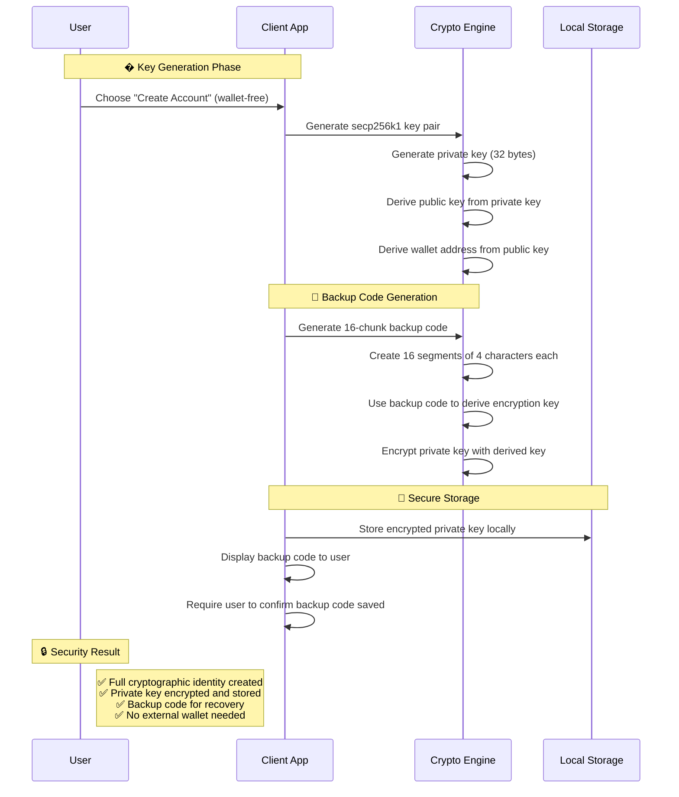
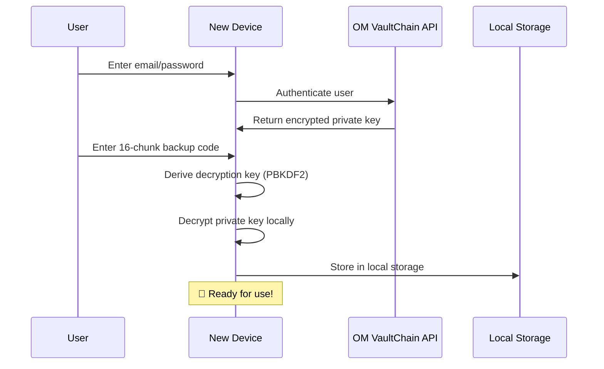

<div align="center">

# 🔐 OM VaultChain - Client-Side Application

**Secure Client-Side Encryption & Decentralized File Management**

[](https://reactjs.org/)
[](https://vitejs.dev/)
[](https://github.com/your-repo)
[](https://github.com/your-repo)

---

*A production-ready React frontend implementing client-side encryption, wallet-free signup with 16-chunk backup codes, and zero-knowledge file management.*

</div>

## 📚 Table of Contents

- [🚀 Quick Start](#-quick-start)
- [🏗️ Project Structure](#️-project-structure)
- [🔐 Signup Process & Key Management](#-signup-process--key-management)
- [🔄 Multi-Device Access](#-multi-device-access)
- [🦊 Wallet Integration](#-wallet-integration)
- [🛠️ Technology Stack](#️-technology-stack)
- [🔒 Security Considerations](#-security-considerations)
- [🚀 Development](#-development)
- [🔗 Integration](#-integration)

---

## 🚀 Quick Start

> **⚡ Fast Setup**: Get the OM VaultChain client running in under 2 minutes

```bash
# Install dependencies
npm install

# Start development server
npm run dev

# Build for production
npm run build

# Preview production build
npm run preview

# Lint code
npm run lint
```

## 🏗️ Project Structure

```
src/
├── crypto/                    # 🔐 Client-Side Encryption Engine
│   ├── encrypt.js            # AES-256-GCM file encryption
│   ├── decrypt.js            # File decryption operations
│   ├── keyUtils.js           # Cryptographic key management
│   ├── hash.js               # SHA-256 hashing utilities
│   ├── envelopeManager.js    # Multi-recipient key envelopes
│   ├── createEnvelope.js     # Secure envelope creation
│   └── backupCodeUtils.js    # 🔑 Backup code generation (16x4 format)
├── components/               # 🧩 React Components
│   ├── auth/                 # Authentication components
│   ├── common/               # Shared UI components
│   ├── files/                # File management components
│   └── layout/               # Layout and navigation
├── pages/                    # 📄 Application Pages
│   ├── auth/                 # Login/Signup pages
│   ├── dashboard/            # Main dashboard
│   ├── profile/              # User profile management
│   ├── error/                # Error pages
│   └── public/               # Public pages
├── services/                 # 🌐 API Integration
│   ├── api/                  # API service modules
│   └── apiClient.js          # HTTP client configuration
├── context/                  # ⚛️ React Context Providers
├── hooks/                    # 🪝 Custom React Hooks
├── utils/                    # 🛠️ Utility Functions
├── styles/                   # 🎨 Styling
│   ├── components/           # Component-specific styles
│   ├── pages/                # Page-specific styles
│   ├── globals.css           # Global styles
│   ├── themes.css            # Theme definitions
│   └── variables.css         # CSS variables
└── assets/                   # 📁 Static Assets
    ├── images/               # Image files
    ├── fonts/                # Font files
    └── animations/           # Animation assets
```

## 🔐 Signup Process & Key Management

### 🎯 Wallet-Free Signup Feature

OM VaultChain offers a unique **wallet-free signup option** that generates cryptographic key pairs entirely in the browser, providing users with secure access without requiring external wallet software.

#### 🔑 16-Chunk Backup Code System

<div align="center">

**🔢 Backup Code Format**
```
ABCD-EFGH-IJKL-MNOP-QRST-UVWX-YZ12-3456-
H1J8-W2E5-Z9X4-C6V7-B3N1-Q8M5-F2K9-D7L4
```
*64 characters • 16 chunks • 4 chars each • Dash separated*

</div>

#### 🎯 Generation Process

<div align="center">



</div>

| 🔢 Step | 🎯 Action | 🔧 Implementation | 🛡️ Security |
|---------|-----------|------------------|-------------|
| **1** | **🔐 Key Pair Generation** | secp256k1 in browser | Private key never transmitted |
| **2** | **🎲 Backup Code Creation** | 16×4 alphanumeric chunks | Cryptographically secure random |
| **3** | **🔄 Key Derivation** | PBKDF2-SHA256 from backup code | 100k+ iterations |
| **4** | **🔒 Private Key Encryption** | AES-256-GCM encryption | Local encryption only |
| **5** | **💾 Secure Storage** | Encrypted key in browser | Device-specific storage |
| **6** | **👤 User Education** | Backup code display & warnings | Critical importance emphasized |

#### 🛡️ Security Features

<div align="center">

| 🛡️ Feature | 📝 Description | ✅ Benefit |
|-------------|----------------|------------|
| **🔐 Client-Side Only** | All cryptographic operations in browser | Zero server-side key exposure |
| **🚫 Zero Server Knowledge** | Backend never sees unencrypted private keys | Complete user privacy |
| **🔑 Human-Readable Recovery** | 16-chunk backup code format | Easy to write down and store |
| **⚡ Hardware Wallet Security** | Same cryptographic strength | Enterprise-grade protection |
| **🌐 Web3 Compatible** | Generated addresses work everywhere | Universal blockchain access |

</div>

### 📝 Implementation Example

<div align="center">

**🔧 Backup Code Generation (backupCodeUtils.js)**

</div>

```javascript
// Generate 16-chunk backup code with cryptographically secure randomness
export function generateBackupCode(){
    const charset = 'ABCDEFGHIJKLMNOPQRSTUVWXYZ0123456789';
    const segment = Array.from({length: 16}, () =>
        Array.from({length: 4}, () =>
            charset[Math.floor(crypto.getRandomValues(new Uint32Array(1))[0] / 2 ** 32 * charset.length)]
        ).join("")
    );
    return segment.join("-");
}

// Example output: "ABCD-EFGH-IJKL-MNOP-QRST-UVWX-YZ12-3456-H1J8-W2E5-Z9X4-C6V7-B3N1-Q8M5-F2K9-D7L4"
```

#### 🔐 Complete Cryptographic Flow

```javascript
// 1. Generate secp256k1 private key (32 bytes)
const privateKey = crypto.getRandomValues(new Uint8Array(32));

// 2. Derive public key using elliptic curve cryptography
const publicKey = secp256k1.getPublicKey(privateKey);

// 3. Derive Ethereum-compatible wallet address
const walletAddress = ethereumjs.pubToAddress(publicKey);

// 4. Generate backup code for recovery
const backupCode = generateBackupCode(); // 16x4 format

// 5. Derive encryption key from backup code
const encryptionKey = await crypto.subtle.importKey(
    'raw',
    await crypto.subtle.deriveBits({
        name: 'PBKDF2',
        salt: new TextEncoder().encode('omvaultchain-salt'),
        iterations: 100000,
        hash: 'SHA-256'
    }, backupCodeKey, 256),
    { name: 'AES-GCM' },
    false,
    ['encrypt', 'decrypt']
);

// 6. Encrypt private key with derived key
const encryptedPrivateKey = await crypto.subtle.encrypt({
    name: 'AES-GCM',
    iv: crypto.getRandomValues(new Uint8Array(12))
}, encryptionKey, privateKey);
```

## � Multi-Device Access

<div align="center">

**🔄 Seamless Cross-Device Experience**

</div>

### 📱 Logging in on a New Device

<div align="center">



</div>

| 🔢 Step | 🎯 Action | 🔧 Implementation | 🛡️ Security |
|---------|-----------|------------------|-------------|
| **1** | **🔐 Authentication** | Email/password login | Standard auth validation |
| **2** | **📥 Key Retrieval** | Fetch encrypted private key | Encrypted data only |
| **3** | **🔑 Backup Code Entry** | User enters 16-chunk code | Client-side input |
| **4** | **🔄 Key Derivation** | PBKDF2 derives decryption key | KDF on client |
| **5** | **🔓 Decryption** | Decrypt private key | Local processing |
| **6** | **💾 Local Storage** | Store for future use | Device-specific storage |

## 🦊 Wallet Integration

<div align="center">

**🔗 Optional MetaMask/WalletConnect Support**

[](https://metamask.io/)
[](https://walletconnect.org/)

</div>

### 🎯 Dual Authentication Options

| 🔢 Option | 🎯 Method | 💡 Best For | 🛡️ Security |
|-----------|-----------|-------------|-------------|
| **🔑 Wallet-Free** | Generated keys + backup codes | Mainstream users | Client-side encryption |
| **🦊 Wallet-Based** | MetaMask/WalletConnect | Crypto enthusiasts | Hardware wallet support |

## �🛠️ Technology Stack

<div align="center">

| **Category** | **Technology** | **Version** | **Purpose** |
|--------------|----------------|-------------|-------------|
| **🔐 Encryption** | Web Crypto API / CryptoJS | ES2021+ | AES-GCM, SHA-256, secp256k1 |
| **⚛️ Frontend** | React | 19.1.0 | Modern UI framework |
| **⚡ Build Tool** | Vite | 7.0.4 | Fast build tool and dev server |
| **🔑 Cryptography** | @noble/secp256k1 | 2.3.0 | Elliptic curve cryptography |
| **🌐 Web3 Utils** | ethereumjs-util | 7.1.5 | Ethereum address generation |
| **🔒 Crypto Ops** | crypto-js | 4.2.0 | Additional cryptographic operations |

</div>

## 🔒 Security Considerations

<div align="center">

**🛡️ Enterprise-Grade Security Architecture**

</div>

### 🛡️ What We Protect Against

<div align="center">

| 🎯 Threat | 🔒 Protection | ✅ Status |
|-----------|---------------|-----------|
| **🏢 Server Breaches** | Encrypted keys useless without backup codes | ✅ Protected |
| **🕵️ Man-in-the-Middle** | All encryption/decryption client-side | ✅ Protected |
| **👨‍💼 Insider Threats** | Admins cannot access user private keys | ✅ Protected |
| **📱 Device Loss** | Backup code enables recovery | ✅ Protected |

</div>

### ⚠️ Critical User Responsibilities

<div align="center">

> **🔑 Backup Code is Your Master Key**
>
> The 16-chunk backup code is the **ONLY** way to recover your account on new devices. If lost, all encrypted files become permanently inaccessible.

</div>

| 🎯 Responsibility | 📝 Description | 🚨 Risk Level |
|------------------|----------------|---------------|
| **🔐 Secure Backup Code Storage** | Store codes safely (offline, password manager) | 🔴 Critical |
| **📱 Device Security** | Maintain device security (updates, antivirus) | 🟡 High |
| **🤐 Backup Code Confidentiality** | Never share codes with anyone | 🔴 Critical |

### 📋 Security Best Practices

- **📝 Write Down Backup Code**: Store physically in multiple secure locations
- **🚫 Never Share**: Backup code grants full access to your account
- **🔒 Secure Storage**: Consider using a password manager or safe
- **✅ Verify Backup**: Test recovery process before storing important files
- **🔄 Regular Backups**: Periodically verify backup code is still accessible

### 🚫 Recovery Limitations

<div align="center">

| ❌ Limitation | 📝 Explanation | 💡 Mitigation |
|---------------|----------------|---------------|
| **🔑 No Backup Code = No Recovery** | We cannot recover lost backup codes | Store multiple secure copies |
| **� No Password Reset for Keys** | Password reset only affects account access | Backup code is separate |
| **💀 Permanent Data Loss** | Lost codes = permanent encrypted data loss | Education & warnings |

</div>

## �🚀 Development

<div align="center">

**⚙️ Development Environment Setup**

</div>

### Prerequisites
- **Node.js 18+** - JavaScript runtime
- **npm or yarn** - Package manager

### Available Scripts

```bash
# Development
npm run dev          # Start development server with HMR
npm run build        # Build for production
npm run preview      # Preview production build locally
npm run lint         # Run ESLint for code quality
```

### Build Configuration

This project uses **Vite** with the following plugins:
- **[@vitejs/plugin-react](https://github.com/vitejs/vite-plugin-react/blob/main/packages/plugin-react)** - Uses Babel for Fast Refresh
- **ESLint integration** for code quality and consistency

## 🔗 Integration

<div align="center">

**🌐 Backend Services Integration**

</div>

This client-side application integrates with the OM VaultChain backend ecosystem:

| 🔧 Service | 🎯 Purpose | 🔗 Integration |
|------------|------------|----------------|
| **🎯 Laravel Core API** | Authentication and business logic | RESTful API calls |
| **📦 Storage Service** | IPFS file storage | Encrypted file uploads |
| **⛓️ Blockchain Service** | Smart contract interactions | Web3 transactions |
| **🛡️ Access Control Service** | Permission management | Access validation |

## 📚 Key Features

<div align="center">

**✨ Production-Ready Features**

</div>

- **🔐 Client-Side Encryption**: Files encrypted before leaving your device
- **🔑 Wallet-Free Signup**: No external wallet software required
- **💾 16-Chunk Backup Recovery**: Human-readable recovery system
- **🌐 Web3 Compatible**: Works with existing Ethereum tools
- **📱 Responsive Design**: Works on desktop and mobile
- **⚡ Fast Performance**: Optimized with Vite and modern React
- **🛡️ Zero-Knowledge Architecture**: Complete user privacy
- **🔄 Multi-Device Access**: Seamless cross-device experience

---

<div align="center">

**🔐 OM VaultChain Client - Secure by Design**

*Providing enterprise-grade security with consumer-friendly usability.*

[](https://opensource.org/licenses/MIT)
[](https://github.com/your-org/om-vaultchain)

**Made with ❤️ by the OM VaultChain Team**

</div>
