```mermaid
flowchart TD
    A[👤 User clicks 'Sign Up with Wallet'] --> B[🦊 Connect MetaMask]
    B --> C[🖊️ Sign Verification Message]
    C --> D[📤 Send Signature to Backend]
    D --> E[🛡️ Backend Verifies Signature]
    E --> F[✅ Account Created!]
```

<div align="center">

# 🔐 OM VaultChain - Client-Side Application

**Secure Client-Side Encryption & Decentralized File Management**

[](https://reactjs.org/)
[](https://vitejs.dev/)
[](https://github.com/your-repo)
[](https://github.com/your-repo)

---

*A production-ready React frontend implementing client-side encryption, wallet-free signup with 16-chunk backup codes, and zero-knowledge file management.*

</div>

## 📚 Table of Contents

- [🚀 Quick Start](#-quick-start)
- [🎯 What is OM VaultChain?](#-what-is-om-vaultchain)
- [🏗️ Project Structure](#️-project-structure)
- [🔐 How Authentication Works](#-how-authentication-works)
- [🔑 Private Key Management](#-private-key-management)
- [🛠️ Technology Stack](#️-technology-stack)
- [💻 Development Guide](#-development-guide)
- [🔒 Security & Best Practices](#-security--best-practices)

---

## 🚀 Quick Start

> **⚡ Fast Setup**: Get the OM VaultChain client running in under 2 minutes

```bash
# Install dependencies
npm install

# Start development server
npm run dev

# Build for production
npm run build

# Preview production build
npm run preview

# Lint code
npm run lint
```

## 🎯 What is OM VaultChain?

OM VaultChain is a **secure file management system** that puts **privacy first**. Here's what makes it special:

### 🔐 **Zero-Knowledge Architecture**
- **Your files are encrypted on YOUR device** before they ever leave your computer
- **We never see your private keys** - they're generated and stored locally
- **Even if our servers are hacked**, your files remain secure because we only store encrypted data

### 🎯 **Two Ways to Sign Up**

| Method | Best For | How It Works |
|--------|----------|--------------|
| **🔑 Backup Code** | Regular users | Generate keys in browser + 16-chunk recovery code |
| **🦊 Wallet-Based** | Crypto users | Use your existing MetaMask/Web3 wallet |

### 🌟 **Key Benefits**
- ✅ **No wallet required** - works for everyone
- ✅ **True privacy** - we can't access your files
- ✅ **Multi-device** - access from anywhere with your backup code
- ✅ **Web3 compatible** - works with existing crypto wallets

## 🏗️ Project Structure

```
src/
├── crypto/                    # 🔐 Client-Side Encryption Engine
│   ├── encrypt.js            # File encryption + private key encryption
│   ├── decrypt.js            # File decryption operations
│   ├── keyUtils.js           # RSA key generation & management
│   ├── hash.js               # SHA-256 hashing utilities
│   ├── backupCodeUtils.js    # 16-chunk backup code generation
│   ├── envelopeManager.js    # Multi-recipient key envelopes
│   └── createEnvelope.js     # Secure envelope creation
├── pages/auth/               # 📄 Authentication Pages
│   ├── SignupBackupCode.js   # Wallet-free signup flow
│   ├── SignupBackupCode.html # Backup code signup UI
│   ├── SignupWallet.js       # MetaMask/Web3 wallet signup
│   └── SignupWallet.html     # Wallet signup UI
├── services/api/             # 🌐 Backend Integration
│   ├── authService.js        # Authentication API calls
│   └── apiClient.js          # HTTP client (connects to Laravel)
├── utils/                    # 🛠️ Utility Functions
│   ├── userKeyStorage.js     # Local storage for private keys
│   └── walletUtils.js        # MetaMask integration utilities
├── components/               # 🧩 React Components (Future)
├── styles/                   # 🎨 Styling
└── assets/                   # 📁 Static Assets
```

### 🎯 **Key Files Explained**

| File | Purpose | What It Does |
|------|---------|--------------|
| `crypto/keyUtils.js` | **RSA Key Generation** | Creates 2048-bit RSA key pairs for encryption |
| `crypto/backupCodeUtils.js` | **Backup Code Creation** | Generates 16-chunk recovery codes |
| `crypto/encrypt.js` | **Encryption Engine** | Encrypts files + derives keys from backup codes |
| `pages/auth/SignupBackupCode.js` | **Wallet-Free Signup** | Complete signup flow without external wallet |
| `pages/auth/SignupWallet.js` | **Web3 Signup** | MetaMask-based authentication |
| `utils/userKeyStorage.js` | **Local Key Storage** | Stores encrypted private keys in browser |
| `services/apiClient.js` | **Laravel Integration** | Connects to backend API at `localhost:8000` |

## 🔐 How Authentication Works

OM VaultChain offers **two authentication methods** - choose what works best for you:

### 🎯 **Method 1: Backup Code Signup** (Recommended for most users)

This is our **wallet-free option** - no MetaMask or crypto wallet needed!

#### 🔄 **How It Works**



```mermaid
flowchart TD
    A[👤 User clicks 'Sign Up'] --> B[🔐 Generate RSA Keys in Browser]
    B --> C[🎲 Generate 16-Chunk Backup Code]
    C --> D[🔑 Derive AES Key from Backup Code]
    D --> E[🔒 Encrypt Private Key with AES]
    E --> F[📤 Send to Laravel Backend]
    F --> G[💾 Store Encrypted Key + User Data]
    G --> H[✅ Account Created!]
```

#### 🔑 **16-Chunk Backup Code System**

Your backup code looks like this:
```
ABCD-EFGH-IJKL-MNOP-QRST-UVWX-YZ12-3456-
H1J8-W2E5-Z9X4-C6V7-B3N1-Q8M5-F2K9-D7L4
```
*64 characters • 16 chunks • 4 chars each • Dash separated*

> **🚨 CRITICAL**: This backup code is your **master key**. If you lose it, you lose access to your files forever!

#### 📋 **Step-by-Step Process**

| Step | What Happens | Where | Security |
|------|-------------|-------|----------|
| **1. Generate Keys** | Create 2048-bit RSA key pair | Your browser | Keys never leave your device |
| **2. Create Backup Code** | Generate 16-chunk recovery code | Your browser | Cryptographically secure random |
| **3. Derive AES Key** | Use backup code to create encryption key | Your browser | PBKDF2 with 100k iterations |
| **4. Encrypt Private Key** | Encrypt your private key with AES | Your browser | AES-256-GCM encryption |
| **5. Send to Backend** | Send encrypted data to Laravel API | Network | Only encrypted data transmitted |
| **6. Store Locally** | Save keys in browser storage | Your browser | For convenience on this device |

### 🎯 **Method 2: Wallet-Based Signup** (For crypto users)

If you already have MetaMask or another Web3 wallet, you can use it to sign up!

#### 🔄 **How It Works**



#### 📋 **Step-by-Step Process**

| Step | What Happens | Cost | Security |
|------|-------------|------|----------|
| **1. Connect Wallet** | MetaMask connects to app | Free | Wallet address obtained |
| **2. Sign Message** | Sign verification message | **Free** (no gas) | Proves wallet ownership |
| **3. Send to Backend** | Submit signature + user info | Free | Cryptographic proof |
| **4. Verify & Create** | Backend verifies signature | Free | Account created |

> **💡 Pro Tip**: Wallet signup is **completely free** - no gas fees required!

## 🔑 Private Key Management

Understanding how your private keys work is crucial for using OM VaultChain safely.

### 🎯 **What Are Private Keys?**

Think of private keys as the **master password** to your encrypted files:
- 🔐 **They encrypt/decrypt your files** - without them, your files are unreadable
- 🔑 **They prove you own your data** - like a digital signature
- 💾 **They're generated on YOUR device** - we never see them

### 📍 **Where Are Private Keys Stored?**

| Scenario | Location | How to Access | Security Level |
|----------|----------|---------------|----------------|
| **Same Device** | Browser Local Storage | Automatic login | 🟢 Convenient |
| **New Device** | Need backup code to decrypt | Enter 16-chunk code | 🟡 Requires backup code |
| **Lost Backup Code** | ❌ **PERMANENTLY LOST** | No recovery possible | 🔴 **Critical** |

### 🔄 **How to Get Your Private Key**

#### 🏠 **Scenario 1: On Your Current Device**

If you're on the device where you signed up:

```javascript
// Your private key is automatically available in browser storage
// Located in: localStorage['VaultChain_Users']
// Format: { email: { privateKey: "base64...", publicKey: "base64..." } }
```

**To access it programmatically:**
```javascript
import { getUserPrivateKey } from './src/utils/userKeyStorage.js';

const userData = getUserPrivateKey('your-email@example.com');
if (userData) {
    console.log('Private Key:', userData.privateKey);
    console.log('Public Key:', userData.publicKey);
}
```

#### 🌐 **Scenario 2: On a New Device**

If you're on a new device, you need your **16-chunk backup code**:

1. **Login with email/password** (gets your encrypted private key from server)
2. **Enter your 16-chunk backup code** (decrypts your private key locally)
3. **Private key is now available** (stored locally for future use)

**The decryption process:**
```javascript
import { deriveKeyFromBackupCode } from './src/crypto/encrypt.js';

// 1. Get your backup code (16 chunks)
const backupCode = "ABCD-EFGH-IJKL-MNOP-..."; // Your actual code

// 2. Derive decryption key
const aesKey = await deriveKeyFromBackupCode(backupCode);

// 3. Decrypt your private key (happens automatically during login)
```

### 🚨 **Critical Security Notes**

| ⚠️ Warning | Why It Matters | What To Do |
|------------|----------------|------------|
| **Backup Code = Master Key** | If lost, ALL files become unrecoverable | Write it down, store safely |
| **We Can't Help You Recover** | Zero-knowledge means we don't have your keys | Multiple secure backups |
| **Private Key = File Access** | Anyone with your private key can decrypt files | Keep devices secure |

### 🛠️ **For Developers: Key Management Code**

**Generate and store private key (signup):**
```javascript
// In SignupBackupCode.js
const { publicKey, privateKey } = await generateEncryptionKeyPair();
const backupCode = generateBackupCode();
const aesKey = await deriveKeyFromBackupCode(backupCode);
const { encryptedPrivateKey, iv } = await encryptPrivateKeyAES(privateKeyBase64, aesKey);

// Store locally for convenience
storePrivateKey(email, privateKeyBase64, publicKeyBase64);
```

**Retrieve private key (login on new device):**
```javascript
// User enters backup code, we decrypt their private key
const aesKey = await deriveKeyFromBackupCode(userBackupCode);
const decryptedPrivateKey = await decryptPrivateKeyAES(encryptedPrivateKey, aesKey, iv);
```

## 🛠️ Technology Stack

| Category | Technology | Version | Purpose |
|----------|------------|---------|---------|
| **🔐 Encryption** | Web Crypto API | Native | RSA-2048, AES-256-GCM, PBKDF2 |
| **⚛️ Frontend** | React | 19.1.0 | Modern UI framework |
| **⚡ Build Tool** | Vite | 7.0.4 | Fast development server |
| **🔑 Crypto Library** | @noble/secp256k1 | 2.3.0 | Elliptic curve cryptography |
| **🌐 Web3 Utils** | ethereumjs-util | 7.1.5 | Ethereum address generation |
| **🔒 Additional Crypto** | crypto-js | 4.2.0 | Additional cryptographic operations |
| **🎯 Backend** | Laravel API | - | User management & data storage |

### 🏗️ **Architecture Overview**

```
🖥️ CLIENT-SIDE (This App)          🎯 LARAVEL BACKEND (localhost:8000)
├── 🎨 User Interface              ├── 👤 User Account Management
├── 🔐 Key Generation              ├── 🔐 Authentication System
├── 🔑 Backup Code Creation        ├── 🗄️ Database Operations
├── 📤 API Calls to Laravel        ├── 🛡️ Security & Validation
└── 💾 Local Key Storage           └── 📊 Encrypted Data Storage
```

### 🔗 **Backend Integration**

This client connects to a **Laravel API** running on `localhost:8000`:

| Endpoint | Purpose | What Client Sends |
|----------|---------|-------------------|
| `POST /api/auth/signup/backupCode` | Backup code signup | `{firstName, lastName, email, password, publicKey, encryptedPrivateKey, iv}` |
| `POST /api/auth/signup/wallet` | Wallet-based signup | `{firstName, lastName, email, walletAddress, signature, message}` |
| `POST /api/auth/login` | User login | `{email, password}` |
| `GET /api/auth/profile` | Get user profile | `Authorization: Bearer <token>` |

> **🎯 Important**: The Laravel backend handles user accounts, but **never sees unencrypted private keys**!

## 💻 Development Guide

### 🚀 **Getting Started**

1. **Clone and Install**
```bash
git clone <repository-url>
cd client-side
npm install
```

2. **Start Development Server**
```bash
npm run dev
# Opens at http://localhost:5173
```

3. **Make Sure Laravel Backend is Running**
```bash
# The client expects Laravel API at http://127.0.0.1:8000
# Make sure your Laravel backend is running first!
```

### 🔧 **Key Development Files**

| File | Purpose | When to Edit |
|------|---------|--------------|
| `src/crypto/keyUtils.js` | RSA key generation | Adding new crypto functions |
| `src/crypto/encrypt.js` | Encryption logic | Modifying encryption algorithms |
| `src/services/apiClient.js` | Backend connection | Changing API endpoints |
| `src/pages/auth/SignupBackupCode.js` | Backup code signup | Modifying signup flow |
| `src/utils/userKeyStorage.js` | Local storage | Changing how keys are stored |

### 🧪 **Testing Your Changes**

1. **Test Backup Code Signup**
   - Fill out signup form
   - Check that backup code is generated
   - Verify private key is stored locally
   - Confirm API call to Laravel succeeds

2. **Test Wallet Signup**
   - Connect MetaMask
   - Sign verification message
   - Check API call succeeds

3. **Test Private Key Access**
   - Check browser localStorage
   - Verify keys are properly formatted
   - Test key retrieval functions

### 🔍 **Debugging Tips**

```javascript
// Check if private key is stored locally
console.log(localStorage.getItem('VaultChain_Users'));

// Test backup code generation
import { generateBackupCode } from './src/crypto/backupCodeUtils.js';
console.log(generateBackupCode());

// Test key derivation
import { deriveKeyFromBackupCode } from './src/crypto/encrypt.js';
const key = await deriveKeyFromBackupCode('YOUR-BACKUP-CODE-HERE');
console.log(key);
```

## 🔒 Security & Best Practices

### 🛡️ **What Makes OM VaultChain Secure?**

| Security Feature | How It Works | Why It Matters |
|------------------|--------------|----------------|
| **🔐 Client-Side Encryption** | Files encrypted on YOUR device | We never see your data |
| **🚫 Zero-Knowledge** | We don't have your private keys | Even if hacked, your files stay safe |
| **🔑 Local Key Generation** | Keys created in your browser | No network transmission of keys |
| **🛡️ Strong Encryption** | RSA-2048 + AES-256-GCM | Military-grade protection |

### ⚠️ **Critical Security Rules**

> **🚨 MOST IMPORTANT**: Your 16-chunk backup code is your **MASTER KEY**. If you lose it, your files are **GONE FOREVER**.

| Rule | Why | What To Do |
|------|-----|------------|
| **🔐 Backup Code = Everything** | Only way to recover on new devices | Write it down, store safely |
| **🚫 We Can't Help You** | Zero-knowledge means we don't have your keys | Multiple secure backups |
| **📱 Device Security Matters** | Private keys stored locally | Keep devices updated & secure |
| **🤐 Never Share Codes** | Anyone with backup code = full access | Treat like bank account password |

### 📋 **Security Best Practices**

#### ✅ **DO These Things**
- 📝 **Write down backup code** on paper, store in safe place
- 🔒 **Use password manager** to store backup code securely
- 📱 **Keep devices secure** with updates and antivirus
- ✅ **Test recovery** before storing important files
- 🔄 **Multiple backups** of your backup code in different locations

#### ❌ **DON'T Do These Things**
- 🚫 **Don't screenshot** backup codes (can be hacked)
- 🚫 **Don't email** backup codes to yourself
- 🚫 **Don't share** backup codes with anyone
- 🚫 **Don't store** backup codes in cloud notes apps
- 🚫 **Don't assume** we can recover lost codes (we can't!)

### 🚨 **Recovery Limitations**

| Scenario | Can We Help? | What Happens |
|----------|--------------|--------------|
| **Lost backup code** | ❌ **NO** | Files permanently lost |
| **Forgot password** | ✅ Yes | Can reset password, but need backup code for files |
| **Device stolen** | ✅ Yes | Use backup code on new device |
| **Account hacked** | ✅ Yes | Change password, files still encrypted |

### 🛡️ **For Developers: Security Notes**

- Private keys are **RSA-2048** (not secp256k1 as mentioned in old docs)
- Backup codes use **PBKDF2 with 100k iterations** and **SHA-512**
- AES encryption uses **256-bit keys** with **GCM mode**
- All crypto operations use **Web Crypto API** for security
- Keys are stored in **localStorage** for convenience (encrypted on server)

---

## 🎯 **Quick Reference**

### 🔑 **Getting Your Private Key**

| Scenario | Steps | Code Location |
|----------|-------|---------------|
| **Same Device** | Already in localStorage | `src/utils/userKeyStorage.js` |
| **New Device** | Login + enter backup code | `src/crypto/encrypt.js` (deriveKeyFromBackupCode) |
| **Lost Everything** | ❌ No recovery possible | Create new account |

### 🚀 **Common Development Tasks**

```bash
# Start development
npm run dev

# Test backup code generation
node -e "import('./src/crypto/backupCodeUtils.js').then(m => console.log(m.generateBackupCode()))"

# Check stored keys
# Open browser console: localStorage.getItem('VaultChain_Users')

# Test API connection
curl http://127.0.0.1:8000/api/auth/signup/backupCode
```

### 🔧 **Key Functions Reference**

| Function | File | Purpose |
|----------|------|---------|
| `generateBackupCode()` | `crypto/backupCodeUtils.js` | Create 16-chunk recovery code |
| `generateEncryptionKeyPair()` | `crypto/keyUtils.js` | Generate RSA-2048 key pair |
| `deriveKeyFromBackupCode()` | `crypto/encrypt.js` | Convert backup code to AES key |
| `storePrivateKey()` | `utils/userKeyStorage.js` | Save keys to localStorage |
| `connectWallet()` | `utils/walletUtils.js` | Connect to MetaMask |

---

<div align="center">

**🔐 OM VaultChain Client - Secure by Design**

*Zero-knowledge file encryption that puts privacy first.*

[](https://opensource.org/licenses/MIT)
[](https://github.com/your-org/om-vaultchain)

**Made with ❤️ by the OM VaultChain Team**

</div>

