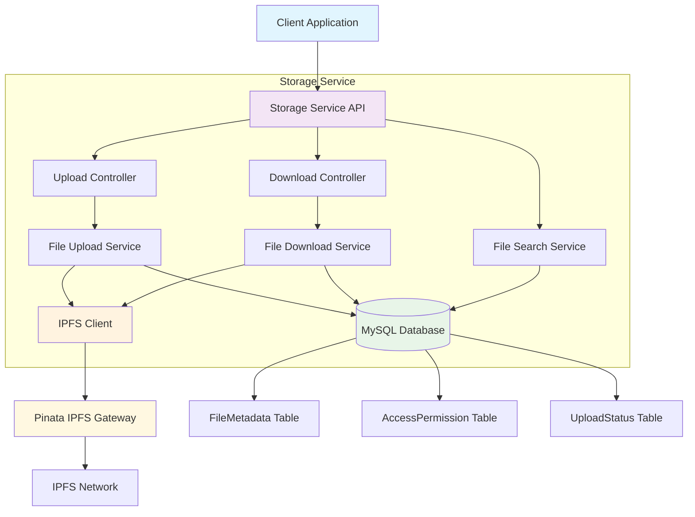
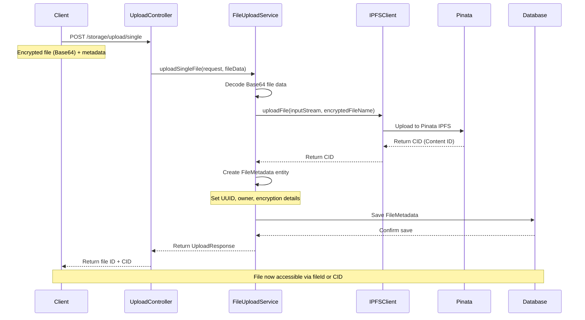
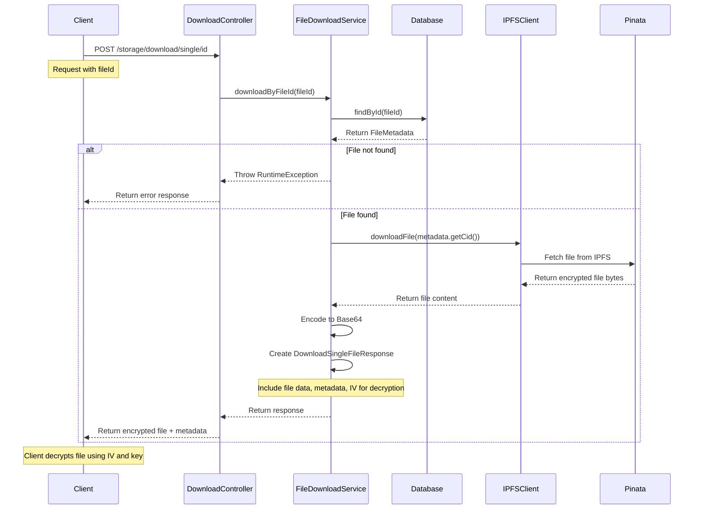
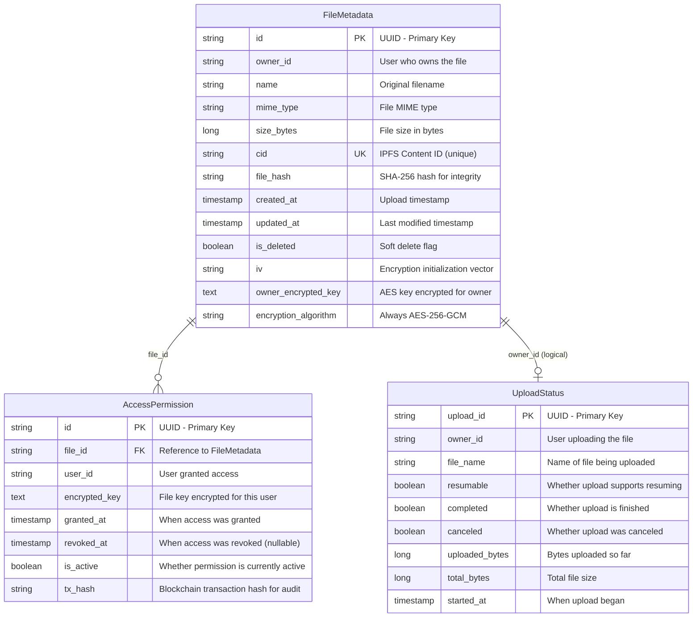
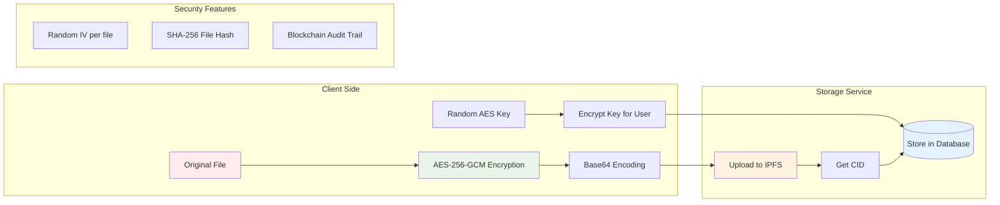

# 🗄️ Storage Service

> **Decentralized File Storage Microservice** - Secure, encrypted file storage on IPFS with comprehensive access management

## 🚀 Quick Start

The Storage Service is a Spring Boot microservice that provides secure, decentralized file storage capabilities. It encrypts files client-side, stores them on IPFS via Pinata, and manages metadata and permissions in a MySQL database.

### 🎯 What This Service Does

- **🔐 Secure Storage**: Client-side encrypted files stored on IPFS network
- **📊 Metadata Management**: File information and access permissions in database
- **⬆️ Smart Uploads**: Single, batch, and resumable upload capabilities
- **⬇️ Flexible Downloads**: Single file, batch, and streaming downloads
- **🔍 Advanced Search**: Metadata-based file search with filtering
- **🛡️ Access Control**: Granular permissions with blockchain audit trails

### 🏗️ Core Architecture



## 📋 Service Components

### 🎮 Controllers
| Component | Purpose | Endpoints |
|-----------|---------|-----------|
| **UploadController** | File upload operations | `/storage/upload/*` |
| **DownloadController** | File download & streaming | `/storage/download/*` |

### ⚙️ Core Services
| Service | Responsibility |
|---------|----------------|
| **FileUploadService** | Process uploads, save metadata, handle resumable uploads |
| **FileDownloadService** | Retrieve files, batch downloads, streaming |
| **FileSearchService** | Metadata-based search with filtering and pagination |
| **IPFSClient** | IPFS network communication via Pinata gateway |

### 🗃️ Data Models
| Entity | Purpose |
|--------|---------|
| **FileMetadata** | File information, encryption details, IPFS CID |
| **AccessPermission** | User access rights with blockchain audit trails |
| **UploadStatus** | Progress tracking for resumable large file uploads |

## 🔄 Process Flows

### 📤 File Upload Flow



### 📥 File Download Flow



## 🗄️ Database Schema



## 🔌 API Endpoints

### 📤 Upload Operations

#### Single File Upload
**`POST /storage/upload/single`**

Upload a single encrypted file to IPFS storage.

**Request Body:**
```json
{
  "ownerId": "user-123",
  "fileData": "BASE64_ENCODED_ENCRYPTED_FILE_CONTENT",
  "fileName": "document.pdf",
  "mimeType": "application/pdf",
  "iv": "randomIVvalue",
  "encryptedKey": "encryptedAESKeyValue",
  "fileHash": "sha256HashOfOriginalFile"
}
```

**Response:**
```json
{
  "fileId": "f0837c2e-b21d-44f0-8f2a-b1d02ccfa882",
  "cid": "Qmabc123xyz...",
  "fileName": "document.enc",
  "status": "COMPLETED"
}
```

#### Batch File Upload
**`POST /storage/upload/batch`**

Upload multiple encrypted files in a single request.

**Request Body:**
```json
{
  "ownerId": "user-123",
  "files": [
    {
      "fileData": "BASE64_ENCODED_ENCRYPTED_FILE_1",
      "fileName": "doc1.pdf",
      "mimeType": "application/pdf",
      "iv": "randomIV1",
      "encryptedKey": "encryptedAESKey1",
      "fileHash": "sha256Hash1"
    },
    {
      "fileData": "BASE64_ENCODED_ENCRYPTED_FILE_2",
      "fileName": "image.png",
      "mimeType": "image/png",
      "iv": "randomIV2",
      "encryptedKey": "encryptedAESKey2",
      "fileHash": "sha256Hash2"
    }
  ]
}
```

**Response:**
```json
[
  {
    "fileName": "doc1.enc",
    "cid": "Qmabc123xyz...",
    "status": "COMPLETED",
    "message": null
  },
  {
    "fileName": "image.enc",
    "cid": "Qmdef456uvw...",
    "status": "COMPLETED",
    "message": null
  }
]
```

### 📥 Download Operations

#### Single File Download
**`POST /storage/download/single/id`**

Download a single file by its unique file ID.

**Request Body:**
```json
{
  "fileId": "9e34d3d5-2f1c-4c8b-95d9-ef85b17aabb2"
}
```

**Response:**
```json
{
  "encryptedData": "BASE64_ENCODED_ENCRYPTED_FILE_CONTENT",
  "fileName": "document.pdf",
  "mimeType": "application/pdf",
  "fileSize": 1048576,
  "cid": "Qmabc123xyz...",
  "fileHash": "sha256HashOfOriginalFile",
  "iv": "randomIVvalue"
}
```

#### Batch File Download
**`GET /storage/download/batch/id`**

Download multiple files as a ZIP archive.

**Request Body:**
```json
{
  "fileIds": [
    "fileId1",
    "fileId2",
    "fileId3"
  ]
}
```

**Response:** ZIP file containing all requested files

### 🔍 Search Operations

#### Search Files by Metadata
**`POST /storage/search`** *(Note: This endpoint exists in the service but may need to be exposed)*

Search files by various metadata criteria with pagination.

**Request Body:**
```json
{
  "nameContains": "document",
  "mimeType": "application/pdf",
  "minSize": 1024,
  "maxSize": 10485760,
  "startDate": "2024-01-01T00:00:00Z",
  "endDate": "2024-12-31T23:59:59Z",
  "sortBy": "createdAt",
  "sortOrder": "desc",
  "page": 0,
  "size": 20
}
```

**Response:**
```json
{
  "results": [
    {
      "id": "file-uuid",
      "fileName": "document.pdf",
      "mimeType": "application/pdf",
      "sizeBytes": 1048576,
      "createdAt": "2024-01-15T10:30:00Z",
      "cid": "Qmabc123xyz..."
    }
  ],
  "totalElements": 1,
  "totalPages": 1,
  "currentPage": 0
}
```

## 🔧 Technical Implementation

### 🌐 IPFS Integration
- **Gateway**: Pinata service for reliable IPFS access
- **Content Addressing**: Each file gets unique CID (Content Identifier)
- **Immutability**: Files cannot be modified once uploaded
- **Deduplication**: Identical files share the same CID
- **Decentralization**: Files distributed across IPFS network

### 🔐 Security Architecture



### 🛡️ Security Features

| Feature | Implementation | Purpose |
|---------|----------------|---------|
| **Client-Side Encryption** | AES-256-GCM | Files encrypted before leaving client |
| **Unique Keys** | Random AES key per file | No key reuse, isolated file access |
| **Initialization Vectors** | Random IV per encryption | Prevents pattern analysis |
| **File Integrity** | SHA-256 hashing | Detect tampering or corruption |
| **Access Control** | Encrypted key sharing | Granular permission management |
| **Audit Trail** | Blockchain transaction hashes | Immutable access records |

### ⚡ Performance Characteristics

| Capability | Specification | Notes |
|------------|---------------|-------|
| **Max File Size** | 500MB | Configurable via Spring Boot properties |
| **Upload Types** | Single, Batch, Resumable | Multiple upload strategies |
| **Concurrent Uploads** | Multi-threaded | Spring Boot async processing |
| **Download Formats** | Single, Batch (ZIP), Stream | Flexible retrieval options |
| **Search Performance** | Indexed queries | MySQL with JPA Specifications |
| **Storage Backend** | IPFS + MySQL | Hybrid approach for optimal performance |

## 🏗️ Development Architecture

### 📁 Project Structure
```
src/main/java/com/omvaultchain/storage/
├── controller/          # REST API endpoints
│   ├── UploadController.java
│   └── DownloadController.java
├── service/            # Business logic
│   ├── FileUploadService.java
│   ├── FileDownloadService.java
│   ├── FileSearchService.java
│   └── IPFSClient.java
├── model/              # Data models & DTOs
│   ├── FileMetadata.java
│   ├── AccessPermission.java
│   ├── UploadRequest.java
│   └── DownloadResponse.java
├── repository/         # Data access layer
│   ├── FileMetadataRepository.java
│   └── AccessPermissionRepository.java
└── config/            # Configuration
    └── StorageConfig.java
```

### 🔄 Key Design Patterns

- **Repository Pattern**: Data access abstraction
- **Service Layer**: Business logic separation
- **DTO Pattern**: Request/response data transfer
- **Dependency Injection**: Spring Boot IoC container
- **RESTful API**: Standard HTTP methods and status codes
